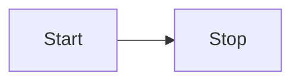

<h1 align="center">Olivier Page — Portfolio</h1>

<p align="center">
  <a href="https://olivierpage.com/" target="_blank"><strong>olivierpage.com</strong></a>
</p>

<p align="center">
  
  
  <br />
  
  
  
  
</p>

<p align="center">
  🔹 <a href="https://github.com/opage/portfolio/issues">Report Bug</a>
  &nbsp;·&nbsp;
  🔹 <a href="https://github.com/opage/portfolio/issues">Request Feature</a>
</p>

## About

Trilingual portfolio built with [VitePress](https://vitepress.dev), styled with
[Tailwind CSS](https://tailwindcss.com) and enhanced with
[Mermaid](https://mermaid.js.org) diagrams.

## Built With

- [VitePress](https://vitepress.dev) — Vue-powered static site generator
- [Vue 3](https://vuejs.org) — component framework
- [Tailwind CSS 4](https://tailwindcss.com) — utility-first styling
- [Mermaid](https://mermaid.js.org) — diagrams rendered via `vitepress-plugin-mermaid`

## Features

- 📖 Multi-page layout (Home, About, Experience, Projects, Resume, Blog)
- 🌍 Internationalization — English / Français / Lëtzebuergesch
- 🌗 Dark mode with automatic diagram re-theming
- 🧜‍♀️ Mermaid diagrams with light/dark support
- 🎨 Switchable folder-style themes
- 📱 Fully responsive

## Project Structure

```
.
├─ .vitepress/
│  ├─ config.mts        # VitePress + Tailwind + Mermaid config
│  └─ theme/
│     └─ index.ts       # re-exports the active theme (switch here)
├─ content/             # markdown source (srcDir)
│  ├─ home/{en,fr,lb}/index.md        → /, /fr/, /lb/
│  ├─ about/{en,fr,lb}/index.md       → /about/{lang}/
│  ├─ experience/{en,fr,lb}/index.md  → /experience/{lang}/
│  ├─ projects/{en,fr,lb}/index.md    → /projects/{lang}/
│  ├─ resume/{en,fr,lb}/index.md      → /resume/{lang}/
│  ├─ blog/{en,fr,lb}/*.md            → /blog/{lang}/
│  └─ public/           # static assets (images, PDFs, _headers)
└─ themes/
   └─ purple/           # the current theme (folder-style)
      ├─ index.ts
      ├─ Layout.vue
      ├─ styles.css     # Tailwind entry + design tokens
      ├─ dict.ts        # i18n dictionary loader
      ├─ projects-data.ts
      ├─ i18n/{en,fr,lb}.ts
      └─ components/
         ├─ ui/UiPill.vue   # reusable pill/badge
         └─ ... (feature components)
```

## Getting Started

You need Node.js and git installed.

1. `npm install`
2. `npm run dev` — starts the dev server at http://localhost:5173
3. `npm run build` — production build (output in `.vitepress/dist`)
4. `npm run preview` — preview the production build

## Internationalization (i18n)

The site is trilingual. Each section follows a `{page}/{lang}/` convention.
Translations live in `themes/purple/i18n/`:

- `en.ts` — English
- `fr.ts` — French
- `lb.ts` — Luxembourgish
- `types.ts` — shared `Dictionary` type

The language is switched via the flag toggle in the navbar.

## Themes

Themes are self-contained folders under `themes/`. The active theme is selected
by the re-export in `.vitepress/theme/index.ts`:

```ts
// .vitepress/theme/index.ts
export { default } from '../../themes/purple'
```

To create a new theme, copy `themes/purple` to `themes/<name>`, customise it, and
update the re-export above.

## Mermaid Diagrams

Write diagrams in any Markdown file using a `mermaid` fenced code block:

````md

````

Rendering is handled by `vitepress-plugin-mermaid`. Dark mode is detected
automatically — diagrams re-render when the theme changes.

## Deployment

Deploys automatically to GitHub Pages on every push to `master` (see
`.github/workflows/deploy.yml`).

## Show your support

Give a ⭐ if you like this website!

<a href="https://www.buymeacoffee.com/opage" target="_blank"></a>
