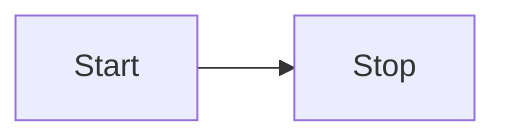

<h1 align="center">Olivier Page — Portfolio</h1>

<p align="center">
  <a href="https://olivierpage.com/" target="_blank"><strong>olivierpage.com</strong></a>
</p>

<p align="center">
  
  
  <br />
  
  
  
</p>

<p align="center">
  🔹 <a href="https://github.com/opage/portfolio/issues">Report Bug</a>
  &nbsp;·&nbsp;
  🔹 <a href="https://github.com/opage/portfolio/issues">Request Feature</a>
</p>

## About

Trilingual portfolio built with [Astro](https://astro.build), styled with
[Tailwind CSS](https://tailwindcss.com) and enhanced with
[Mermaid](https://mermaid.js.org) diagrams.

## Built With

- [Astro](https://astro.build) — static site generator (zero JS by default,
  vanilla-JS islands for the typewriter, timeline, and diagrams)
- [Tailwind CSS 4](https://tailwindcss.com) — utility-first styling
- [Mermaid](https://mermaid.js.org) — diagrams via `rehype-mermaid`
  (`pre-mermaid` strategy) + `MermaidLoader.astro`, with light/dark re-rendering
- [Astro Markdown](https://docs.astro.build/en/guides/markdown-content/)
  (`@astrojs/markdown-remark`) — blog rendering with `remark-gfm` tables and
  Shiki syntax highlighting

## Features

- 📖 Multi-page layout (Home, About, Experience, Projects, Resume, Blog)
- 🌍 Internationalization — English / Français / Lëtzebuergesch
- 🌗 Dark mode with automatic diagram re-theming
- 🧜‍♀️ Mermaid diagrams with light/dark support
- 🎨 Two independent themes (`dossier`, `purple`), switchable via one import
- 📱 Fully responsive
- 📡 RSS feeds (`/rss.xml`, `/fr/rss.xml`, `/lb/rss.xml`) and sitemap

## Project Structure

```
.
├─ astro.config.mjs      # Astro + Tailwind config (BASE_PATH aware)
├─ public/               # static assets (images, PDFs, _headers)
├─ src/
│  ├─ pages/             # routes: /, /fr/, /lb/, /about/[lang], /blog/[lang]/[slug], …
│  ├─ layouts/Layout.astro  # nav, footer, dark mode, language switcher shell
│  ├─ components/        # Astro components + vanilla-JS islands
│  ├─ content/blog/      # blog markdown templates with [[placeholders]]
│  ├─ data/              # flat per-domain *-data.yml (site, page, home,
│  │                     # experience, projects, blog-posts, blog-bodies)
│  └─ utils/             # i18n, site meta, markdown rendering, base-path helper
└─ themes/
   ├─ dossier/styles.css  # active theme (Tailwind entry + design tokens)
   └─ purple/styles.css   # independent violet theme (same class contract)
```

## Getting Started

You need Node.js and git installed.

1. `npm install`
2. `npm run dev` — starts the dev server at http://localhost:4321
3. `npm run build` — production build (output in `dist/`)
4. `npm run preview` — preview the production build

## Internationalization (i18n)

The site is trilingual. Routes follow a `{page}/{lang}/` convention
(`src/pages/about/[lang].astro`, …). All locale strings live in flat
per-domain YAML files under `src/data/`, loaded once by `src/data/index.ts`:

- `site-data.yml` — descriptions, nav, footer, resume/blog UI copy
- `page-data.yml`, `home-data.yml`, `experience-data.yml`,
  `projects-data.yml` — page content
- `blog-posts.yml`, `blog-bodies.yml` — posts metadata and bodies

The language is switched via the flag toggle in the navbar.

## Themes

Two independent, self-contained themes live under `themes/`:

- `dossier/` (active) — warm paper/clay editorial style
  (Fraunces / Inter / JetBrains Mono)
- `purple/` — the original violet theme with gradient display headlines
  (Outfit / Inter / JetBrains Mono)

Each theme is a single `styles.css` exposing the same component-class
contract (`.card`, `.btn-primary`, `.masthead-link`, `.vp-doc`, …), so every
page and component works under either one. Switch themes with the stylesheet
import in `src/layouts/Layout.astro`:

```astro
import '../../themes/purple/styles.css'
```

Shared content data (dictionaries, posts, timelines) lives in `src/data/`
and is theme-agnostic.

## Mermaid Diagrams

Write diagrams in any blog template (`src/content/blog/*.md`) using a `mermaid`
fenced code block:

````md

````

Rendering is handled by `src/components/MermaidLoader.astro`, which renders
diagrams client-side with the `mermaid` package. Dark mode is detected
automatically — diagrams re-render when the theme changes.

## Deployment

Deploys automatically to GitHub Pages on every push to `master` (see
`.github/workflows/deploy.yml`).

## Show your support

Give a ⭐ if you like this website!

<a href="https://www.buymeacoffee.com/opage" target="_blank"></a>
