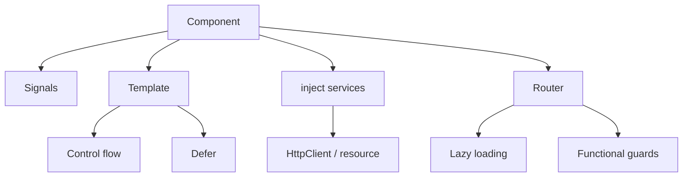

Angular has changed a lot in the last few versions. If you last wrote an app
with `NgModule`, `*ngIf`, and `@Injectable` constructors, much of that is now
optional. This guide covers what a modern, expert-level Angular codebase looks
like today.



## Standalone components

`NgModule` is now optional. Components, directives, and pipes declare their own
dependencies with `imports`, and you wire the app with `provide*` functions.

```typescript
import { Component, input, output } from '@angular/core'

@Component({
  selector: 'app-user-card',
  standalone: true,
  imports: [],
  template: `
    <div class="card">
      <h3>{{ name() }}</h3>
      <button (click)="select.emit(id())">Select</button>
    </div>
  `,
})
export class UserCardComponent {
  readonly id = input.required<number>()
  readonly name = input.required<string>()
  readonly select = output<number>()
}
```

## Signals: the reactivity core

Signals replaced most of the old `ChangeDetectionStrategy` ceremony. They are
the foundation for inputs, outputs, and derived state.

```typescript
import { Component, computed, effect, signal } from '@angular/core'

@Component({ /* ... */ })
export class CounterComponent {
  readonly count = signal(0)
  readonly double = computed(() => this.count() * 2)

  constructor() {
    effect(() => console.log('count is now', this.count()))
  }

  increment() {
    this.count.update((n) => n + 1)
  }
}
```

Modern two-way binding uses `model()`, and queries use `viewChild` /
`contentChild` returning signals:

```typescript
readonly value = model(0)
readonly list = viewChild.required(ElementRef)
```

For asynchronous data, `resource()` replaces the manual "loading state + fetch"
dance:

```typescript
import { resource, signal } from '@angular/core'

export class UserListComponent {
  readonly search = signal('')

  readonly users = resource({
    request: () => ({ q: this.search() }),
    loader: ({ request }) => fetchUsers(request.q),
  })
}
```

`resource()` exposes `value()`, `status()`, `isLoading()`, and `error()`, so the
template can react to every loading phase.

## Built-in control flow and deferred loading

The old `*ngIf` / `*ngFor` structural directives are now built-in blocks that
read more like plain templates.

```html
@if (user(); as u) {
  <p>Hello {{ u.name }}</p>
} @else {
  <p>Not signed in</p>
}

@for (item of items(); track item.id) {
  <li>{{ item.label }}</li>
} @empty {
  <li>Nothing here</li>
}

@switch (status()) {
  @case ('ok') { <span>OK</span> }
  @case ('error') { <span>Error</span> }
  @default { <span>Unknown</span> }
}
```

Load heavy pieces only when needed with `@defer`:

```html
@defer (on viewport) {
  <app-heavy-chart />
} @placeholder {
  <p>Chart appears here…</p>
} @loading (minimum 200ms) {
  <p>Loading…</p>
}
```

## Zoneless change detection

You can now drop Zone.js entirely. Provide zoneless detection at bootstrap and
rely on signals to tell Angular what changed.

```typescript
import { bootstrapApplication } from '@angular/platform-browser'
import { provideZonelessChangeDetection } from '@angular/core'

bootstrapApplication(AppComponent, {
  providers: [provideZonelessChangeDetection()],
})
```

Zoneless means less runtime overhead and fewer surprises — but it expects
signal-based state and proper `OnPush`-friendly code.

## Dependency injection with inject()

Constructor injection is replaced by the `inject()` function, which keeps code
terse and plays nicely with functional APIs.

```typescript
import { inject, Injectable } from '@angular/core'

@Injectable({ providedIn: 'root' })
export class UserService {
  readonly api = inject(ApiService)
  readonly users = this.api.getUsers()
}
```

## Routing: functional guards and lazy loading

Guards, resolvers, and interceptors are now plain functions.

```typescript
import { inject } from '@angular/core'
import type { CanActivateFn } from '@angular/router'
import type { HttpInterceptorFn } from '@angular/common/http'

// guard
export const authGuard: CanActivateFn = () => inject(AuthService).isLoggedIn()

// interceptor
export const authInterceptor: HttpInterceptorFn = (req, next) => {
  const token = inject(AuthService).token()
  return next(req.clone({ setHeaders: { Authorization: `Bearer ${token}` } }))
}
```

Lazy loading is per-route and per-component:

```typescript
export const routes: Routes = [
  {
    path: 'admin',
    loadChildren: () =>
      import('./admin/admin.routes').then((m) => m.adminRoutes),
  },
  {
    path: 'profile',
    loadComponent: () =>
      import('./profile/profile.component').then((m) => m.ProfileComponent),
  },
]
```

## HTTP with signals

`HttpClient` works directly with signals, so a GET can be a reactive value.

```typescript
import { HttpClient, provideHttpClient } from '@angular/common/http'

@Injectable({ providedIn: 'root' })
export class UserService {
  private readonly http = inject(HttpClient)

  readonly users = this.http.get<User[]>('/api/users')
}
```

For request-scoped loading that already lives in an `Observable`, `rxResource()`
wraps `HttpClient` directly:

```typescript
import { inject, Injectable, signal } from '@angular/core'
import { HttpClient } from '@angular/common/http'
import { rxResource } from '@angular/core/rxjs-interop'

@Injectable({ providedIn: 'root' })
export class UserService {
  private readonly http = inject(HttpClient)
  readonly query = signal('')

  readonly users = rxResource({
    request: () => this.query(),
    loader: ({ request }) => this.http.get<User[]>(`/api/users?q=${request}`),
  })
}
```

`rxResource()` exposes the same `value()`, `status()`, `isLoading()`, and
`error()` signals as `resource()`.

## State management with NgRx

For global state, NgRx offers a signals-based **SignalStore** that fits the
modern zoneless, signal-driven model.

```typescript
import { computed } from '@angular/core'
import { patchState, signalStore, withComputed, withMethods, withState } from '@ngrx/signals'

interface CartState {
  items: CartItem[]
}

export const CartStore = signalStore(
  withState<CartState>({ items: [] }),
  withComputed(({ items }) => ({
    count: computed(() => items().length),
    total: computed(() => items().reduce((sum, item) => sum + item.price, 0)),
  })),
  withMethods((store) => ({
    addItem(item: CartItem) {
      patchState(store, { items: [...store.items(), item] })
    },
    removeItem(id: string) {
      patchState(store, { items: store.items().filter((item) => item.id !== id) })
    },
  })),
)
```

Provide the store and inject it into the component:

```typescript
@Component({
  selector: 'app-cart',
  standalone: true,
  providers: [CartStore],
  template: `
    <p>{{ cartStore.count() }} items — {{ cartStore.total() | currency }}</p>
    <button (click)="cartStore.addItem({ id: '1', price: 10 })">Add</button>
  `,
})
export class CartComponent {
  readonly cartStore = inject(CartStore)
}
```

For collections, `withEntities` gives a normalized, ready-to-use shape:

```typescript
import { setAllEntities, withEntities } from '@ngrx/signals/entities'

export const UserStore = signalStore(
  withEntities<User>(),
  withMethods((store) => ({
    load(users: User[]) {
      patchState(store, setAllEntities(users))
    },
  })),
)
```

For complex asynchronous orchestration, the classic `@ngrx/effects` still
excels; `createEffect` turns streams of actions into side effects.

```typescript
@Injectable()
export class UserEffects {
  private readonly actions$ = inject(Actions)
  private readonly users = inject(UserService)

  loadUsers$ = createEffect(() =>
    this.actions$.pipe(
      ofType(loadUsers),
      switchMap(() => this.users.getAll().pipe(
        map((users) => loadUsersSuccess({ users })),
      )),
    ),
  )
}
```

SignalStore is the modern default for most state; reach for `@ngrx/effects`
when you need advanced async flows.

## A modern architecture

A clean, scalable Angular app today tends to look like this:

- **Standalone everything** — no `NgModule`, explicit `imports`.
- **Signals for state** — `signal`/`computed`/`effect` plus `model`/`input`.
- **`inject()`** everywhere — composable, testable services.
- **Zoneless + `OnPush`** — predictable change detection.
- **Functional guards/interceptors** — thin, typed routing layer.
- **Lazy routes + `@defer`** — fast initial load.
- **Feature-based folders** — group by domain, not by layer.

```text
src/app/
  auth/
    login.component.ts
    auth.service.ts
    auth.guard.ts
  orders/
    order-list.component.ts
    order.service.ts
  shared/
    ui/
      button.component.ts
```

## Version history

A condensed timeline of the major releases and their headline changes.

| Version | Release | Breaking changes / news |
| ------- | ------- | ----------------------- |
| 2.0 | Sep 2016 | Complete rewrite from AngularJS: TypeScript, components, DI |
| 4.0 | Mar 2017 | Version jump (no 3.x); new `HttpClient`; animation package |
| 5.0 | Nov 2017 | Build optimizer; `HttpClient` stable |
| 6.0 | May 2018 | Angular CLI workspaces; RxJS 6; tree-shakable providers |
| 7.0 | Oct 2018 | CLI prompts; CDK drag & drop and virtual scrolling |
| 8.0 | May 2019 | Ivy (preview); differential loading; dynamic import for lazy routes |
| 9.0 | Feb 2020 | Ivy enabled by default; TestBed improvements |
| 10.0 | Jun 2020 | TypeScript 3.9; new date range picker |
| 11.0 | Nov 2020 | Hot module replacement; stricter types |
| 12.0 | May 2021 | View Engine removed; Sass modern API; strict mode default |
| 13.0 | Nov 2021 | IE11 dropped; RxJS 7; no more `entryComponents` |
| 14.0 | Jun 2022 | Standalone components (preview); typed reactive forms; `inject()` |
| 15.0 | Nov 2022 | Standalone stable; `NgModule` optional; directive composition API |
| 16.0 | May 2023 | Signals (preview); esbuild dev server; required inputs |
| 17.0 | Nov 2023 | Built-in control flow; `@defer`; standalone default |
| 18.0 | May 2024 | Zoneless (experimental); `@let` variables; signal inputs/outputs |
| 19.0 | Nov 2024 | Signals stable; `resource()`/`rxResource()`; `linkedSignal` |
| 20.0 | May 2025 | Zoneless change detection stable (default for new apps) |
| 21.0 | Nov 2025 | Signal and zoneless refinements |

## Wrapping up

The move to signals, standalone components, and zoneless detection is the
biggest shift in Angular's history. Adopting it — signals for state, `inject()`
for dependencies, functional routing, and lazy loading — gives you smaller
bundles, fewer change-detection bugs, and code that is far easier to reason
about.
