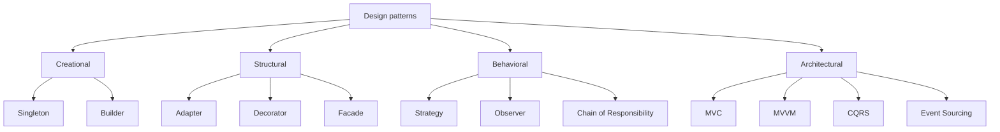

Design patterns are reusable solutions to common problems. They are not
copy-paste templates — they are ideas you adapt to your own situation. This
guide walks through ten of the most useful ones, grouped by what they do.



## Strategy

**The idea:** pick an algorithm at runtime without changing the code that calls
it.

Think of a checkout page: the customer can pay by card, PayPal, or bank
transfer. Each option is a different strategy behind the same button.

```csharp
public interface IPaymentStrategy
{
    void Pay(decimal amount);
}

public class CreditCardPayment : IPaymentStrategy
{
    public void Pay(decimal amount) => Console.WriteLine($"Paid {amount} by card");
}

public class PayPalPayment : IPaymentStrategy
{
    public void Pay(decimal amount) => Console.WriteLine($"Paid {amount} via PayPal");
}

public class Checkout
{
    private readonly IPaymentStrategy _strategy;

    public Checkout(IPaymentStrategy strategy) => _strategy = strategy;

    public void Complete(decimal amount) => _strategy.Pay(amount);
}
```

## Decorator

**The idea:** add behavior to an object by wrapping it, layer by layer.

Like adding toppings to a coffee: you start with an espresso and keep piling on
milk, sugar, or caramel without changing the espresso itself.

```csharp
public interface ICoffee
{
    string Description { get; }
    decimal Cost { get; }
}

public class Espresso : ICoffee
{
    public string Description => "Espresso";
    public decimal Cost => 2.00m;
}

public class MilkDecorator : ICoffee
{
    private readonly ICoffee _inner;

    public MilkDecorator(ICoffee inner) => _inner = inner;

    public string Description => _inner.Description + ", milk";
    public decimal Cost => _inner.Cost + 0.50m;
}
```

## Observer

**The idea:** one object notifies many listeners when something changes.

Like a newsletter: people subscribe, and everyone gets an update when a new
edition is published.

```csharp
public interface IListener
{
    void Notify(string message);
}

public class NewsFeed
{
    private readonly List<IListener> _listeners = new();

    public void Subscribe(IListener listener) => _listeners.Add(listener);

    public void Publish(string message) =>
        _listeners.ForEach(listener => listener.Notify(message));
}
```

## Chain of Responsibility

**The idea:** pass a request along a chain of handlers until one of them
handles it.

Like customer support: a ticket is escalated level by level until someone can
resolve it. Each handler decides whether to process the request or forward it.

```csharp
public interface IHandler
{
    IHandler SetNext(IHandler handler);
    void Handle(string request);
}

public abstract class BaseHandler : IHandler
{
    private IHandler? _next;

    public IHandler SetNext(IHandler handler)
    {
        _next = handler;
        return handler;
    }

    public virtual void Handle(string request)
    {
        _next?.Handle(request);
    }
}

public class AuthHandler : BaseHandler
{
    public override void Handle(string request)
    {
        if (request.StartsWith("auth"))
        {
            Console.WriteLine("Auth passed");
            base.Handle(request);
        }
        else
        {
            Console.WriteLine("Auth failed — stop");
        }
    }
}

public class LoggingHandler : BaseHandler
{
    public override void Handle(string request)
    {
        Console.WriteLine($"Logging: {request}");
        base.Handle(request);
    }
}

var logging = new LoggingHandler();
var auth = new AuthHandler();
logging.SetNext(auth);

logging.Handle("auth:user-42");
```

Each handler only knows about the next one, so the chain can be reordered or
extended without changing existing handlers.

## Singleton

**The idea:** guarantee there is exactly one instance of a class.

Like a single settings file for an app — everyone reads the same one.

```csharp
public sealed class Configuration
{
    public static Configuration Instance { get; } = new Configuration();

    private Configuration() { }

    public string AppName => "MyApp";
}
```

## Facade

**The idea:** hide a complex system behind one simple front door.

Like a car ignition: you turn one key, and many parts work together underneath.

```csharp
public class OrderFacade
{
    private readonly PaymentService _payment = new();
    private readonly InventoryService _inventory = new();

    public void PlaceOrder(Order order)
    {
        _payment.Charge(order);
        _inventory.Reserve(order);
    }
}
```

## Builder

**The idea:** build a complex object step by step instead of one giant
constructor.

Like ordering a custom burger: pick the bun, the cheese, the extras — then
build it.

```csharp
public class Burger
{
    public bool Cheese { get; set; }
    public bool Bacon { get; set; }
}

public class BurgerBuilder
{
    private readonly Burger _burger = new();

    public BurgerBuilder AddCheese() { _burger.Cheese = true; return this; }

    public BurgerBuilder AddBacon() { _burger.Bacon = true; return this; }

    public Burger Build() => _burger;
}
```

## Adapter

**The idea:** make two incompatible interfaces work together.

Like a travel plug adapter that lets your charger fit a foreign socket.

```csharp
public interface IShape
{
    double Area();
}

public class LegacyRectangle
{
    public double Width { get; set; }
    public double Height { get; set; }
}

public class RectangleAdapter : IShape
{
    private readonly LegacyRectangle _rect;

    public RectangleAdapter(LegacyRectangle rect) => _rect = rect;

    public double Area() => _rect.Width * _rect.Height;
}
```

## MVC (Model-View-Controller)

**The idea:** separate data, presentation, and control logic.

The **model** holds the data, the **view** shows it, and the **controller**
reacts to user input.

```csharp
public class User
{
    public string Name { get; set; } = "Olivier";
}

public class UserController
{
    public string GetUserName() => new User().Name;
}
```

## MVVM (Model-View-ViewModel)

**The idea:** bind the view directly to a **view model**, so the UI updates
automatically when data changes.

Popular in desktop and mobile apps, where a button click changes a property and
the screen reflects it without manual wiring.

```csharp
public class CounterViewModel : INotifyPropertyChanged
{
    private int _count;

    public int Count
    {
        get => _count;
        set { _count = value; OnPropertyChanged(); }
    }

    public void Increment() => Count++;

    // INotifyPropertyChanged implementation omitted for brevity
}
```

## CQRS (Command Query Responsibility Segregation)

**The idea:** separate writes (commands) from reads (queries).

Reads and writes often need different models and different storage. Splitting
them keeps each side simple and scalable.

```csharp
public record CreateOrderCommand(int Id, decimal Total);

public record GetOrderQuery(int Id);

public class CreateOrderHandler
{
    public void Handle(CreateOrderCommand command) { /* save the order */ }
}

public class GetOrderHandler
{
    public Order Handle(GetOrderQuery query) => /* load the order */ null!;
}
```

## Event Sourcing

**The idea:** store every state change as an immutable event, and rebuild the
current state by replaying those events.

Instead of saving the current balance, you save "deposited 100", "withdrew 40".
The balance is a projection you can recompute at any time.

```csharp
public interface IEvent { }

public record AccountOpened(Guid AccountId, string Owner) : IEvent;
public record MoneyDeposited(Guid AccountId, decimal Amount) : IEvent;
public record MoneyWithdrawn(Guid AccountId, decimal Amount) : IEvent;

public class Account
{
    public Guid Id { get; private set; }
    public decimal Balance { get; private set; }

    public void Apply(IEvent @event)
    {
        switch (@event)
        {
            case AccountOpened e:
                Id = e.AccountId;
                break;
            case MoneyDeposited e:
                Balance += e.Amount;
                break;
            case MoneyWithdrawn e:
                Balance -= e.Amount;
                break;
        }
    }
}
```

```csharp
// load = replay the history
var account = new Account();
foreach (var @event in eventStore.Load(accountId))
{
    account.Apply(@event);
}
```

Event sourcing gives you a full audit trail, makes state reproducible, and
pairs naturally with CQRS — but it costs more storage and complexity.

## Wrapping up

You will not use every pattern every day — but recognising them helps you read
other people's code, discuss designs clearly, and pick the right tool when a
problem looks familiar.
