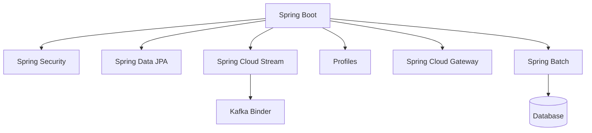
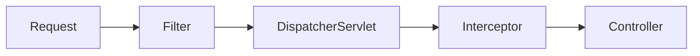

Java keeps getting more concise, and the Spring ecosystem keeps removing
boilerplate. This guide covers the language features and Spring modules an
expert backend developer uses every day, then closes with a version timeline.



## Modern Java

### Lambdas

A lambda is a compact implementation of a functional interface (an interface
with a single abstract method). It powers the Stream API and Spring's
functional DSLs.

```java
List<String> names = List.of("Ada", "Bob", "Cara");

// lambda
names.forEach(name -> System.out.println(name));

// method reference
names.forEach(System.out::println);
```

The JDK ships the common functional interfaces, so you rarely write your own.

```java
Predicate<String> isLong = s -> s.length() > 3;
Function<String, Integer> length = String::length;
Consumer<String> print = System.out::println;
Supplier<String> id = () -> UUID.randomUUID().toString();
```

### Streams

A stream is a pipeline over a collection: a source, a chain of lazy
intermediate operations, and one terminal operation that runs it.

```java
List<Order> orders = List.of(/* ... */);

List<String> emails = orders.stream()
  .filter(o -> o.total() > 100)
  .sorted(Comparator.comparing(Order::total).reversed())
  .map(Order::customerEmail)
  .distinct()
  .limit(10)
  .toList();
```

Common terminal operations:

```java
double sum = orders.stream().mapToDouble(Order::total).sum();

Map<Status, List<Order>> byStatus =
  orders.stream().collect(Collectors.groupingBy(Order::status));

boolean anyLarge = orders.stream().anyMatch(o -> o.total() > 1000);
```

`filter`, `map`, `sorted`, `distinct`, and `limit` are lazy; `toList`,
`collect`, `reduce`, and `forEach` trigger the pipeline. Streams encourage
immutable, declarative data processing.

### Records

Records give you immutable data carriers with no boilerplate.

```java
public record User(String name, int age) { }
```

### Pattern matching

`instanceof` narrows the variable in place.

```java
if (obj instanceof String s) {
  System.out.println(s.length());
}
```

Switch expressions combine with pattern matching for exhaustive, typed logic.

```java
String result = switch (obj) {
  case Integer i -> "int " + i;
  case String s  -> "str " + s;
  default        -> "other";
};
```

### Sealed classes

Sealed hierarchies declare every allowed subtype, so the compiler can check
exhaustiveness.

```java
public sealed interface Shape permits Circle, Square { }

public record Circle(double radius) implements Shape { }
public record Square(double side) implements Shape { }
```

### Virtual threads

Project Loom (stable since Java 21) makes blocking code scale with cheap,
lightweight threads.

```java
try (var executor = Executors.newVirtualThreadPerTaskExecutor()) {
  executor.submit(() -> handleRequest());
}
```

## Spring Boot

Spring Boot wires an application from a single annotation and sensible
defaults, configured via `application.yml`.

```java
@SpringBootApplication
public class Application {
  public static void main(String[] args) {
    SpringApplication.run(Application.class, args);
  }
}
```

Starters pull in a whole feature (web, data, security) with one dependency, and
auto-configuration adapts to what is on the classpath.

## Spring beans and components

A **bean** is any object managed by Spring's IoC container. **Components** are
classes auto-detected by component scanning through stereotype annotations.

```java
@Component
public class EmailService { }

@Service
public class OrderService { }

@Repository
public class OrderRepository { }

@Controller
public class OrderController { }
```

`@Component` is the generic stereotype; `@Service`, `@Repository`, and
`@Controller` are specializations that add meaning and future behaviour.

For third-party or manually constructed objects, declare a bean in a
`@Configuration` class.

```java
@Configuration
public class AppConfig {
  @Bean
  OrderValidator orderValidator() {
    return new OrderValidator();
  }
}
```

Inject dependencies through the constructor — the modern, testable default.

```java
@Service
public class OrderService {
  private final OrderRepository repository;
  private final EmailService email;

  public OrderService(OrderRepository repository, EmailService email) {
    this.repository = repository;
    this.email = email;
  }
}
```

`@Autowired` is the older, annotation-driven way. It can target fields,
setters, or constructors.

```java
@Service
public class OrderService {

  @Autowired
  private OrderRepository repository;

  private EmailService email;

  @Autowired
  public void setEmailService(EmailService email) {
    this.email = email;
  }
}
```

Field and setter injection are flexible but make dependencies mutable and
harder to test. Prefer constructor injection — on a single constructor,
`@Autowired` is even optional.

When several beans share the same type, `@Qualifier` picks the right one.

```java
@Service
public class CreditCardPayment implements PaymentService { }

@Service
public class PayPalPayment implements PaymentService { }
```

```java
@Service
public class CheckoutService {

  private final PaymentService payment;

  public CheckoutService(@Qualifier("payPalPayment") PaymentService payment) {
    this.payment = payment;
  }
}
```

The qualifier is the bean name — by default the class name with a lowercase
first letter. You can set an explicit name with `@Service("paypal")` or
`@Bean("paypal")`.

Spring provides several bean scopes. `singleton` (the default) creates one
instance per container; `prototype` creates a new instance on every request;
the web scopes (`request`, `session`, `application`, `websocket`) are tied to a
web context.

```java
// singleton (default) — one instance per container
@Component
public class SingletonService { }

// prototype — a new instance on every injection
@Component
@Scope("prototype")
public class ShoppingCart { }

// request — one instance per HTTP request
@Component
@Scope(value = WebApplicationContext.SCOPE_REQUEST,
       proxyMode = ScopedProxyMode.TARGET_CLASS)
public class RequestContext { }

// session — one instance per HTTP session
@Component
@Scope(value = WebApplicationContext.SCOPE_SESSION,
       proxyMode = ScopedProxyMode.TARGET_CLASS)
public class UserSession { }

// application — one instance per ServletContext
@Component
@Scope(value = WebApplicationContext.SCOPE_APPLICATION)
public class AppWideConfig { }

// websocket — one instance per WebSocket session
@Component
@Scope(value = "websocket",
       proxyMode = ScopedProxyMode.TARGET_CLASS)
public class ChatSession { }
```

The short-lived scopes (`request`, `session`, `websocket`) need
`proxyMode = ScopedProxyMode.TARGET_CLASS` so they can be injected into
longer-lived singletons.

Spring ships shorthand annotations for the common web scopes:

```java
@Component
@RequestScope
public class RequestContext { }

@Component
@SessionScope
public class UserSession { }

@Component
@ApplicationScope
public class AppWideConfig { }
```

`@RequestScope` and `@SessionScope` are shortcuts for the `@Scope` version with
`proxyMode = ScopedProxyMode.TARGET_CLASS`. There is no shorthand for
`prototype` or `websocket` — use `@Scope` for those.

Here is the complete set:

| Scope | Lifetime | Shorthand |
| --- | --- | --- |
| `singleton` | One instance per container | default |
| `prototype` | New instance on every request | — |
| `request` | One instance per HTTP request | `@RequestScope` |
| `session` | One instance per HTTP session | `@SessionScope` |
| `application` | One instance per `ServletContext` | `@ApplicationScope` |
| `websocket` | One instance per WebSocket session | — |

In short, the shorthand annotations are `@RequestScope`, `@SessionScope`, and
`@ApplicationScope`. Spring Cloud also ships `@RefreshScope` for
`@Scope("refresh")`. There is no shorthand for `singleton` (the default),
`prototype`, or `websocket`.

`@SpringBootApplication` enables component scanning over its package, so any
annotated class there is picked up automatically.

## Spring Security

Security is configured through a `SecurityFilterChain` bean. The lambda DSL is
the modern, readable style.

```java
@Bean
SecurityFilterChain filterChain(HttpSecurity http) throws Exception {
  return http
    .authorizeHttpRequests(auth -> auth
      .requestMatchers("/api/public/**").permitAll()
      .anyRequest().authenticated())
    .oauth2ResourceServer(oauth -> oauth.jwt(Customizer.withDefaults()))
    .build();
}
```

JWT resource servers are the default for stateless APIs; method security
(`@PreAuthorize`) guards individual service calls. Enable it with
`@EnableMethodSecurity` and annotate the methods you want to protect.

```java
@RestController
@RequestMapping("/api/orders")
public class OrderController {

  private final OrderService orders;

  public OrderController(OrderService orders) {
    this.orders = orders;
  }

  @PreAuthorize("hasRole('ADMIN')")
  @DeleteMapping("/{id}")
  public void cancel(@PathVariable Long id) {
    orders.cancel(id);
  }
}
```

`@PreAuthorize` accepts SpEL, so you can check roles (`hasRole`), authorities
(`hasAuthority`), or the request itself (`#id == authentication.name`). Use
`@PostAuthorize` to filter the returned value after the method runs.

## Filters vs interceptors

Both wrap requests, but at different layers. A **filter** is part of the
Servlet API and runs around the entire request, before Spring's
`DispatcherServlet`. An **interceptor** is Spring MVC and runs inside the
dispatcher, with access to the target controller.



A filter is for concerns that must run before Spring even sees the request:

```java
@Component
public class RequestLoggingFilter extends OncePerRequestFilter {

  @Override
  protected void doFilterInternal(
      HttpServletRequest request,
      HttpServletResponse response,
      FilterChain chain) throws ServletException, IOException {

    long start = System.currentTimeMillis();
    chain.doFilter(request, response);
    log.info("{} {} took {} ms", request.getMethod(),
        request.getRequestURI(), System.currentTimeMillis() - start);
  }
}
```

An interceptor is for concerns that need the controller, such as timing a
specific handler:

```java
@Component
public class TimingInterceptor implements HandlerInterceptor {

  @Override
  public boolean preHandle(HttpServletRequest request,
      HttpServletResponse response, Object handler) {
    request.setAttribute("startTime", System.currentTimeMillis());
    return true;
  }

  @Override
  public void afterCompletion(HttpServletRequest request,
      HttpServletResponse response, Object handler, Exception ex) {
    long start = (long) request.getAttribute("startTime");
    log.info("Handler {} took {} ms", handler,
        System.currentTimeMillis() - start);
  }
}
```

```java
@Configuration
public class WebConfig implements WebMvcConfigurer {

  @Override
  public void addInterceptors(InterceptorRegistry registry) {
    registry.addInterceptor(new TimingInterceptor())
        .addPathPatterns("/api/**");
  }
}
```

| | Filter | Interceptor |
| --- | --- | --- |
| Layer | Servlet API | Spring MVC |
| Runs | Before `DispatcherServlet` | Inside `DispatcherServlet` |
| Sees the controller | No | Yes (`HandlerMethod`) |
| Typical uses | Auth, CORS, encoding, logging | Timing, model attributes, handler-aware logging |

In short: filters for the container level, interceptors for the MVC level.

## @RestController vs @Controller

`@Controller` is the classic MVC stereotype: its methods return a **view name**
resolved by a `ViewResolver`. `@RestController` is a convenience combination of
`@Controller` + `@ResponseBody`, so methods return **data** serialized to JSON.

```java
@Controller
public class PageController {

  @GetMapping("/")
  public String home() {
    return "index"; // view name, not JSON
  }
}
```

```java
@RestController
@RequestMapping("/api/users")
public class UserController {

  private final UserService users;

  public UserController(UserService users) {
    this.users = users;
  }

  @GetMapping
  public List<User> list() {
    return users.findAll(); // serialized to JSON
  }
}
```

`@GetMapping`, `@PostMapping`, `@PutMapping`, and `@DeleteMapping` are
shortcuts for `@RequestMapping(method = ...)`. Use `@Controller` for
server-rendered pages and `@RestController` for APIs.

## Spring Data JPA

Entities map classes to tables, and repository interfaces generate the queries
from method names.

```java
@Entity
@Table(name = "customer")
public class Customer {
  @Id
  @GeneratedValue(strategy = GenerationType.IDENTITY)
  private Long id;

  @Column(nullable = false)
  private String name;
}
```

```java
public interface CustomerRepository extends JpaRepository<Customer, Long> {
  List<Customer> findByNameContainingIgnoreCase(String name);

  Page<Customer> findByNameContainingIgnoreCase(String name, Pageable pageable);
}
```

Pagination uses `Pageable` with `Page` or `Slice`:

```java
Page<Customer> page = repository.findByNameContainingIgnoreCase(
    "a", PageRequest.of(0, 20, Sort.by("name")));

List<Customer> content = page.getContent();
long total = page.getTotalElements();
int pages = page.getTotalPages();
```

`PageRequest.of(page, size)` maps to `offset = page * size` and `limit = size`.
`Page` runs an extra `COUNT` query for the total; use `Slice` to skip it when you
only need a "has next" flag.

Use `@Transactional` on service boundaries so multiple writes commit or roll
back together.

```java
@Service
public class OrderService {

  private final OrderRepository orders;
  private final PaymentService payments;

  public OrderService(OrderRepository orders, PaymentService payments) {
    this.orders = orders;
    this.payments = payments;
  }

  @Transactional
  public Order placeOrder(Order order) {
    Order saved = orders.save(order);
    payments.charge(order.getTotal());
    return saved;
  }
}
```

If any step throws a `RuntimeException`, the whole method rolls back. Fine-tune
it with `rollbackFor` (for checked exceptions), `readOnly = true` (for
read-only queries), and `propagation` (to join or require a new transaction).

## Lombok and MapStruct

### Lombok

Lombok removes boilerplate with compile-time annotations. `@Getter`/`@Setter`
generate accessors, `@Builder` a builder, and `@Slf4j` a logger.

```java
@Getter
@Setter
@Builder
@NoArgsConstructor
@AllArgsConstructor
@Entity
public class Customer {
  @Id
  @GeneratedValue(strategy = GenerationType.IDENTITY)
  private Long id;

  private String name;
}
```

`@RequiredArgsConstructor` generates a constructor for `final` fields, which
pairs perfectly with constructor injection.

```java
@Service
@RequiredArgsConstructor
public class OrderService {
  private final OrderRepository orders;
  private final PaymentService payments;

  public void place(Order order) {
    orders.save(order);
  }
}
```

`@Data` bundles accessors with `equals`/`hashCode`/`toString`, but avoid it on
JPA entities, where the generated `equals` can behave badly on mutable state.

### MapStruct

MapStruct generates type-safe mappers between DTOs and entities at compile time.
Declare an interface and it produces the implementation.

```java
@Mapper(componentModel = "spring")
public interface CustomerMapper {

  CustomerDto toDto(Customer customer);

  @Mapping(target = "id", ignore = true)
  Customer toEntity(CreateCustomerRequest request);
}
```

With `componentModel = "spring"`, the mapper is a Spring bean you can inject.

```java
@Service
@RequiredArgsConstructor
public class CustomerService {
  private final CustomerRepository repository;
  private final CustomerMapper mapper;

  public CustomerDto create(CreateCustomerRequest request) {
    return mapper.toDto(repository.save(mapper.toEntity(request)));
  }
}
```

Unlike reflection-based mappers, MapStruct is type-safe and fails at compile
time when fields do not match.

## Spring Cloud Stream with the Kafka binder

Cloud Stream abstracts the messaging infrastructure behind a binding model, so
your code speaks functions, not Kafka clients.

```java
@Bean
Function<Order, Order> processOrder() {
  return order -> {
    // validate, enrich, or transform
    return order;
  };
}
```

```yaml
spring:
  cloud:
    stream:
      bindings:
        processOrder-in-0:
          destination: orders
        processOrder-out-0:
          destination: orders-processed
      kafka:
        binder:
          brokers: localhost:9092
```

Swap the binder (Kafka, Rabbit, Kafka Streams) without touching the function.

## Profiles

Profiles load different configuration per environment. Files are named
`application-{profile}.yml`, and `spring.profiles.active` selects them.

```yaml
spring:
  profiles:
    active: dev
```

```yaml
# application-dev.yml
server:
  port: 8080
```

### Loading multiple profiles

Profiles are additive and ordered — activate several at once:

```yaml
spring:
  profiles:
    active: dev,local
```

Loading rules:

- A **later** profile overrides an **earlier** one.
- Every `application-{profile}.yml` overrides the base `application.yml`.
- With no active profile, Spring uses the `default` profile (`application.yml`
  only).
- Activate externally with the `SPRING_PROFILES_ACTIVE` environment variable or
  `--spring.profiles.active=dev,local`.

A profile can pull in others with `include`:

```yaml
spring:
  profiles:
    include: common,metrics
```

You can also gate beans with `@Profile`.

```java
@Component
@Profile("!prod")
public class DevDataSeeder { }
```

## Spring Cloud Gateway

The gateway routes requests to downstream services using predicates and
filters.

```yaml
spring:
  cloud:
    gateway:
      routes:
        - id: order-service
          uri: lb://ORDER-SERVICE
          predicates:
            - Path=/api/orders/**
          filters:
            - StripPrefix=1
```

Predicates match the request; filters transform it (rewrite path, add headers,
circuit-break). Paired with a discovery client, `lb://` load-balances across
instances.

## Spring Batch

Spring Batch handles large, scheduled data processing: read in chunks, process,
write, with restart and retry built in. A job is made of chunk-oriented steps.

```java
@Configuration
@EnableBatchProcessing
public class BatchConfig {

  @Bean
  public Job importUsersJob(JobRepository jobRepository, Step step) {
    return new JobBuilder("importUsersJob", jobRepository)
        .start(step)
        .build();
  }

  @Bean
  public Step step(JobRepository jobRepository,
      PlatformTransactionManager transactionManager,
      ItemReader<User> reader,
      ItemProcessor<User, User> processor,
      ItemWriter<User> writer) {
    return new StepBuilder("step", jobRepository)
        .<User, User>chunk(100, transactionManager)
        .reader(reader)
        .processor(processor)
        .writer(writer)
        .build();
  }

  @Bean
  public ItemReader<User> reader() {
    return new FlatFileItemReaderBuilder<User>()
        .name("userReader")
        .resource(new FileSystemResource("users.csv"))
        .delimited()
        .names("name", "email")
        .targetType(User.class)
        .build();
  }

  @Bean
  public ItemProcessor<User, User> processor() {
    return user -> {
      user.setEmail(user.getEmail().toLowerCase());
      return user;
    };
  }
}
```

- **Job** — the whole batch process.
- **Step** — one phase; here a chunk step that reads, transforms, and writes.
- **Reader / Processor / Writer** — the chunk pipeline.
- **chunk(100)** — process 100 items per transaction, so a failure rolls back
  one chunk, not the whole job.

Spring Batch records job and step status in a metadata store, so jobs can be
restarted from where they failed.

## Java version history

A condensed timeline of the major releases and their headline changes.

| Version | Release | Breaking changes / news |
| ------- | ------- | ----------------------- |
| 8 | Mar 2014 | Lambdas, Streams, `Optional`, `java.time`; PermGen removed (Metaspace) |
| 9 | Sep 2017 | Module system (JPMS/Jigsaw), JShell, `List.of`/`Map.of` |
| 10 | Mar 2018 | `var` local-variable type inference |
| 11 | Sep 2018 | LTS; `HttpClient`, `var` in lambdas; Java EE & CORBA modules removed |
| 12 | Mar 2019 | Switch expressions (preview), Shenandoah GC |
| 13 | Sep 2019 | Text blocks (preview), ZGC |
| 14 | Mar 2020 | Switch expressions standard; records & pattern matching (preview) |
| 15 | Sep 2020 | Text blocks standard; sealed classes (preview) |
| 16 | Mar 2021 | Records standard; pattern matching for `instanceof` standard |
| 17 | Sep 2021 | LTS; sealed classes standard; strong encapsulation of JDK internals |
| 18 | Mar 2022 | UTF-8 default charset; simple web server |
| 19 | Sep 2022 | Virtual threads (preview); record patterns (preview) |
| 20 | Mar 2023 | Record patterns standard; virtual threads (2nd preview) |
| 21 | Sep 2023 | LTS; virtual threads standard, pattern matching for switch, sequenced collections |
| 22 | Mar 2024 | Unnamed variables & patterns; statements before `super()` |
| 23 | Sep 2024 | Module import declarations (preview); primitive patterns (preview) |
| 24 | Mar 2025 | Compact object headers, class-file API, stream gatherers |
| 25 | Sep 2025 | LTS; structured concurrency & scoped values stable |

## Wrapping up

Modern Java leans on records, pattern matching, sealed types, and virtual
threads to cut boilerplate and scale. The Spring ecosystem layers Boot's
auto-configuration, Security's filter chain, JPA's repositories, Cloud Stream's
bindings, profiles, and a gateway on top. Together they give you a production
backend that is concise, typed, and easy to reason about.
