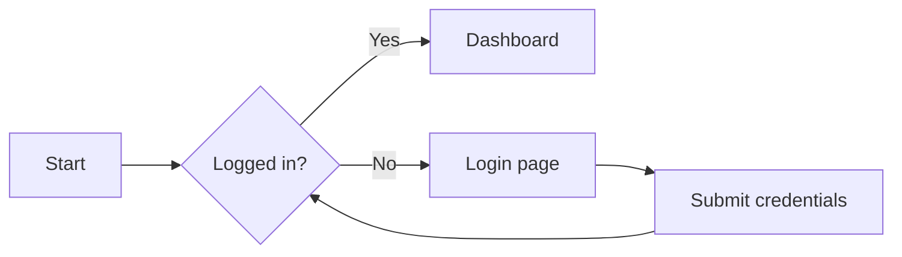
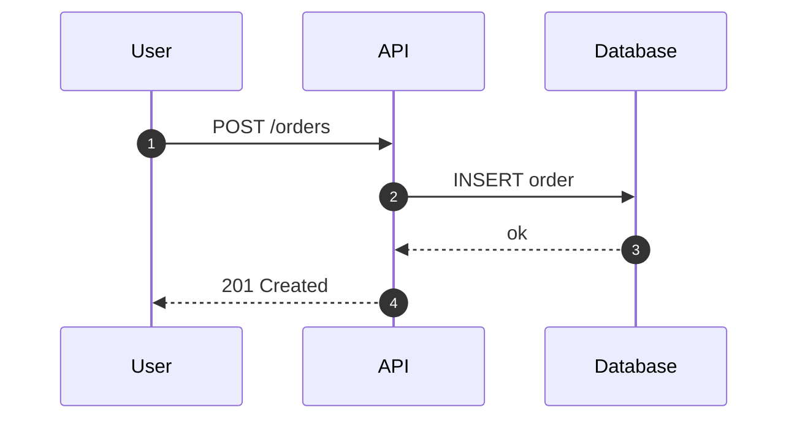
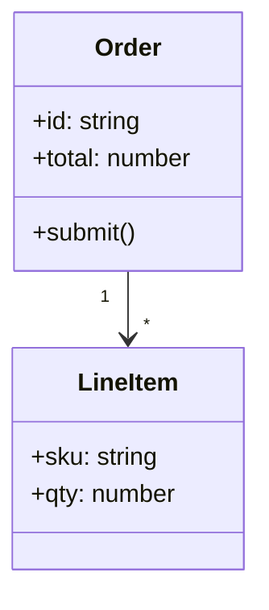
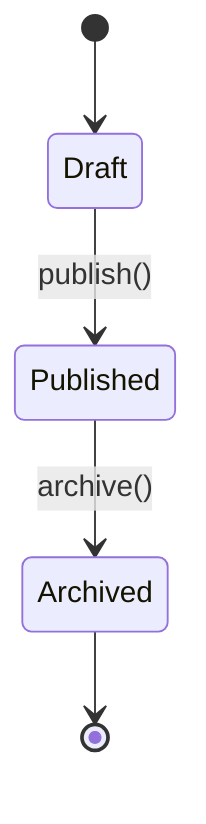
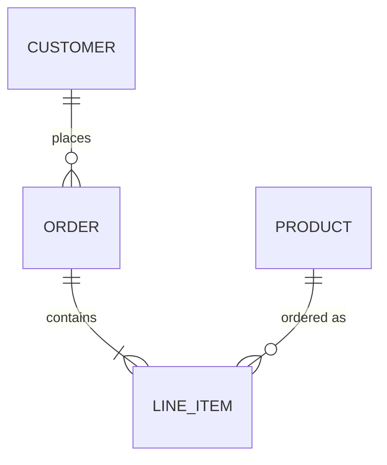
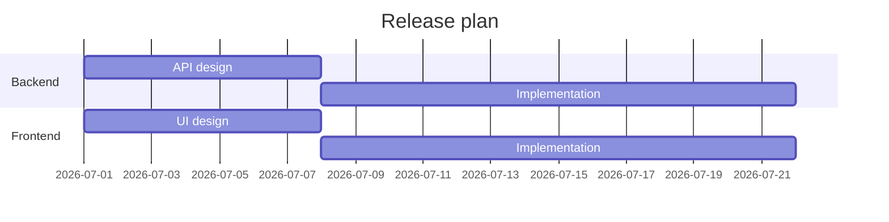
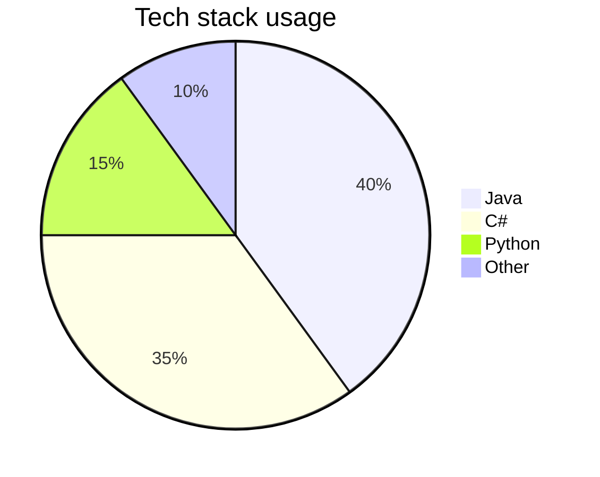
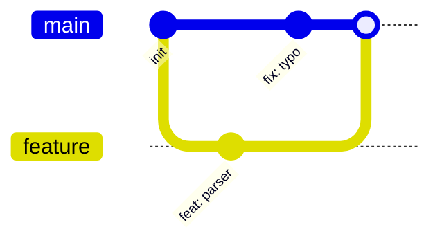
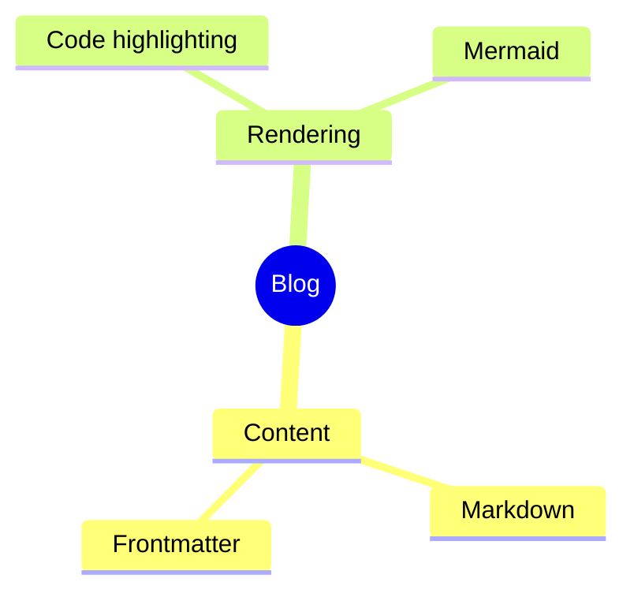
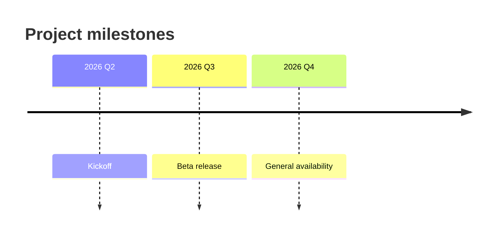

Any fenced code block tagged with `mermaid` is rendered as an SVG diagram. Here
is a tour of what is available.

## Flowchart

## Sequence

## Class diagram

## State diagram

## Entity relationship

## Gantt chart

## Pie chart

## Git graph

## Mindmap

## Timeline

Wrap any of these in a `mermaid` fence and it will render on the page.
