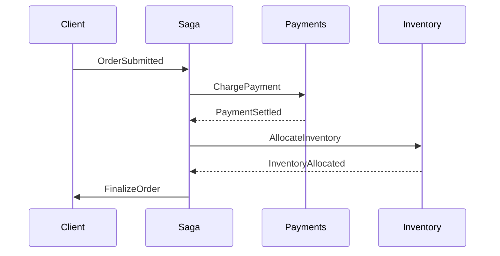
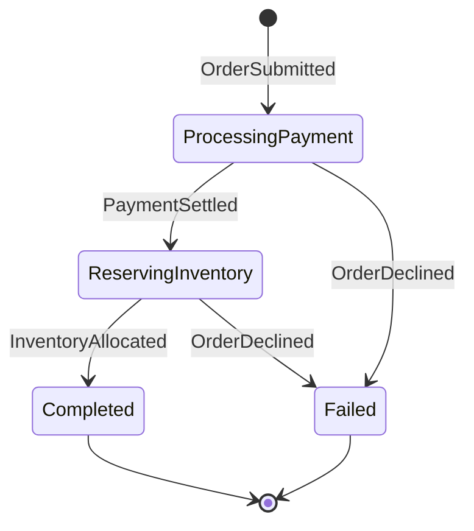

## The problem with a single transaction

A checkout rarely completes in one request. Money must be captured, stock must be
set aside, and the warehouse must be told to ship. Trying to wrap all of that in
one distributed transaction — a two-phase commit across services — looks tidy on
paper but breaks down quickly in reality.

The catch is that no service can predict how long another will take. A payment
provider might wait on a fraud review, and a stock check might be slow under load.
Keeping locks open across several systems for that long is impractical and can
drag the whole platform down.

A **saga** sidesteps this by cutting the flow into local steps that each finish
quickly and can be undone on their own.

## What a saga actually is

A saga is a chain of local actions where every step has a matching **compensating
action** that reverses it when a later step fails. Instead of one atomic
operation, the work is split into small, independently recoverable pieces.

Take an order as an example:



If the inventory step reports that an item is sold out after payment has already
gone through, the saga fires a reimbursement to give the money back. Each piece
is decoupled, and nothing stays locked for the entire journey.

## MassTransit sagas are state machines

[MassTransit](https://masstransit.io) implements sagas through a state machine,
an approach inherited from Automatonymous. Before writing code it helps to know
the four parts that make up the model:

1. **States** — the positions a workflow can be in
2. **Events** — messages that push the workflow from one state to another
3. **Behaviors** — the work performed when an event lands in a given state
4. **Instance** — the persisted record holding data for a single conversation

Every state machine ships with an `Initial` and a `Final` state for free. A new
instance starts in `Initial`, and reaching `Final` means the saga has finished.

Here is the state machine we are going to build:



## The saga instance

The instance is the entity that MassTransit persists between messages. It keeps
the correlation key, the current state, and any business data the steps need.

```csharp
public class OrderState : SagaStateMachineInstance
{
    public Guid CorrelationId { get; set; }
    public string CurrentState { get; set; } = string.Empty;

    public decimal Total { get; set; }
    public string? PaymentReference { get; set; }
    public DateTime? PlacedAt { get; set; }
    public string? BuyerEmail { get; set; }
}
```

`CorrelationId` is the identifier that ties every incoming message back to the
right instance, while `CurrentState` records where the workflow currently stands.
The remaining properties carry the data the process needs along the way.

## The events

Events are the messages that drive transitions. Each one must be correlated to a
specific instance through a shared identifier.

```csharp
public record OrderSubmitted(Guid OrderId, decimal Total, string Email);

public record PaymentSettled(Guid OrderId, string PaymentReference);

public record InventoryAllocated(Guid OrderId);

public record OrderDeclined(Guid OrderId, string Reason);
```

These records travel over the bus; the saga reacts to them and may publish new
commands in response.

## Building the state machine

The state machine ties states, events, and behaviors together and declares which
transitions are legal.

```csharp
public class OrderStateMachine : MassTransitStateMachine<OrderState>
{
    public OrderStateMachine()
    {
        InstanceState(x => x.CurrentState);

        Event(() => OrderSubmitted, x => x.CorrelateById(c => c.Message.OrderId));
        Event(() => PaymentSettled, x => x.CorrelateById(c => c.Message.OrderId));
        Event(() => InventoryAllocated, x => x.CorrelateById(c => c.Message.OrderId));
        Event(() => OrderDeclined, x => x.CorrelateById(c => c.Message.OrderId));

        Initially(
            When(OrderSubmitted)
                .Then(c =>
                {
                    c.Saga.Total = c.Message.Total;
                    c.Saga.BuyerEmail = c.Message.Email;
                    c.Saga.PlacedAt = DateTime.UtcNow;
                })
                .PublishAsync(c => c.Init<ChargePayment>(new
                {
                    OrderId = c.Saga.CorrelationId,
                    Amount = c.Saga.Total
                }))
                .TransitionTo(ProcessingPayment)
        );

        During(ProcessingPayment,
            When(PaymentSettled)
                .Then(c => c.Saga.PaymentReference = c.Message.PaymentReference)
                .PublishAsync(c => c.Init<AllocateInventory>(new
                {
                    OrderId = c.Saga.CorrelationId
                }))
                .TransitionTo(ReservingInventory),
            When(OrderDeclined)
                .TransitionTo(Failed)
                .Finalize()
        );

        During(ReservingInventory,
            When(InventoryAllocated)
                .PublishAsync(c => c.Init<FinalizeOrder>(new
                {
                    OrderId = c.Saga.CorrelationId
                }))
                .TransitionTo(Completed)
                .Finalize(),
            When(OrderDeclined)
                .PublishAsync(c => c.Init<ReimbursePayment>(new
                {
                    OrderId = c.Saga.CorrelationId,
                    Amount = c.Saga.Total
                }))
                .TransitionTo(Failed)
                .Finalize()
        );

        SetCompletedWhenFinalized();
    }

    public State ProcessingPayment { get; private set; } = null!;
    public State ReservingInventory { get; private set; } = null!;
    public State Completed { get; private set; } = null!;
    public State Failed { get; private set; } = null!;

    public Event<OrderSubmitted> OrderSubmitted { get; private set; } = null!;
    public Event<PaymentSettled> PaymentSettled { get; private set; } = null!;
    public Event<InventoryAllocated> InventoryAllocated { get; private set; } = null!;
    public Event<OrderDeclined> OrderDeclined { get; private set; } = null!;
}
```

Notice the compensation logic: when the stock step fails after payment, the saga
publishes `ReimbursePayment` to unwind the charge. The happy path and the failure
path are declared side by side, which makes the workflow easy to read.

## The consumers

The saga is the coordinator, not the doer. The actual work lives in message
consumers that handle commands and report back through events.

```csharp
public class ChargePaymentConsumer(
    IPaymentGateway gateway,
    ILogger<ChargePaymentConsumer> logger) : IConsumer<ChargePayment>
{
    public async Task Consume(ConsumeContext<ChargePayment> context)
    {
        try
        {
            var result = await gateway.ChargeAsync(
                context.Message.OrderId,
                context.Message.Amount);

            if (result.Succeeded)
            {
                await context.Publish<PaymentSettled>(new
                {
                    OrderId = context.Message.OrderId,
                    PaymentReference = result.Reference
                });
            }
            else
            {
                await context.Publish<OrderDeclined>(new
                {
                    OrderId = context.Message.OrderId,
                    Reason = result.RejectionReason
                });
            }
        }
        catch (Exception ex)
        {
            logger.LogError(ex, "Payment failed for order {OrderId}", context.Message.OrderId);

            await context.Publish<OrderDeclined>(new
            {
                OrderId = context.Message.OrderId,
                Reason = "Payment gateway error"
            });
        }
    }
}
```

Splitting responsibilities this way keeps each service focused on its own job,
while the saga keeps the whole process moving in the right direction.

## Wiring it up with Azure Service Bus

Persisting saga state requires a repository. We will use Entity Framework Core
against SQL Server, with Azure Service Bus as the transport.

First, the required packages:

```powershell
Install-Package MassTransit.EntityFrameworkCore
Install-Package MassTransit.Azure.ServiceBus.Core
Install-Package Microsoft.EntityFrameworkCore.SqlServer
```

Define a `DbContext` and a class map for the saga instance:

```csharp
public class OrderSagaDbContext : SagaDbContext
{
    public OrderSagaDbContext(DbContextOptions options) : base(options) { }

    protected override IEnumerable<ISagaClassMap> Configurations
    {
        get { yield return new OrderStateMap(); }
    }
}

public class OrderStateMap : SagaClassMap<OrderState>
{
    protected override void Configure(EntityTypeBuilder<OrderState> entity, ModelBuilder model)
    {
        entity.Property(x => x.CurrentState).HasMaxLength(64);
        entity.Property(x => x.BuyerEmail).HasMaxLength(256);
        entity.Property(x => x.PaymentReference).HasMaxLength(64);
    }
}
```

Finally, register everything in the application:

```csharp
builder.Services.AddDbContext<OrderSagaDbContext>(options =>
    options.UseSqlServer(builder.Configuration.GetConnectionString("SqlServer")));

builder.Services.AddMassTransit(x =>
{
    x.AddSagaStateMachine<OrderStateMachine, OrderState>()
        .EntityFrameworkRepository(r =>
        {
            r.ConcurrencyMode = ConcurrencyMode.Pessimistic;
            r.AddDbContext<DbContext, OrderSagaDbContext>();
        });

    x.UsingAzureServiceBus((context, cfg) =>
    {
        cfg.Host(builder.Configuration.GetConnectionString("ServiceBus"));
        cfg.ConfigureEndpoints(context);
    });
});
```

## Why reach for sagas

- **Resilience** — every step can be retried on its own, and failures trigger
  compensation instead of leaving the system half-done.
- **Visibility** — the current state tells you exactly where each order stands,
  which simplifies debugging and monitoring.
- **Loose coupling** — services talk through messages and can evolve separately
  without breaking the overall flow.
- **Maintainability** — a change to one step does not ripple through the others.

The state machine also forces the business process to be explicit. Every state
and transition is spelled out, turning a murky distributed flow into something a
new team member can follow.

## Wrapping up

Modeling a checkout as a MassTransit saga gives you coordinated, recoverable
workflows without the pain of distributed transactions. Define the states and
events, persist the instance, and let Azure Service Bus carry the messages. The
result is a process that is clear, observable, and forgiving when things go
wrong.
