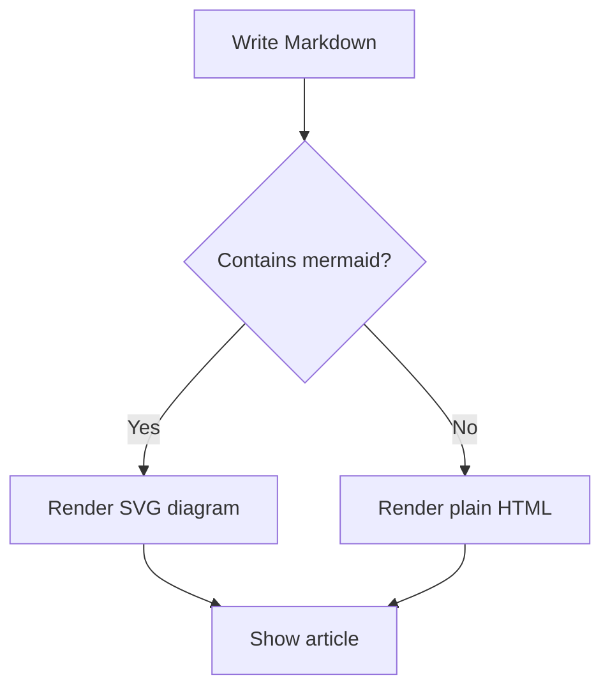
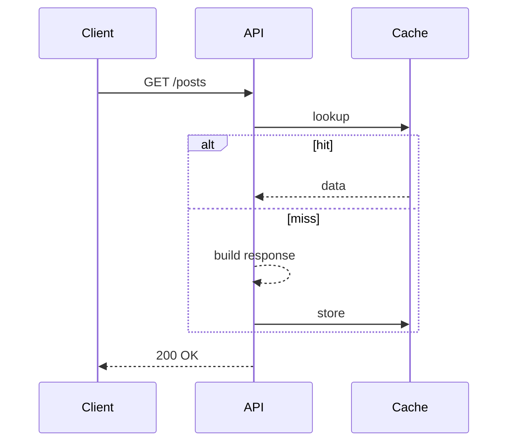

## Why a blog?

I built this space to share the notes and lessons I gather while working on
side projects and production systems. Expect deep dives on **SolidJS**, **.NET**,
**Java**, **Angular**, and the tooling around them.

## Markdown power

Articles are written as plain Markdown files, so I can focus on content. The
renderer supports the usual suspects out of the box:

- Headings, lists, and blockquotes
- Tables
- Links and images
- Fenced code blocks with **syntax highlighting**
- **Mermaid** diagrams

## Syntax highlighting

Code blocks are highlighted automatically based on the language tag:

```typescript
export interface Feature<T> {
  run(input: T): Promise<T>
}

export const identity = <T,>(value: T): T => value
```

```csharp
public sealed class Greeter
{
    public string Hello(string name) => $"Hello, {name}!";
}
```

## Mermaid diagrams

Diagrams render from a `mermaid` code block:



Sequence diagrams work too:



## Wrapping up

That is the basics. Stay tuned for more detailed technical articles.
