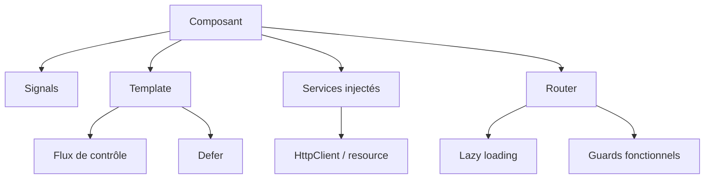

Angular a beaucoup évolué ces dernières versions. Si vous avez écrit votre
dernière application avec `NgModule`, `*ngIf` et des constructeurs `@Injectable`,
une grande partie de tout cela est désormais optionnelle. Ce guide présente ce
à quoi ressemble aujourd'hui un code Angular moderne, de niveau expert.



## Composants standalone

`NgModule` est désormais optionnel. Les composants, directives et pipes
déclarent leurs propres dépendances via `imports`, et l'application se câble
avec des fonctions `provide*`.

```typescript
import { Component, input, output } from '@angular/core'

@Component({
  selector: 'app-user-card',
  standalone: true,
  imports: [],
  template: `
    <div class="card">
      <h3>{{ name() }}</h3>
      <button (click)="select.emit(id())">Select</button>
    </div>
  `,
})
export class UserCardComponent {
  readonly id = input.required<number>()
  readonly name = input.required<string>()
  readonly select = output<number>()
}
```

## Les signals : le cœur de la réactivité

Les signals remplacent la plupart de l'ancien cérémonial de
`ChangeDetectionStrategy`. Ils sont le fondement des inputs, des outputs et de
l'état dérivé.

```typescript
import { Component, computed, effect, signal } from '@angular/core'

@Component({ /* ... */ })
export class CounterComponent {
  readonly count = signal(0)
  readonly double = computed(() => this.count() * 2)

  constructor() {
    effect(() => console.log('count is now', this.count()))
  }

  increment() {
    this.count.update((n) => n + 1)
  }
}
```

Le binding bidirectionnel moderne utilise `model()`, et les requêtes utilisent
`viewChild` / `contentChild` qui renvoient des signals :

```typescript
readonly value = model(0)
readonly list = viewChild.required(ElementRef)
```

Pour les données asynchrones, `resource()` remplace la danse manuelle
« état de chargement + fetch » :

```typescript
import { resource, signal } from '@angular/core'

export class UserListComponent {
  readonly search = signal('')

  readonly users = resource({
    request: () => ({ q: this.search() }),
    loader: ({ request }) => fetchUsers(request.q),
  })
}
```

`resource()` expose `value()`, `status()`, `isLoading()` et `error()`, pour que
le template puisse réagir à chaque phase de chargement.

## Flux de contrôle natif et chargement différé

Les anciennes directives structurelles `*ngIf` / `*ngFor` sont désormais des
blocs intégrés qui se lisent comme du simple template.

```html
@if (user(); as u) {
  <p>Hello {{ u.name }}</p>
} @else {
  <p>Not signed in</p>
}

@for (item of items(); track item.id) {
  <li>{{ item.label }}</li>
} @empty {
  <li>Nothing here</li>
}

@switch (status()) {
  @case ('ok') { <span>OK</span> }
  @case ('error') { <span>Error</span> }
  @default { <span>Unknown</span> }
}
```

Ne chargez les morceaux lourds que lorsque c'est nécessaire avec `@defer` :

```html
@defer (on viewport) {
  <app-heavy-chart />
} @placeholder {
  <p>Chart appears here…</p>
} @loading (minimum 200ms) {
  <p>Loading…</p>
}
```

## Détection de changements sans Zone.js (zoneless)

Vous pouvez désormais vous passer complètement de Zone.js. Fournissez la
détection zoneless au bootstrap et laissez les signals indiquer à Angular ce qui
a changé.

```typescript
import { bootstrapApplication } from '@angular/platform-browser'
import { provideZonelessChangeDetection } from '@angular/core'

bootstrapApplication(AppComponent, {
  providers: [provideZonelessChangeDetection()],
})
```

Le zoneless réduit le surcoût d'exécution et les surprises — mais il attend un
état basé sur les signals et du code compatible `OnPush`.

## Injection de dépendances avec inject()

L'injection par constructeur est remplacée par la fonction `inject()`, qui rend
le code concis et s'accorde avec les API fonctionnelles.

```typescript
import { inject, Injectable } from '@angular/core'

@Injectable({ providedIn: 'root' })
export class UserService {
  readonly api = inject(ApiService)
  readonly users = this.api.getUsers()
}
```

## Routing : guards fonctionnels et lazy loading

Les guards, resolvers et interceptors sont désormais de simples fonctions.

```typescript
import { inject } from '@angular/core'
import type { CanActivateFn } from '@angular/router'
import type { HttpInterceptorFn } from '@angular/common/http'

// guard
export const authGuard: CanActivateFn = () => inject(AuthService).isLoggedIn()

// interceptor
export const authInterceptor: HttpInterceptorFn = (req, next) => {
  const token = inject(AuthService).token()
  return next(req.clone({ setHeaders: { Authorization: `Bearer ${token}` } }))
}
```

Le lazy loading se fait par route et par composant :

```typescript
export const routes: Routes = [
  {
    path: 'admin',
    loadChildren: () =>
      import('./admin/admin.routes').then((m) => m.adminRoutes),
  },
  {
    path: 'profile',
    loadComponent: () =>
      import('./profile/profile.component').then((m) => m.ProfileComponent),
  },
]
```

## HTTP avec les signals

`HttpClient` fonctionne directement avec les signals : un GET peut être une
valeur réactive.

```typescript
import { HttpClient, provideHttpClient } from '@angular/common/http'

@Injectable({ providedIn: 'root' })
export class UserService {
  private readonly http = inject(HttpClient)

  readonly users = this.http.get<User[]>('/api/users')
}
```

Pour un chargement par requête qui vit déjà dans un `Observable`, `rxResource()`
enveloppe directement `HttpClient` :

```typescript
import { inject, Injectable, signal } from '@angular/core'
import { HttpClient } from '@angular/common/http'
import { rxResource } from '@angular/core/rxjs-interop'

@Injectable({ providedIn: 'root' })
export class UserService {
  private readonly http = inject(HttpClient)
  readonly query = signal('')

  readonly users = rxResource({
    request: () => this.query(),
    loader: ({ request }) => this.http.get<User[]>(`/api/users?q=${request}`),
  })
}
```

`rxResource()` expose les mêmes signals `value()`, `status()`, `isLoading()` et
`error()` que `resource()`.

## Gestion d'état avec NgRx

Pour l'état global, NgRx propose un **SignalStore** basé sur les signals, qui
s'intègre au modèle moderne zoneless et piloté par signals.

```typescript
import { computed } from '@angular/core'
import { patchState, signalStore, withComputed, withMethods, withState } from '@ngrx/signals'

interface CartState {
  items: CartItem[]
}

export const CartStore = signalStore(
  withState<CartState>({ items: [] }),
  withComputed(({ items }) => ({
    count: computed(() => items().length),
    total: computed(() => items().reduce((sum, item) => sum + item.price, 0)),
  })),
  withMethods((store) => ({
    addItem(item: CartItem) {
      patchState(store, { items: [...store.items(), item] })
    },
    removeItem(id: string) {
      patchState(store, { items: store.items().filter((item) => item.id !== id) })
    },
  })),
)
```

Fournissez le store et injectez-le dans le composant :

```typescript
@Component({
  selector: 'app-cart',
  standalone: true,
  providers: [CartStore],
  template: `
    <p>{{ cartStore.count() }} items — {{ cartStore.total() | currency }}</p>
    <button (click)="cartStore.addItem({ id: '1', price: 10 })">Add</button>
  `,
})
export class CartComponent {
  readonly cartStore = inject(CartStore)
}
```

Pour les collections, `withEntities` fournit une forme normalisée prête à
l'emploi :

```typescript
import { setAllEntities, withEntities } from '@ngrx/signals/entities'

export const UserStore = signalStore(
  withEntities<User>(),
  withMethods((store) => ({
    load(users: User[]) {
      patchState(store, setAllEntities(users))
    },
  })),
)
```

Pour une orchestration asynchrone complexe, le classique `@ngrx/effects`
excelle toujours ; `createEffect` transforme des flux d'actions en effets de
bord.

```typescript
@Injectable()
export class UserEffects {
  private readonly actions$ = inject(Actions)
  private readonly users = inject(UserService)

  loadUsers$ = createEffect(() =>
    this.actions$.pipe(
      ofType(loadUsers),
      switchMap(() => this.users.getAll().pipe(
        map((users) => loadUsersSuccess({ users })),
      )),
    ),
  )
}
```

SignalStore est le choix moderne par défaut pour la plupart des états ;
utilisez `@ngrx/effects` quand vous avez besoin de flux asynchrones avancés.

## Une architecture moderne

Une application Angular propre et scalable aujourd'hui ressemble à ceci :

- **Tout en standalone** — pas de `NgModule`, des `imports` explicites.
- **Signals pour l'état** — `signal`/`computed`/`effect` plus `model`/`input`.
- **`inject()` partout** — des services composables et testables.
- **Zoneless + `OnPush`** — une détection de changements prévisible.
- **Guards/interceptors fonctionnels** — une couche de routing fine et typée.
- **Routes lazy + `@defer`** — un chargement initial rapide.
- **Dossiers par fonctionnalité** — grouper par domaine, pas par couche.

```text
src/app/
  auth/
    login.component.ts
    auth.service.ts
    auth.guard.ts
  orders/
    order-list.component.ts
    order.service.ts
  shared/
    ui/
      button.component.ts
```

## Historique des versions

Une chronologie condensée des versions majeures et de leurs changements clés.

| Version | Sortie | Changements majeurs / breaking changes |
| ------- | ------ | ------------------------------------- |
| 2.0 | Sept 2016 | Réécriture complète depuis AngularJS : TypeScript, composants, DI |
| 4.0 | Mars 2017 | Saut de version (pas de 3.x) ; nouveau `HttpClient` ; package d'animations |
| 5.0 | Nov 2017 | Build optimizer ; `HttpClient` stable |
| 6.0 | Mai 2018 | Workspaces Angular CLI ; RxJS 6 ; providers tree-shakables |
| 7.0 | Oct 2018 | Prompts CLI ; drag & drop CDK et virtual scrolling |
| 8.0 | Mai 2019 | Ivy (aperçu) ; differential loading ; import dynamique pour les routes lazy |
| 9.0 | Fév 2020 | Ivy activé par défaut ; améliorations TestBed |
| 10.0 | Juin 2020 | TypeScript 3.9 ; nouveau sélecteur de plage de dates |
| 11.0 | Nov 2020 | Hot module replacement ; types plus stricts |
| 12.0 | Mai 2021 | View Engine supprimé ; API moderne de Sass ; mode strict par défaut |
| 13.0 | Nov 2021 | Support IE11 abandonné ; RxJS 7 ; plus d'`entryComponents` |
| 14.0 | Juin 2022 | Composants standalone (aperçu) ; formulaires réactifs typés ; `inject()` |
| 15.0 | Nov 2022 | Standalone stable ; `NgModule` optionnel ; directive composition API |
| 16.0 | Mai 2023 | Signals (aperçu) ; serveur de dev esbuild ; inputs requis |
| 17.0 | Nov 2023 | Flux de contrôle intégré ; `@defer` ; standalone par défaut |
| 18.0 | Mai 2024 | Zoneless (expérimental) ; variables `@let` ; inputs/outputs signals |
| 19.0 | Nov 2024 | Signals stables ; `resource()`/`rxResource()` ; `linkedSignal` |
| 20.0 | Mai 2025 | Détection zoneless stable (par défaut pour les nouvelles apps) |
| 21.0 | Nov 2025 | Améliorations signals et zoneless |

## Pour conclure

Le passage aux signals, aux composants standalone et à la détection zoneless est
le plus grand bouleversement de l'histoire d'Angular. L'adopter — signals pour
l'état, `inject()` pour les dépendances, routing fonctionnel et lazy loading —
vous donne des bundles plus petits, moins de bugs de détection de changements et
un code bien plus facile à raisonner.
