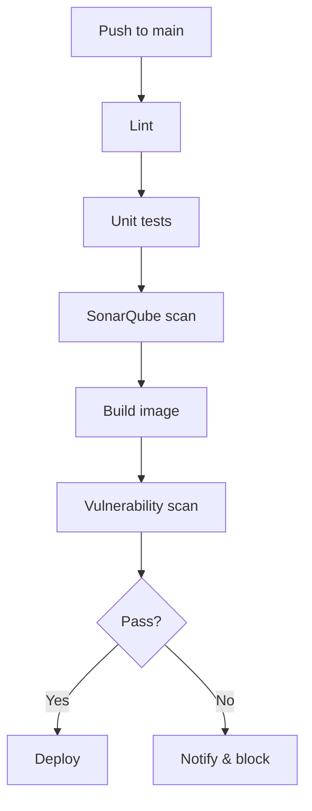
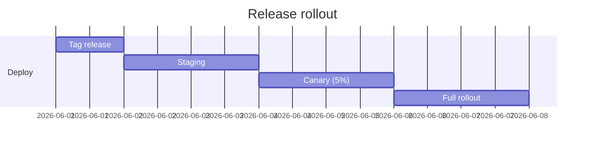
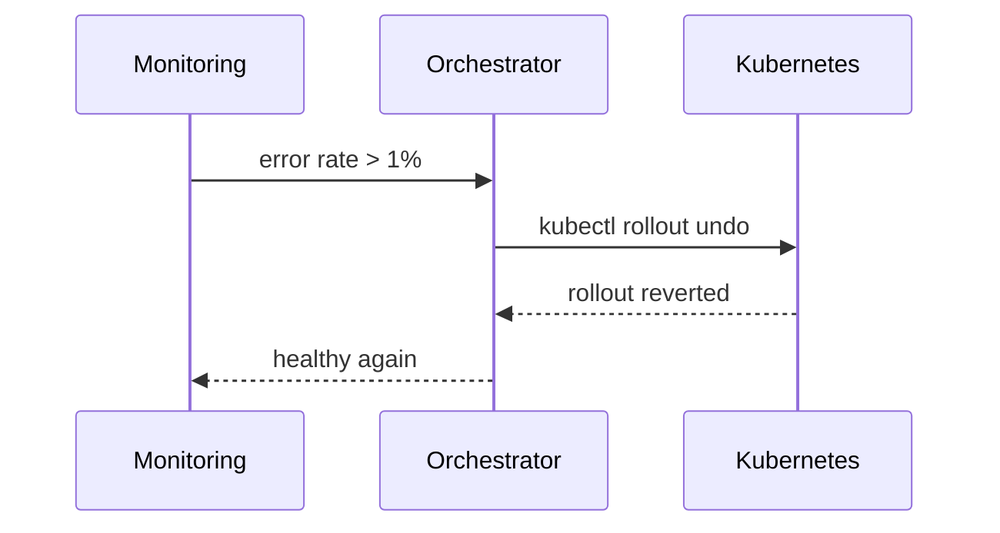

Automatiser votre pipeline de livraison supprime les étapes manuelles et rend
chaque merge reproductible. Voici le pipeline que j'utilise pour mes projets
personnels.

## Vue d'ensemble



## Le fichier de workflow

```yaml
name: ci

on:
  push:
    branches: [main]
  pull_request:

jobs:
  build:
    runs-on: ubuntu-latest
    steps:
      - uses: actions/checkout@v4
      - uses: actions/setup-node@v4
        with:
          node-version: 22
          cache: npm
      - run: npm ci
      - run: npm run lint
      - run: npm run test -- --coverage
      - run: npm run build
```

## Processus de release

Les releases sont créées à partir de tags et suivent un déploiement progressif.



## Séquence de rollback

Si une release casse, le rollback est entièrement automatisé.



Gardez le pipeline rapide, déterministe et observable — tout le reste suit.
