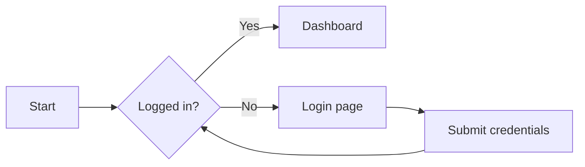
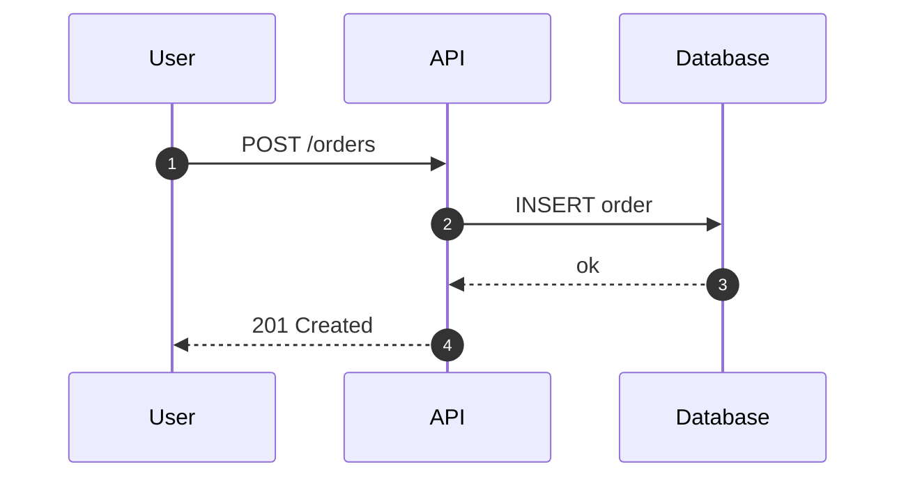
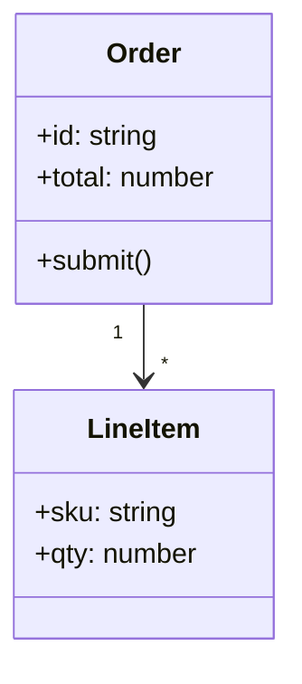
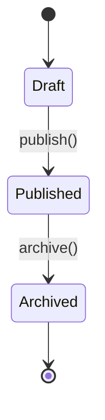
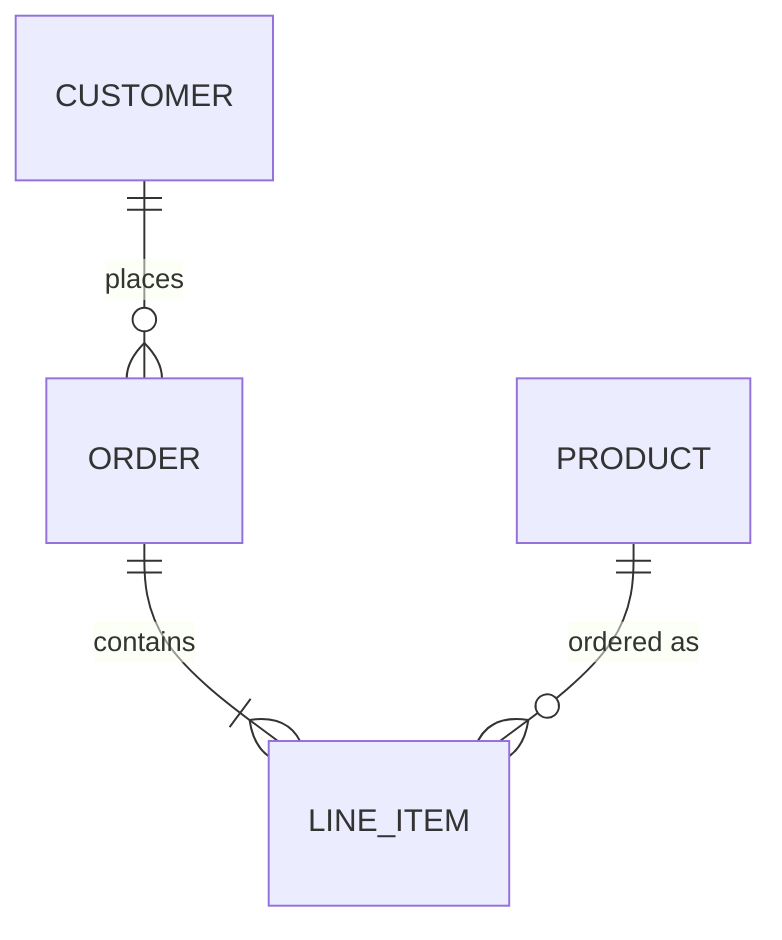
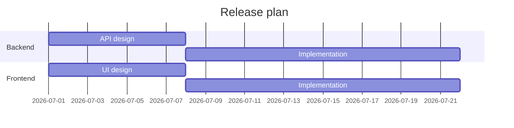
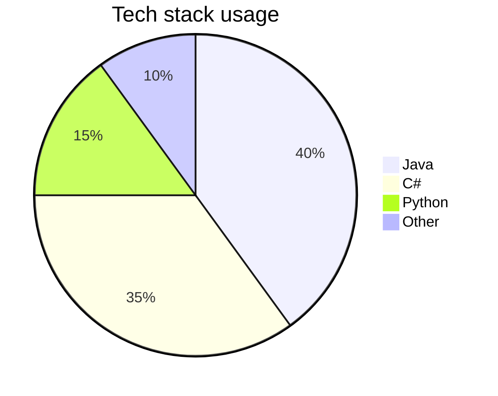
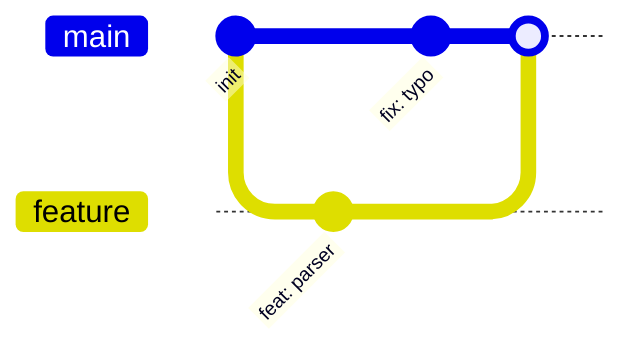
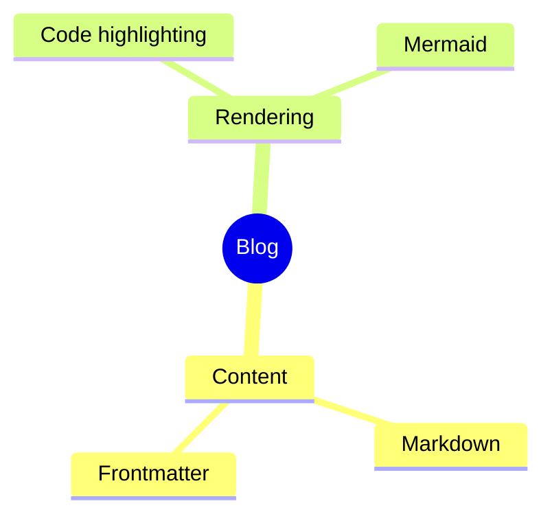
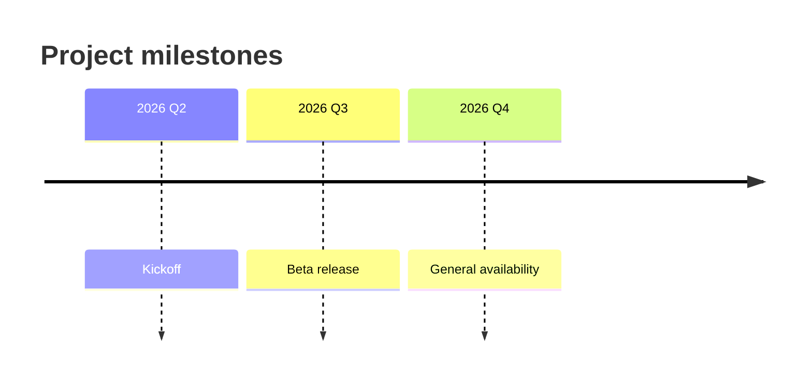

Tout bloc de code délimité et étiqueté `mermaid` est rendu sous forme de
diagramme SVG. Voici un tour d'horizon de ce qui est disponible.

## Organigramme

## Séquence

## Diagramme de classes

## Diagramme d'états

## Entité-relation

## Diagramme de Gantt

## Diagramme circulaire

## Graphe Git

## Carte mentale

## Chronologie

Enveloppez n'importe lequel de ces exemples dans un bloc `mermaid` et il sera
rendu sur la page.
