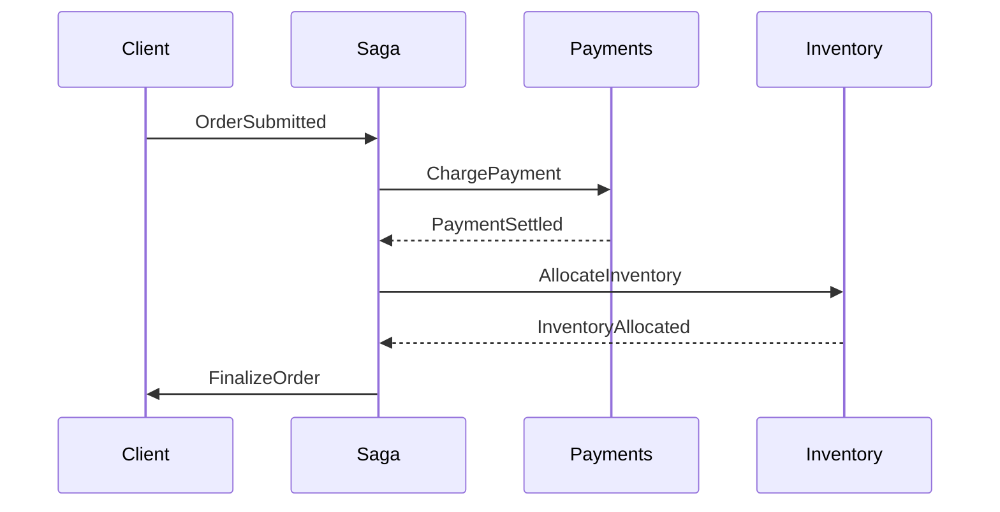
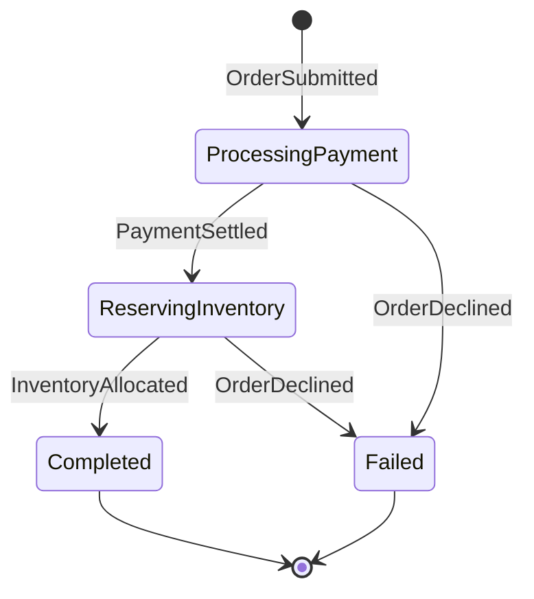

## Le problème d'une transaction unique

Un checkout se termine rarement en une seule requête. L'argent doit être
encaissé, le stock doit être réservé et l'entrepôt doit être prévenu pour
l'expédition. Tout envelopper dans une transaction distribuée — un commit en
deux phases entre services — semble propre sur le papier, mais s'effondre vite
dans la réalité.

Le hic, c'est qu'aucun service ne peut prédire combien de temps un autre mettra.
Un prestataire de paiement peut attendre une vérification anti-fraude, et un
contrôle de stock peut être lent sous la charge. Garder des verrous ouverts sur
plusieurs systèmes pendant aussi longtemps est irréaliste et peut alourdir toute
la plateforme.

Un **saga** contourne cela en découpant le flux en étapes locales qui se
terminent rapidement et peuvent être annulées séparément.

## Ce qu'est réellement un saga

Un saga est une chaîne d'actions locales où chaque étape possède une **action
compensatoire** qui l'inverse lorsqu'une étape ultérieure échoue. Au lieu d'une
opération atomique, le travail est découpé en petits morceaux récupérables
indépendamment.

Prenons une commande comme exemple :



Si l'étape de stock signale qu'un article est épuisé après que le paiement est
déjà passé, le saga déclenche un remboursement pour rendre l'argent. Chaque
pièce est découplée et rien ne reste verrouillé pendant tout le parcours.

## Les sagas MassTransit sont des machines à états

[MassTransit](https://masstransit.io) implémente les sagas à travers une machine
à états, une approche héritée d'Automatonymous. Avant d'écrire du code, il est
utile de connaître les quatre éléments du modèle :

1. **États** — les positions que peut occuper un workflow
2. **Événements** — les messages qui font passer le workflow d'un état à un autre
3. **Comportements** — le travail effectué lorsqu'un événement arrive dans un état donné
4. **Instance** — l'enregistrement persisté contenant les données d'une seule conversation

Chaque machine à états inclut gratuitement un état `Initial` et un état `Final`.
Une nouvelle instance démarre dans `Initial`, et atteindre `Final` signifie que
le saga est terminé.

Voici la machine à états que nous allons construire :



## L'instance du saga

L'instance est l'entité que MassTransit persiste entre les messages. Elle
conserve la clé de corrélation, l'état courant et les données métier dont les
étapes ont besoin.

```csharp
public class OrderState : SagaStateMachineInstance
{
    public Guid CorrelationId { get; set; }
    public string CurrentState { get; set; } = string.Empty;

    public decimal Total { get; set; }
    public string? PaymentReference { get; set; }
    public DateTime? PlacedAt { get; set; }
    public string? BuyerEmail { get; set; }
}
```

`CorrelationId` est l'identifiant qui relie chaque message entrant à la bonne
instance, tandis que `CurrentState` enregistre où en est le workflow. Les
propriétés restantes transportent les données nécessaires au processus.

## Les événements

Les événements sont les messages qui déclenchent les transitions. Chacun doit
être corrélé à une instance précise via un identifiant partagé.

```csharp
public record OrderSubmitted(Guid OrderId, decimal Total, string Email);

public record PaymentSettled(Guid OrderId, string PaymentReference);

public record InventoryAllocated(Guid OrderId);

public record OrderDeclined(Guid OrderId, string Reason);
```

Ces records circulent sur le bus ; le saga y réagit et peut publier de nouvelles
commandes en réponse.

## Construire la machine à états

La machine à états relie les états, les événements et les comportements, et
déclare quelles transitions sont autorisées.

```csharp
public class OrderStateMachine : MassTransitStateMachine<OrderState>
{
    public OrderStateMachine()
    {
        InstanceState(x => x.CurrentState);

        Event(() => OrderSubmitted, x => x.CorrelateById(c => c.Message.OrderId));
        Event(() => PaymentSettled, x => x.CorrelateById(c => c.Message.OrderId));
        Event(() => InventoryAllocated, x => x.CorrelateById(c => c.Message.OrderId));
        Event(() => OrderDeclined, x => x.CorrelateById(c => c.Message.OrderId));

        Initially(
            When(OrderSubmitted)
                .Then(c =>
                {
                    c.Saga.Total = c.Message.Total;
                    c.Saga.BuyerEmail = c.Message.Email;
                    c.Saga.PlacedAt = DateTime.UtcNow;
                })
                .PublishAsync(c => c.Init<ChargePayment>(new
                {
                    OrderId = c.Saga.CorrelationId,
                    Amount = c.Saga.Total
                }))
                .TransitionTo(ProcessingPayment)
        );

        During(ProcessingPayment,
            When(PaymentSettled)
                .Then(c => c.Saga.PaymentReference = c.Message.PaymentReference)
                .PublishAsync(c => c.Init<AllocateInventory>(new
                {
                    OrderId = c.Saga.CorrelationId
                }))
                .TransitionTo(ReservingInventory),
            When(OrderDeclined)
                .TransitionTo(Failed)
                .Finalize()
        );

        During(ReservingInventory,
            When(InventoryAllocated)
                .PublishAsync(c => c.Init<FinalizeOrder>(new
                {
                    OrderId = c.Saga.CorrelationId
                }))
                .TransitionTo(Completed)
                .Finalize(),
            When(OrderDeclined)
                .PublishAsync(c => c.Init<ReimbursePayment>(new
                {
                    OrderId = c.Saga.CorrelationId,
                    Amount = c.Saga.Total
                }))
                .TransitionTo(Failed)
                .Finalize()
        );

        SetCompletedWhenFinalized();
    }

    public State ProcessingPayment { get; private set; } = null!;
    public State ReservingInventory { get; private set; } = null!;
    public State Completed { get; private set; } = null!;
    public State Failed { get; private set; } = null!;

    public Event<OrderSubmitted> OrderSubmitted { get; private set; } = null!;
    public Event<PaymentSettled> PaymentSettled { get; private set; } = null!;
    public Event<InventoryAllocated> InventoryAllocated { get; private set; } = null!;
    public Event<OrderDeclined> OrderDeclined { get; private set; } = null!;
}
```

Remarquez la logique de compensation : lorsque l'étape de stock échoue après le
paiement, le saga publie `ReimbursePayment` pour annuler le débit. Le chemin
nominal et le chemin d'échec sont déclarés côte à côte, ce qui rend le workflow
facile à lire.

## Les consumers

Le saga est le coordinateur, pas l'exécutant. Le vrai travail se trouve dans les
consumers qui traitent les commandes et rendent compte via des événements.

```csharp
public class ChargePaymentConsumer(
    IPaymentGateway gateway,
    ILogger<ChargePaymentConsumer> logger) : IConsumer<ChargePayment>
{
    public async Task Consume(ConsumeContext<ChargePayment> context)
    {
        try
        {
            var result = await gateway.ChargeAsync(
                context.Message.OrderId,
                context.Message.Amount);

            if (result.Succeeded)
            {
                await context.Publish<PaymentSettled>(new
                {
                    OrderId = context.Message.OrderId,
                    PaymentReference = result.Reference
                });
            }
            else
            {
                await context.Publish<OrderDeclined>(new
                {
                    OrderId = context.Message.OrderId,
                    Reason = result.RejectionReason
                });
            }
        }
        catch (Exception ex)
        {
            logger.LogError(ex, "Payment failed for order {OrderId}", context.Message.OrderId);

            await context.Publish<OrderDeclined>(new
            {
                OrderId = context.Message.OrderId,
                Reason = "Payment gateway error"
            });
        }
    }
}
```

Séparer les responsabilités de cette façon permet à chaque service de se
concentrer sur son propre rôle, pendant que le saga fait avancer tout le
processus dans la bonne direction.

## Configuration avec Azure Service Bus

Persister l'état du saga nécessite un dépôt. Nous utiliserons Entity Framework
Core sur SQL Server, avec Azure Service Bus comme transport.

D'abord, les paquets requis :

```powershell
Install-Package MassTransit.EntityFrameworkCore
Install-Package MassTransit.Azure.ServiceBus.Core
Install-Package Microsoft.EntityFrameworkCore.SqlServer
```

Définissez un `DbContext` et une carte de classe pour l'instance du saga :

```csharp
public class OrderSagaDbContext : SagaDbContext
{
    public OrderSagaDbContext(DbContextOptions options) : base(options) { }

    protected override IEnumerable<ISagaClassMap> Configurations
    {
        get { yield return new OrderStateMap(); }
    }
}

public class OrderStateMap : SagaClassMap<OrderState>
{
    protected override void Configure(EntityTypeBuilder<OrderState> entity, ModelBuilder model)
    {
        entity.Property(x => x.CurrentState).HasMaxLength(64);
        entity.Property(x => x.BuyerEmail).HasMaxLength(256);
        entity.Property(x => x.PaymentReference).HasMaxLength(64);
    }
}
```

Enfin, enregistrez le tout dans l'application :

```csharp
builder.Services.AddDbContext<OrderSagaDbContext>(options =>
    options.UseSqlServer(builder.Configuration.GetConnectionString("SqlServer")));

builder.Services.AddMassTransit(x =>
{
    x.AddSagaStateMachine<OrderStateMachine, OrderState>()
        .EntityFrameworkRepository(r =>
        {
            r.ConcurrencyMode = ConcurrencyMode.Pessimistic;
            r.AddDbContext<DbContext, OrderSagaDbContext>();
        });

    x.UsingAzureServiceBus((context, cfg) =>
    {
        cfg.Host(builder.Configuration.GetConnectionString("ServiceBus"));
        cfg.ConfigureEndpoints(context);
    });
});
```

## Pourquoi choisir les sagas

- **Résilience** — chaque étape peut être réessayée séparément, et les échecs
  déclenchent une compensation au lieu de laisser le système à moitié fait.
- **Visibilité** — l'état courant indique exactement où en est chaque commande,
  ce qui simplifie le débogage et la supervision.
- **Couplage lâche** — les services communiquent par messages et peuvent évoluer
  séparément sans casser le flux global.
- **Maintenabilité** — une modification sur une étape ne se répercute pas sur
  les autres.

La machine à états force aussi le processus métier à être explicite. Chaque état
et transition est énoncé clairement, transformant un flux distribué opaque en
quelque chose qu'un nouveau membre de l'équipe peut suivre.

## Conclusion

Modéliser un checkout comme un saga MassTransit donne des workflows coordonnés
et récupérables sans la douleur des transactions distribuées. Définissez les
états et les événements, persistez l'instance et laissez Azure Service Bus
transporter les messages. Le résultat est un processus clair, observable et
indulgent quand les choses tournent mal.
