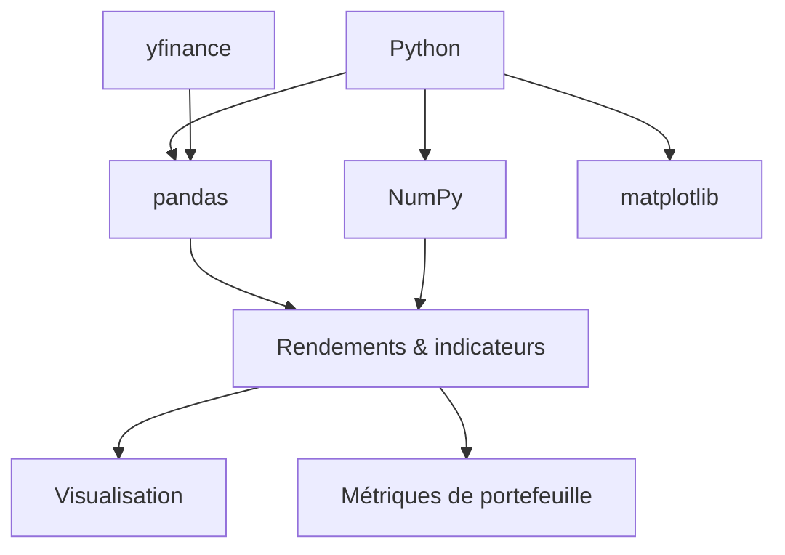

Python est le langage de référence de la finance moderne, car son écosystème
couvre tout, du nettoyage de données à la simulation de Monte-Carlo. Ce guide
parcourt les bibliothèques clés avec des exemples concrets.



## NumPy : le calcul financier vectorisé

NumPy fournit des tableaux rapides et vectorisés — le socle de tout calcul
financier.

```python
import numpy as np

prices = np.array([100, 102, 101, 105, 107])

# simple returns
returns = np.diff(prices) / prices[:-1]
print(returns)  # [ 0.02   -0.0098  0.0396  0.0190]

# log returns
log_returns = np.log(prices[1:] / prices[:-1])

# annualized volatility
volatility = returns.std() * np.sqrt(252)
```

Tout est élément par élément, ce qui évite les boucles Python et garde le
calcul rapide.

## pandas : DataFrames et séries temporelles

pandas enveloppe les données dans un `DataFrame` avec de puissantes opérations
temporelles.

```python
import pandas as pd

df = pd.DataFrame({
    'date': pd.date_range('2026-01-01', periods=5, freq='D'),
    'close': [100, 102, 101, 105, 107],
})

df['returns'] = df['close'].pct_change()
df['cum_return'] = (1 + df['returns']).cumprod() - 1
```

Rééchantillonnez, faites des fenêtres glissantes et des décalages avec des
méthodes intégrées :

```python
df['sma_3'] = df['close'].rolling(3).mean()
df['prev_close'] = df['close'].shift(1)
```

## Récupérer des données de marché avec yfinance

`yfinance` télécharge les historiques de prix directement depuis Yahoo Finance.

```python
import yfinance as yf

ticker = yf.Ticker('AAPL')
history = ticker.history(period='1y', interval='1d')

prices = history['Close']
returns = prices.pct_change().dropna()
```

Vous pouvez aussi charger plusieurs tickers à la fois avec `yf.download`.

## Rendements et métriques de portefeuille

À partir des rendements, calculez les métriques de risque essentielles.

```python
def sharpe_ratio(returns, risk_free_rate=0.0):
    excess = returns - risk_free_rate / 252
    return excess.mean() / returns.std() * np.sqrt(252)

sharpe = sharpe_ratio(returns)
vol = returns.std() * np.sqrt(252)
ann_return = (1 + returns.mean()) ** 252 - 1

print(f"Return: {ann_return:.2%}, Vol: {vol:.2%}, Sharpe: {sharpe:.2f}")
```

Corrélation entre deux actifs :

```python
a = yf.Ticker('AAPL').history(period='1y')['Close'].pct_change()
b = yf.Ticker('MSFT').history(period='1y')['Close'].pct_change()

corr = a.corr(b)
```

## Indicateurs techniques

Les moyennes mobiles sont quelques appels pandas.

```python
df['sma_20'] = df['close'].rolling(20).mean()
df['ema_20'] = df['close'].ewm(span=20, adjust=False).mean()
df['signal'] = np.where(df['sma_20'] > df['ema_20'], 1, 0)
```

`rolling` donne une fenêtre simple ; `ewm` une exponentielle. Le croisement
d'une moyenne courte au-dessus d'une longue est un signal classique.

## Visualisation avec matplotlib

Tracez les prix et les indicateurs pour vérifier les données.

```python
import matplotlib.pyplot as plt

plt.figure(figsize=(10, 5))
plt.plot(df['date'], df['close'], label='Close')
plt.plot(df['date'], df['sma_20'], label='SMA 20')
plt.plot(df['date'], df['ema_20'], label='EMA 20')
plt.legend()
plt.show()
```

## Simulation de Monte-Carlo

Simulez de nombreux chemins de prix futurs en échantillonnant des chocs
aléatoires.

```python
def monte_carlo(initial_price, mu, sigma, days=252, simulations=1000):
    dt = 1 / 252
    paths = np.zeros((days, simulations))
    paths[0] = initial_price
    for t in range(1, days):
        shocks = np.random.normal(mu * dt, sigma * np.sqrt(dt), simulations)
        paths[t] = paths[t - 1] * (1 + shocks)
    return paths

paths = monte_carlo(100, mu=0.07, sigma=0.20)

final_prices = paths[-1]
value_at_risk = np.percentile(final_prices, 5)
```

Cela sous-tend des mesures de risque comme la value-at-risk et le pricing
d'options.

## Pour conclure

NumPy fait le calcul, pandas façonne les données, yfinance les alimente et
matplotlib les montre. Maîtrisez ces quatre-là et vous pourrez calculer des
rendements, des indicateurs et des simulations de Monte-Carlo — l'épine dorsale
de la finance quantitative en Python.
