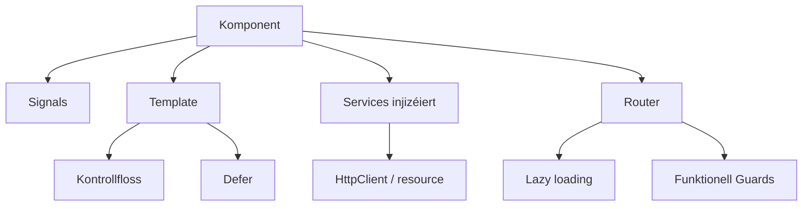

Angular huet sech an de leschte Versiounen däitlech verännert. Wann Dir Är
lescht App mat `NgModule`, `*ngIf` a `@Injectable`-Konstruktore geschriwwen hutt,
ass vill dovu mëttlerweil fakultativ. Dëse Guide weist, wéi e modernen,
expertniveau Angular-Code haut ausgesäit.



## Standalone-Komponenten

`NgModule` ass elo fakultativ. Komponenten, Direktiven a Pipes deklaréieren hir
eege Ofhängegkeeten iwwer `imports`, an d'App gëtt mat `provide*`-Funktiounen
verdrout.

```typescript
import { Component, input, output } from '@angular/core'

@Component({
  selector: 'app-user-card',
  standalone: true,
  imports: [],
  template: `
    <div class="card">
      <h3>{{ name() }}</h3>
      <button (click)="select.emit(id())">Select</button>
    </div>
  `,
})
export class UserCardComponent {
  readonly id = input.required<number>()
  readonly name = input.required<string>()
  readonly select = output<number>()
}
```

## Signals: de Kär vun der Reaktivitéit

Signals ersetzen de gréissten Deel vum alen `ChangeDetectionStrategy`-Zeremoniell.
Si sinn d'Fundament fir Inputs, Outputs an ofgeleet Zoustand.

```typescript
import { Component, computed, effect, signal } from '@angular/core'

@Component({ /* ... */ })
export class CounterComponent {
  readonly count = signal(0)
  readonly double = computed(() => this.count() * 2)

  constructor() {
    effect(() => console.log('count is now', this.count()))
  }

  increment() {
    this.count.update((n) => n + 1)
  }
}
```

Modernt Zwee-Wee-Binding benotzt `model()`, an Queryen benotzen `viewChild` /
`contentChild`, déi Signals zeréckginn:

```typescript
readonly value = model(0)
readonly list = viewChild.required(ElementRef)
```

Fir asynchron Daten ersetzt `resource()` den manuelle « Lued-Zoustand + Fetch »
-Danz:

```typescript
import { resource, signal } from '@angular/core'

export class UserListComponent {
  readonly search = signal('')

  readonly users = resource({
    request: () => ({ q: this.search() }),
    loader: ({ request }) => fetchUsers(request.q),
  })
}
```

`resource()` stellt `value()`, `status()`, `isLoading()` an `error()` zur
Verfügung, sou datt den Template op all Lued-Phas reagéiere kann.

## Kontrollfloss a verspéit Lueden

Déi al strukturell Direktiven `*ngIf` / `*ngFor` sinn elo agebaute Bléck, déi
sech wéi einfachen Template liesen.

```html
@if (user(); as u) {
  <p>Hello {{ u.name }}</p>
} @else {
  <p>Not signed in</p>
}

@for (item of items(); track item.id) {
  <li>{{ item.label }}</li>
} @empty {
  <li>Nothing here</li>
}

@switch (status()) {
  @case ('ok') { <span>OK</span> }
  @case ('error') { <span>Error</span> }
  @default { <span>Unknown</span> }
}
```

Lued schwéier Deeler nëmmen, wann néideg, mat `@defer`:

```html
@defer (on viewport) {
  <app-heavy-chart />
} @placeholder {
  <p>Chart appears here…</p>
} @loading (minimum 200ms) {
  <p>Loading…</p>
}
```

## Zoneless Ännerungsdetektioun

Dir kënnt elo komplett op Zone.js verzichten. Stellt d'Zoneless-Detektioun beim
Bootstrap zur Verfügung a loosst d'Signals dem Angular soen, wat sech geännert
huet.

```typescript
import { bootstrapApplication } from '@angular/platform-browser'
import { provideZonelessChangeDetection } from '@angular/core'

bootstrapApplication(AppComponent, {
  providers: [provideZonelessChangeDetection()],
})
```

Zoneless heescht manner Laufzäit-Overhead a manner Iwwerraschungen — awer et
erwaart signalbaséierten Zoustand an `OnPush`-frëndleche Code.

## Dependency Injection mat inject()

D'Konstruktor-Injektioun gëtt duerch d'`inject()`-Funktioun ersat, déi de Code
kuerz hält a gutt mat funktionellen APIen zesummespillt.

```typescript
import { inject, Injectable } from '@angular/core'

@Injectable({ providedIn: 'root' })
export class UserService {
  readonly api = inject(ApiService)
  readonly users = this.api.getUsers()
}
```

## Routing: funktionell Guards a Lazy Loading

Guards, Resolvers an Interceptors sinn elo einfach Funktiounen.

```typescript
import { inject } from '@angular/core'
import type { CanActivateFn } from '@angular/router'
import type { HttpInterceptorFn } from '@angular/common/http'

// guard
export const authGuard: CanActivateFn = () => inject(AuthService).isLoggedIn()

// interceptor
export const authInterceptor: HttpInterceptorFn = (req, next) => {
  const token = inject(AuthService).token()
  return next(req.clone({ setHeaders: { Authorization: `Bearer ${token}` } }))
}
```

Lazy Loading geschitt pro Route a pro Komponent:

```typescript
export const routes: Routes = [
  {
    path: 'admin',
    loadChildren: () =>
      import('./admin/admin.routes').then((m) => m.adminRoutes),
  },
  {
    path: 'profile',
    loadComponent: () =>
      import('./profile/profile.component').then((m) => m.ProfileComponent),
  },
]
```

## HTTP mat Signals

`HttpClient` funktionéiert direkt mat Signals, sou datt e GET e reaktive Wäert
ka sinn.

```typescript
import { HttpClient, provideHttpClient } from '@angular/common/http'

@Injectable({ providedIn: 'root' })
export class UserService {
  private readonly http = inject(HttpClient)

  readonly users = this.http.get<User[]>('/api/users')
}
```

Fir requestbaséiert Lueden, dat schonn an engem `Observable` lieft, wéckelt
`rxResource()` den `HttpClient` direkt an:

```typescript
import { inject, Injectable, signal } from '@angular/core'
import { HttpClient } from '@angular/common/http'
import { rxResource } from '@angular/core/rxjs-interop'

@Injectable({ providedIn: 'root' })
export class UserService {
  private readonly http = inject(HttpClient)
  readonly query = signal('')

  readonly users = rxResource({
    request: () => this.query(),
    loader: ({ request }) => this.http.get<User[]>(`/api/users?q=${request}`),
  })
}
```

`rxResource()` stellt déi selwecht `value()`, `status()`, `isLoading()` an
`error()`-Signals zur Verfügung wéi `resource()`.

## State Management mat NgRx

Fir globalen Zoustand bitt NgRx e signalbaséierte **SignalStore**, deen an de
moderne zoneless, signalgedriwwene Modell passt.

```typescript
import { computed } from '@angular/core'
import { patchState, signalStore, withComputed, withMethods, withState } from '@ngrx/signals'

interface CartState {
  items: CartItem[]
}

export const CartStore = signalStore(
  withState<CartState>({ items: [] }),
  withComputed(({ items }) => ({
    count: computed(() => items().length),
    total: computed(() => items().reduce((sum, item) => sum + item.price, 0)),
  })),
  withMethods((store) => ({
    addItem(item: CartItem) {
      patchState(store, { items: [...store.items(), item] })
    },
    removeItem(id: string) {
      patchState(store, { items: store.items().filter((item) => item.id !== id) })
    },
  })),
)
```

Stellt de Store zur Verfügung an injizéiert en an de Komponent:

```typescript
@Component({
  selector: 'app-cart',
  standalone: true,
  providers: [CartStore],
  template: `
    <p>{{ cartStore.count() }} items — {{ cartStore.total() | currency }}</p>
    <button (click)="cartStore.addItem({ id: '1', price: 10 })">Add</button>
  `,
})
export class CartComponent {
  readonly cartStore = inject(CartStore)
}
```

Fir Kollektiounen liwwert `withEntities` eng normaliséiert, asazbereet Form:

```typescript
import { setAllEntities, withEntities } from '@ngrx/signals/entities'

export const UserStore = signalStore(
  withEntities<User>(),
  withMethods((store) => ({
    load(users: User[]) {
      patchState(store, setAllEntities(users))
    },
  })),
)
```

Fir komplex asynchron Orchestréierung exceléiert de klassesche `@ngrx/effects`
ëmmer nach; `createEffect` mécht aus Action-Stréim Säiteneffekter.

```typescript
@Injectable()
export class UserEffects {
  private readonly actions$ = inject(Actions)
  private readonly users = inject(UserService)

  loadUsers$ = createEffect(() =>
    this.actions$.pipe(
      ofType(loadUsers),
      switchMap(() => this.users.getAll().pipe(
        map((users) => loadUsersSuccess({ users })),
      )),
    ),
  )
}
```

SignalStore ass de modernen Standard fir déi meescht Zoustand; gräift op
`@ngrx/effects` zeréck, wann Dir fortgeschratt asynchron Flëss braucht.

## Eng modern Architektur

Eng propper, skaléierbar Angular-App gesäit haut ongeféier sou aus:

- **Alles standalone** — keen `NgModule`, explizit `imports`.
- **Signals fir den Zoustand** — `signal`/`computed`/`effect` plus `model`/`input`.
- **`inject()` iwwerall** — komponéierbar, testbar Servicer.
- **Zoneless + `OnPush`** — virauszeseen Ännerungsdetektioun.
- **Funktionell Guards/Interceptors** — eng dënn, typiséiert Routing-Schicht.
- **Lazy-Routen + `@defer`** — séieren initiale Lueden.
- **Ordner no Feature** — no Domain gruppéieren, net no Schicht.

```text
src/app/
  auth/
    login.component.ts
    auth.service.ts
    auth.guard.ts
  orders/
    order-list.component.ts
    order.service.ts
  shared/
    ui/
      button.component.ts
```

## Versiounsgeschicht

Eng kompakt Chronologie vun de grousse Versiounen an hire Kärännerungen.

| Versioun | Release | Breaking Changes / Neiegkeeten |
| -------- | ------- | ------------------------------ |
| 2.0 | Sept 2016 | Komplett Neischreifung vun AngularJS: TypeScript, Komponenten, DI |
| 4.0 | Mäerz 2017 | Versiounssprong (keng 3.x); neien `HttpClient`; Animatiouns-Package |
| 5.0 | Nov 2017 | Build Optimizer; `HttpClient` stabil |
| 6.0 | Mee 2018 | Angular CLI Workspaces; RxJS 6; tree-shakable Providers |
| 7.0 | Okt 2018 | CLI Prompts; CDK Drag & Drop a Virtual Scrolling |
| 8.0 | Mee 2019 | Ivy (Virschau); Differential Loading; dynameschen Import fir Lazy-Routen |
| 9.0 | Feb 2020 | Ivy standardméisseg aktivéiert; TestBed Verbesserungen |
| 10.0 | Juni 2020 | TypeScript 3.9; neien Datumsberäich-Picker |
| 11.0 | Nov 2020 | Hot Module Replacement; méi streng Typpen |
| 12.0 | Mee 2021 | View Engine ewechgeholl; modern Sass API; Strict Mode standardméisseg |
| 13.0 | Nov 2021 | IE11 Ënnerstëtzung gestrach; RxJS 7; keng `entryComponents` méi |
| 14.0 | Juni 2022 | Standalone-Komponenten (Virschau); typiséiert reaktiv Formulairen; `inject()` |
| 15.0 | Nov 2022 | Standalone stabil; `NgModule` fakultativ; Directive Composition API |
| 16.0 | Mee 2023 | Signals (Virschau); esbuild Dev-Server; erfuerderlech Inputs |
| 17.0 | Nov 2023 | Agebaute Kontrollfloss; `@defer`; Standalone standardméisseg |
| 18.0 | Mee 2024 | Zoneless (experimentell); `@let` Variabelen; Signal Inputs/Outputs |
| 19.0 | Nov 2024 | Signals stabil; `resource()`/`rxResource()`; `linkedSignal` |
| 20.0 | Mee 2025 | Zoneless Ännerungsdetektioun stabil (standardméisseg fir nei Apps) |
| 21.0 | Nov 2025 | Signal- a Zoneless-Verfeinerungen |

## Zum Schluss

De Wiessel op Signals, Standalone-Komponenten an Zoneless-Detektioun ass dee
gréissten Ëmbroch an der Geschicht vum Angular. En ze adoptéieren — Signals fir
den Zoustand, `inject()` fir Ofhängegkeeten, funktionell Routing a Lazy Loading —
gëtt Iech méi kleng Bundles, manner Ännerungsdetektiouns-Bugs an Code, dee vill
méi einfach ze verstoen ass.
