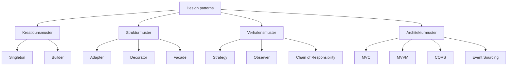

Design Patterns si widderverwendbar Léisunge fir heefeg Problemer. Si si keng
Copy-Paste-Schabloune — si sinn Iddien, déi een un seng eege Situatioun upasst.
Dëse Guide geet duerch zéng vun de nëtzlechsten, gruppéiert no hirer Roll.



## Strategy (Strategie)

**D'Iddi:** en Algorithmus zur Laufzäit wielen, ouni de Code z'änneren, deen en
oprifft.

Denkt un eng Bezuel-Säit: de Client kann mat Kaart, PayPal oder Iwwerweisung
bezuelen. All Optioun ass eng aner Strategie hannert dem selwechte Knäppchen.

```csharp
public interface IPaymentStrategy
{
    void Pay(decimal amount);
}

public class CreditCardPayment : IPaymentStrategy
{
    public void Pay(decimal amount) => Console.WriteLine($"Paid {amount} by card");
}

public class PayPalPayment : IPaymentStrategy
{
    public void Pay(decimal amount) => Console.WriteLine($"Paid {amount} via PayPal");
}

public class Checkout
{
    private readonly IPaymentStrategy _strategy;

    public Checkout(IPaymentStrategy strategy) => _strategy = strategy;

    public void Complete(decimal amount) => _strategy.Pay(amount);
}
```

## Decorator (Dekorateur)

**D'Iddi:** engem Objet Verhalen derbäiginn, andeems een en a Schichten ëmwéckelt.

Wéi ee Kaffi mat Extraen: een fänkt mat engem Espresso un a schicht Mëllech,
Zocker oder Karamell drop, ouni den Espresso selwer z'änneren.

```csharp
public interface ICoffee
{
    string Description { get; }
    decimal Cost { get; }
}

public class Espresso : ICoffee
{
    public string Description => "Espresso";
    public decimal Cost => 2.00m;
}

public class MilkDecorator : ICoffee
{
    private readonly ICoffee _inner;

    public MilkDecorator(ICoffee inner) => _inner = inner;

    public string Description => _inner.Description + ", milk";
    public decimal Cost => _inner.Cost + 0.50m;
}
```

## Observer (Observateur)

**D'Iddi:** en Objet informéiert méi Lauschterer, wann eppes sech ännert.

Wéi en Newsletter: d'Leit abonnéieren sech, an all kritt en Update, wann eng nei
Editioun erauskënnt.

```csharp
public interface IListener
{
    void Notify(string message);
}

public class NewsFeed
{
    private readonly List<IListener> _listeners = new();

    public void Subscribe(IListener listener) => _listeners.Add(listener);

    public void Publish(string message) =>
        _listeners.ForEach(listener => listener.Notify(message));
}
```

## Chain of Responsibility (Verantwortungskette)

**D'Iddi:** eng Ufro laanscht eng Kette vun Handler weiderginn, bis een se
behandelt.

Wéi de Clientssupport: en Ticket gëtt Niveau fir Niveau eskaléiert, bis een e
léise kann. All Handler entscheet, ob en d'Ufro behandelt oder weidergëtt.

```csharp
public interface IHandler
{
    IHandler SetNext(IHandler handler);
    void Handle(string request);
}

public abstract class BaseHandler : IHandler
{
    private IHandler? _next;

    public IHandler SetNext(IHandler handler)
    {
        _next = handler;
        return handler;
    }

    public virtual void Handle(string request)
    {
        _next?.Handle(request);
    }
}

public class AuthHandler : BaseHandler
{
    public override void Handle(string request)
    {
        if (request.StartsWith("auth"))
        {
            Console.WriteLine("Auth passed");
            base.Handle(request);
        }
        else
        {
            Console.WriteLine("Auth failed — stop");
        }
    }
}

public class LoggingHandler : BaseHandler
{
    public override void Handle(string request)
    {
        Console.WriteLine($"Logging: {request}");
        base.Handle(request);
    }
}

var logging = new LoggingHandler();
var auth = new AuthHandler();
logging.SetNext(auth);

logging.Handle("auth:user-42");
```

All Handler kennt nëmmen deen nächsten, sou datt d'Kette ëmgeordert oder
erweidert ka ginn, ouni déi existéierend Handler z'änneren.

## Singleton

**D'Iddi:** garantéieren, datt et genee eng Instanz vun enger Klass gëtt.

Wéi eng eenzeg Astellungsdatei fir eng App — jidderee liest déi selwecht.

```csharp
public sealed class Configuration
{
    public static Configuration Instance { get; } = new Configuration();

    private Configuration() { }

    public string AppName => "MyApp";
}
```

## Facade (Fassad)

**D'Iddi:** e komplext System hannert enger einfacher Entrée verstoppen.

Wéi den Zündschlëssel vun engem Auto: een dréint ee Schlëssel a vill Deeler
schaffen zesummen ënnendrënner.

```csharp
public class OrderFacade
{
    private readonly PaymentService _payment = new();
    private readonly InventoryService _inventory = new();

    public void PlaceOrder(Order order)
    {
        _payment.Charge(order);
        _inventory.Reserve(order);
    }
}
```

## Builder (Monteur)

**D'Iddi:** e komplext Objet Schrëtt fir Schrëtt bauen, amplaz mat engem risege
Konstruktor.

Wéi ee personaliséierte Burger bestellen: een wielt d'Brout, de Kéis, d'Extraen
— an da gëtt zesummegebaut.

```csharp
public class Burger
{
    public bool Cheese { get; set; }
    public bool Bacon { get; set; }
}

public class BurgerBuilder
{
    private readonly Burger _burger = new();

    public BurgerBuilder AddCheese() { _burger.Cheese = true; return this; }

    public BurgerBuilder AddBacon() { _burger.Bacon = true; return this; }

    public Burger Build() => _burger;
}
```

## Adapter (Adaptateur)

**D'Iddi:** zwee inkompatibel Interfaces zesumme schaffe loossen.

Wéi e Reesstecker-Adapter, dee äre Ladegerät an eng auslännesch Steckdous
passt.

```csharp
public interface IShape
{
    double Area();
}

public class LegacyRectangle
{
    public double Width { get; set; }
    public double Height { get; set; }
}

public class RectangleAdapter : IShape
{
    private readonly LegacyRectangle _rect;

    public RectangleAdapter(LegacyRectangle rect) => _rect = rect;

    public double Area() => _rect.Width * _rect.Height;
}
```

## MVC (Model-View-Controller)

**D'Iddi:** d'Donnéeën, d'Duerstellung an d'Steierungslogik trennen.

De **Model** hält d'Donnéeën, d'**View** weist se un, an de **Controller**
reagéiert op d'Aktiounen vum Benotzer.

```csharp
public class User
{
    public string Name { get; set; } = "Olivier";
}

public class UserController
{
    public string GetUserName() => new User().Name;
}
```

## MVVM (Model-View-ViewModel)

**D'Iddi:** d'View direkt un e **ViewModel** bannen, sou datt d'Interface sech
automatesch aktualiséiert, wann d'Donnéeë sech änneren.

Beléift an Desktop- a Mobil-Applikatiounen: ee Klick ännert eng Propriétéit an
den Ecran spigelt dat, ouni manuell Verdrotung.

```csharp
public class CounterViewModel : INotifyPropertyChanged
{
    private int _count;

    public int Count
    {
        get => _count;
        set { _count = value; OnPropertyChanged(); }
    }

    public void Increment() => Count++;

    // INotifyPropertyChanged implementation omitted for brevity
}
```

## CQRS (Trennung vu Kommando an Ufro)

**D'Iddi:** d'Schreiwen (Kommandoen) vum Liesen (Ufroen) trennen.

Liesen a Schreiwen brauchen dacks ënnerschiddlech Modeller a Späicheren. Se ze
trennen hält all Säit einfach a skaléierbar.

```csharp
public record CreateOrderCommand(int Id, decimal Total);

public record GetOrderQuery(int Id);

public class CreateOrderHandler
{
    public void Handle(CreateOrderCommand command) { /* save the order */ }
}

public class GetOrderHandler
{
    public Order Handle(GetOrderQuery query) => /* load the order */ null!;
}
```

## Event Sourcing (Event-Sourcing)

**D'Iddi:** all Zoustandsännerung als immutabel Event späicheren, an den
aktuellen Zoustand nei opbauen, andeems een dës Eventen nei ofspillt.

Amplaz deen aktuelle Saldo ze späicheren, späichert Dir « 100 ageluecht »,
« 40 ofgehuewen ». De Saldo ass eng Projektioun, déi Dir zu all Moment nei
bereche kënnt.

```csharp
public interface IEvent { }

public record AccountOpened(Guid AccountId, string Owner) : IEvent;
public record MoneyDeposited(Guid AccountId, decimal Amount) : IEvent;
public record MoneyWithdrawn(Guid AccountId, decimal Amount) : IEvent;

public class Account
{
    public Guid Id { get; private set; }
    public decimal Balance { get; private set; }

    public void Apply(IEvent @event)
    {
        switch (@event)
        {
            case AccountOpened e:
                Id = e.AccountId;
                break;
            case MoneyDeposited e:
                Balance += e.Amount;
                break;
            case MoneyWithdrawn e:
                Balance -= e.Amount;
                break;
        }
    }
}
```

```csharp
// lueden = d'Geschicht nei ofspillen
var account = new Account();
foreach (var @event in eventStore.Load(accountId))
{
    account.Apply(@event);
}
```

Event Sourcing gëtt Iech eng komplett Audit-Spur, mécht den Zoustand
reproduzéierbar a passt natierlech mat CQRS zesummen — mee et kascht méi
Späicher a Komplexitéit.

## Zum Schluss

Dir wäert net all Pattern all Dag benotzen — awer se erëmzefannen hëlleft Iech,
de Code vun aneren ze liesen, iwwer Designen kloer ze diskutéieren an dat
richtegt Handwierksgeschir ze wielen, wann e Problem Iech vertraut virkënnt.
