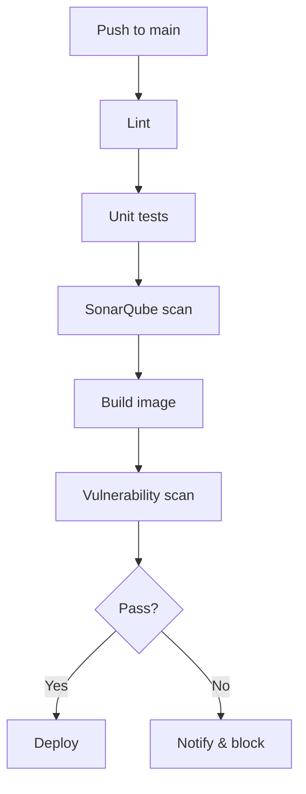
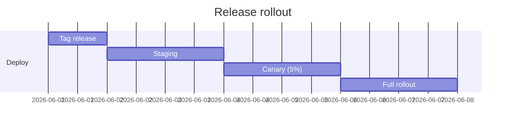
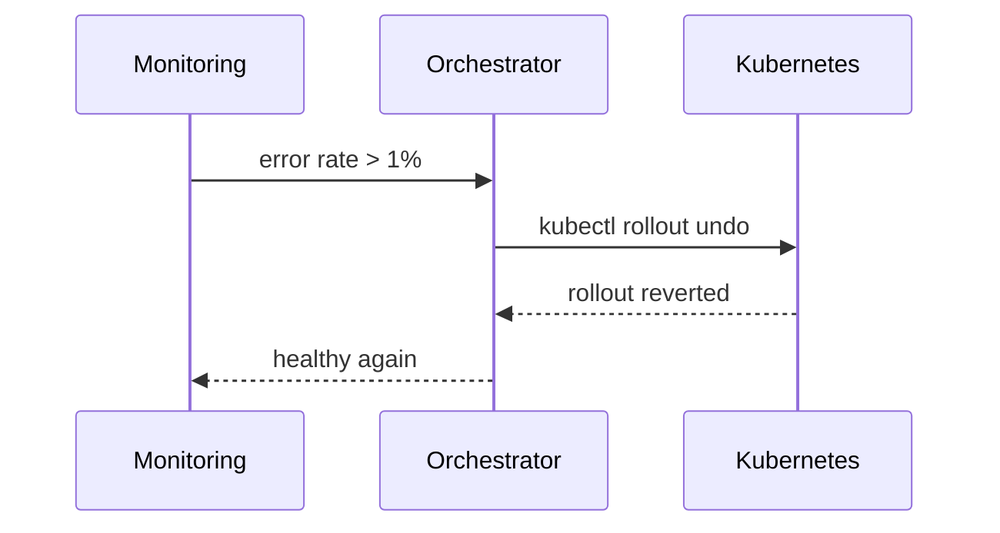

Äre Delivery-Pipeline ze automatiséieren ewechzehuelen manuell Schrëtt a mécht
all Merge reproduzéierbar. Hei ass de Pipeline, deen ech fir Nieweprojeten
benotzen.

## Iwwerbléck



## D'Workflow-Datei

```yaml
name: ci

on:
  push:
    branches: [main]
  pull_request:

jobs:
  build:
    runs-on: ubuntu-latest
    steps:
      - uses: actions/checkout@v4
      - uses: actions/setup-node@v4
        with:
          node-version: 22
          cache: npm
      - run: npm ci
      - run: npm run lint
      - run: npm run test -- --coverage
      - run: npm run build
```

## Release-Prozess

Releases ginn aus Tags geschnidden a verfollegen e stufenweise Rollout.



## Rollback-Sequenz

Wann eng Release brécht, ass de Rollback komplett automatiséiert.



Haalt de Pipeline séier, deterministesch an observéierbar — alles anert kënnt
dann eleng.
