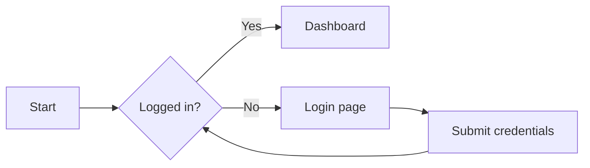
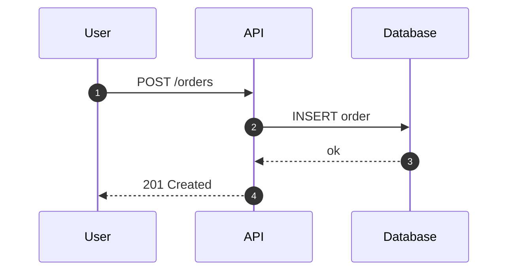
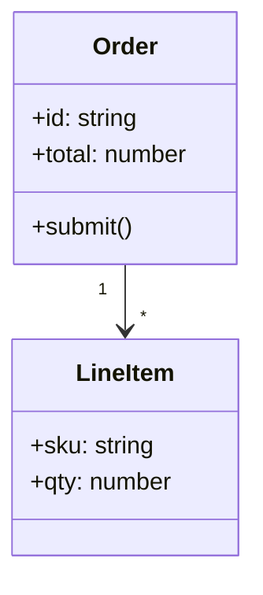
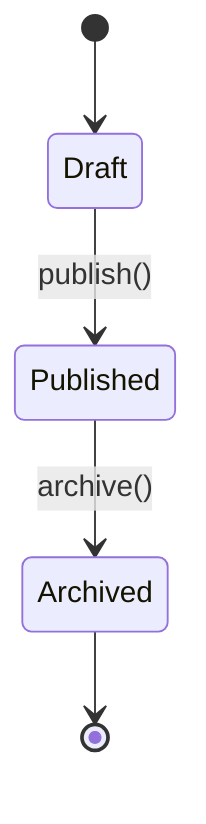
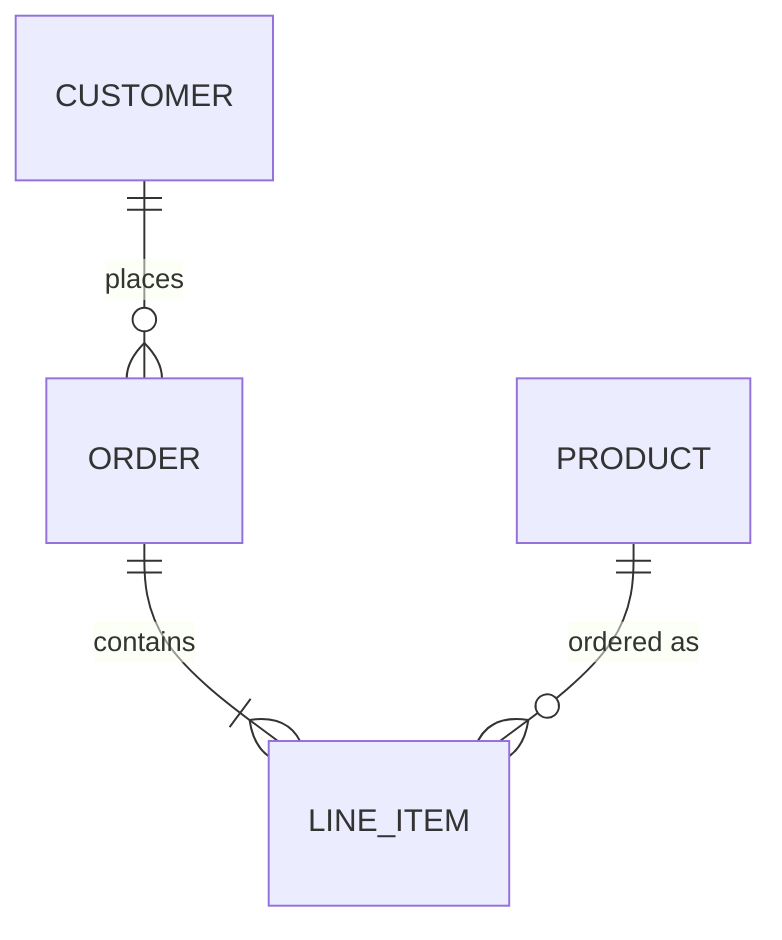
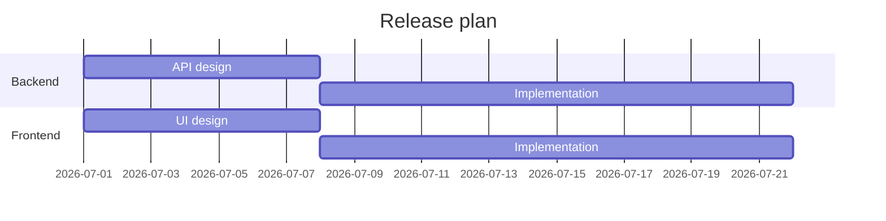
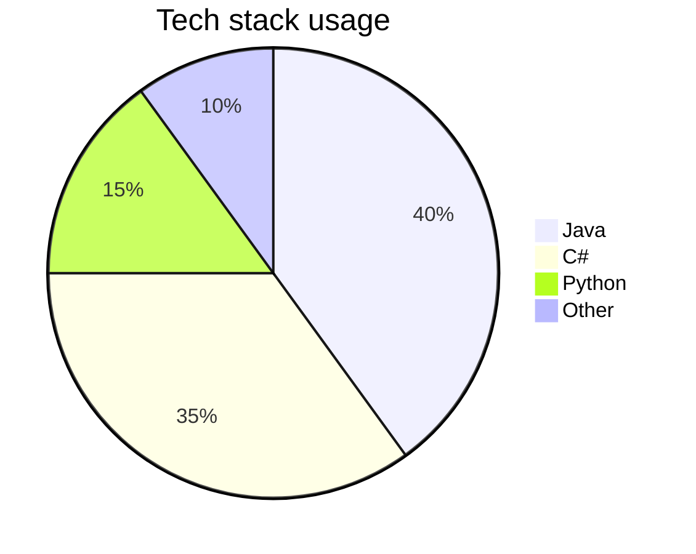
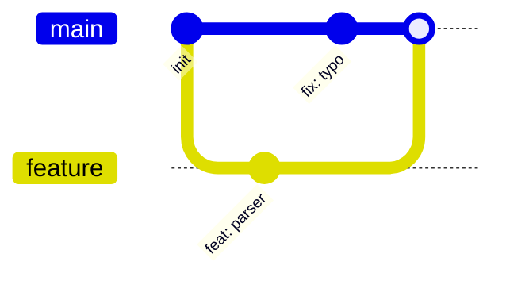
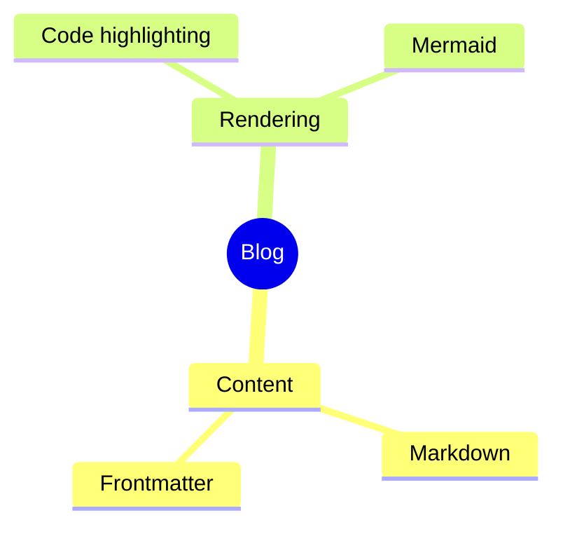
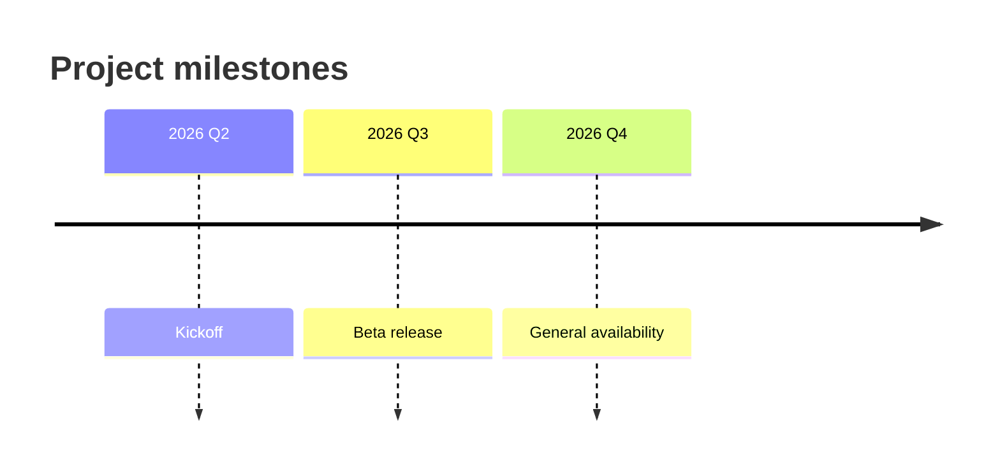

All Code-Blöck mat dem Tag `mermaid` gëtt als SVG-Diagramm gerëndert. Hei ass
en Iwwerbléck iwwer dat, wat verfügbar ass.

## Flowchart

## Sequenz

## Klassendiagramm

## Zoustanksdiagramm

## Entitéits-Bezéiung

## Gantt-Diagramm

## Kreesdiagramm

## Git-Graph

## Mindmap

## Zäitlinn

Setzt ee vun dëse Beispiller an e `mermaid`-Block an et gëtt op der Säit
gerëndert.
