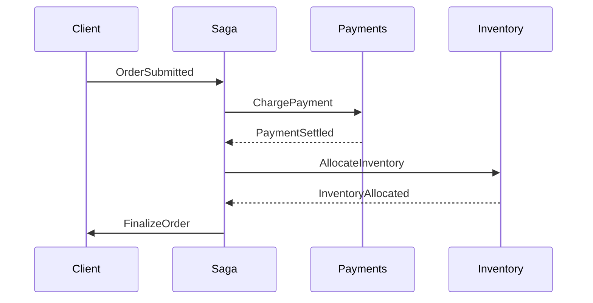
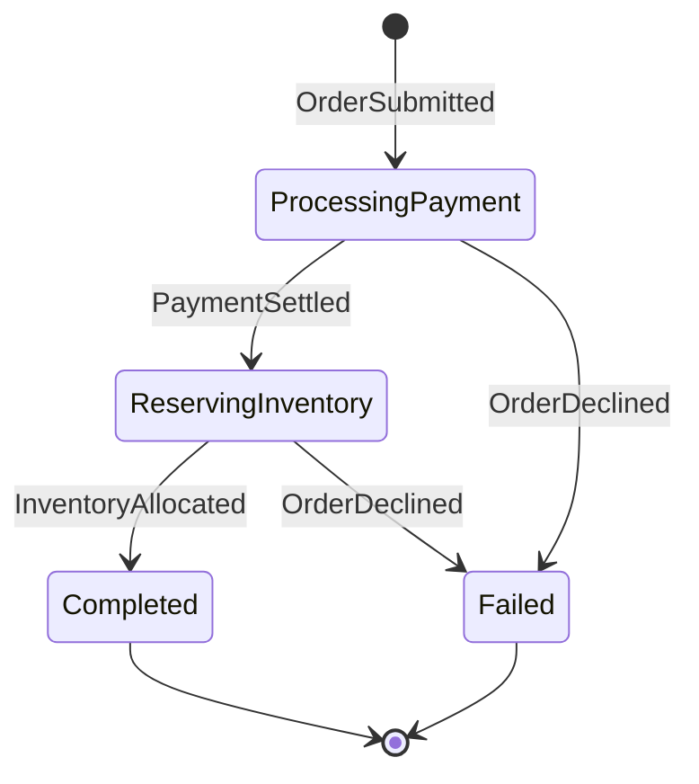

## De Problem mat enger eenzeger Transaktioun

E Checkout ass selten an enger Ufro fäerdeg. D'Geld muss agezunn, de Stock muss
reservéiert an d'Lager muss iwwer d'Liwwerung informéiert ginn. Dat alles an eng
eenzeg verdeelt Transaktioun ze wéckelen — en Zwee-Phase-Commit iwwer Servicer —
gesäit op Pabeier propper aus, brécht awer an der Realitéit séier zesummen.

D'Problem ass, datt kee Service viraussoe kann, wéi laang en anere braucht. E
Bezuel-Provider ka waarden, bis eng Fraud-Prüfung duerch ass, an eng
Stock-Kontroll ka bei Laascht lues sinn. Spären iwwer verschidde Systemer sou
laang opzehalen ass onpraktesch a kann déi ganz Plattform bremsen.

E **Saga** ëmgeet dat, andeems de Flux a lokal Schrëtt opgedeelt gëtt, déi
séier fäerdeg sinn an eenzel réckgängeg gemaach kënne ginn.

## Wat e Saga wierklech ass

E Saga ass eng Kette vu lokalen Aktiounen, wou all Schrëtt eng passend
**kompenséierend Aktioun** huet, déi e réckgängeg mécht, wann e spéidere Schrëtt
feelgeet. Amplaz vun enger atomarer Operatioun gëtt d'Aarbecht a kleng,
onofhängeg erholbar Stécker opgedeelt.

Huelt eng Bestellung als Beispill:



Wann de Stock-Schrëtt mellt, datt en Artikel ausverkaaft ass nodeems d'Bezuelung
scho duerch ass, léist de Saga eng Réckzuelung aus, fir d'Geld zeréckzeginn. All
Deel ass entkoppelt, an näischt bleift de ganze Wee gespaart.

## MassTransit-Sagas si State-Machinen

[MassTransit](https://masstransit.io) setzt Sagas iwwer eng State-Machine ëm,
eng Approche, déi vun Automatonymous ierft. Ier ee Code schreift, hëlleft et,
déi véier Deeler vum Modell ze kennen:

1. **Staaten** — d'Positiounen, an deenen e Workflow ka sinn
2. **Eventer** — Messagen, déi de Workflow vun engem Staat an en anere réckelen
3. **Behavioren** — d'Aarbecht, déi ausgefouert gëtt, wann en Event an engem bestëmmte Staat ukënnt
4. **Instanz** — den persistéierten Datensaz mat den Daten vun enger eenzeger Konversatioun

All State-Machine huet gratis en `Initial`- an e `Final`-Staat. Eng nei Instanz
fänkt am `Initial` un, a `Final` z'erreechen heescht, datt de Saga fäerdeg ass.

Hei ass d'State-Machine, déi mir baue wäerten:



## D'Saga-Instanz

D'Instanz ass d'Entitéit, déi MassTransit tëscht de Messagen persistéiert. Se
hält de Korrelatiounsschlëssel, den aktuellen Staat an d'Business-Daten, déi
d'Schrëtt brauchen.

```csharp
public class OrderState : SagaStateMachineInstance
{
    public Guid CorrelationId { get; set; }
    public string CurrentState { get; set; } = string.Empty;

    public decimal Total { get; set; }
    public string? PaymentReference { get; set; }
    public DateTime? PlacedAt { get; set; }
    public string? BuyerEmail { get; set; }
}
```

`CorrelationId` ass den Identifikateur, deen all erakommende Message mat der
richteger Instanz verbënnt, iwwerdeems `CurrentState` festhält, wou de Workflow
grad steet. Déi reschtlech Eegenschaften droen d'Daten, déi de Prozess ënnerwee
brauch.

## D'Eventer

Eventer sinn d'Messagen, déi Iwwergäng ausléisen. All eenzel muss iwwer en
gemeinsamen Identifikateur mat enger bestëmmter Instanz korreléiert sinn.

```csharp
public record OrderSubmitted(Guid OrderId, decimal Total, string Email);

public record PaymentSettled(Guid OrderId, string PaymentReference);

public record InventoryAllocated(Guid OrderId);

public record OrderDeclined(Guid OrderId, string Reason);
```

Dës Records lafen iwwer de Bus; de Saga reagéiert dorop a kann als Äntwert nei
Commande publizéieren.

## D'State-Machine bauen

D'State-Machine verbënnt Staaten, Eventer a Behavioren an deklaréiert, wéi eng
Iwwergäng erlaabt sinn.

```csharp
public class OrderStateMachine : MassTransitStateMachine<OrderState>
{
    public OrderStateMachine()
    {
        InstanceState(x => x.CurrentState);

        Event(() => OrderSubmitted, x => x.CorrelateById(c => c.Message.OrderId));
        Event(() => PaymentSettled, x => x.CorrelateById(c => c.Message.OrderId));
        Event(() => InventoryAllocated, x => x.CorrelateById(c => c.Message.OrderId));
        Event(() => OrderDeclined, x => x.CorrelateById(c => c.Message.OrderId));

        Initially(
            When(OrderSubmitted)
                .Then(c =>
                {
                    c.Saga.Total = c.Message.Total;
                    c.Saga.BuyerEmail = c.Message.Email;
                    c.Saga.PlacedAt = DateTime.UtcNow;
                })
                .PublishAsync(c => c.Init<ChargePayment>(new
                {
                    OrderId = c.Saga.CorrelationId,
                    Amount = c.Saga.Total
                }))
                .TransitionTo(ProcessingPayment)
        );

        During(ProcessingPayment,
            When(PaymentSettled)
                .Then(c => c.Saga.PaymentReference = c.Message.PaymentReference)
                .PublishAsync(c => c.Init<AllocateInventory>(new
                {
                    OrderId = c.Saga.CorrelationId
                }))
                .TransitionTo(ReservingInventory),
            When(OrderDeclined)
                .TransitionTo(Failed)
                .Finalize()
        );

        During(ReservingInventory,
            When(InventoryAllocated)
                .PublishAsync(c => c.Init<FinalizeOrder>(new
                {
                    OrderId = c.Saga.CorrelationId
                }))
                .TransitionTo(Completed)
                .Finalize(),
            When(OrderDeclined)
                .PublishAsync(c => c.Init<ReimbursePayment>(new
                {
                    OrderId = c.Saga.CorrelationId,
                    Amount = c.Saga.Total
                }))
                .TransitionTo(Failed)
                .Finalize()
        );

        SetCompletedWhenFinalized();
    }

    public State ProcessingPayment { get; private set; } = null!;
    public State ReservingInventory { get; private set; } = null!;
    public State Completed { get; private set; } = null!;
    public State Failed { get; private set; } = null!;

    public Event<OrderSubmitted> OrderSubmitted { get; private set; } = null!;
    public Event<PaymentSettled> PaymentSettled { get; private set; } = null!;
    public Event<InventoryAllocated> InventoryAllocated { get; private set; } = null!;
    public Event<OrderDeclined> OrderDeclined { get; private set; } = null!;
}
```

Opgepasst op d'Kompensatiounslogik: wann de Stock-Schrëtt nom Bezuelen feelgeet,
publizéiert de Saga `ReimbursePayment`, fir de Betrag zeréckzebezuelen. De
gléckleche Wee an de Feelerwee ginn niewentenee deklaréiert, wat de Workflow
einfach liesbar mécht.

## D'Consumer

De Saga ass de Koordinator, net den Ausféierer. Déi richteg Aarbecht läit an de
Message-Consumer, déi Commande veraarbechten an iwwer Eventer zeréckmellen.

```csharp
public class ChargePaymentConsumer(
    IPaymentGateway gateway,
    ILogger<ChargePaymentConsumer> logger) : IConsumer<ChargePayment>
{
    public async Task Consume(ConsumeContext<ChargePayment> context)
    {
        try
        {
            var result = await gateway.ChargeAsync(
                context.Message.OrderId,
                context.Message.Amount);

            if (result.Succeeded)
            {
                await context.Publish<PaymentSettled>(new
                {
                    OrderId = context.Message.OrderId,
                    PaymentReference = result.Reference
                });
            }
            else
            {
                await context.Publish<OrderDeclined>(new
                {
                    OrderId = context.Message.OrderId,
                    Reason = result.RejectionReason
                });
            }
        }
        catch (Exception ex)
        {
            logger.LogError(ex, "Payment failed for order {OrderId}", context.Message.OrderId);

            await context.Publish<OrderDeclined>(new
            {
                OrderId = context.Message.OrderId,
                Reason = "Payment gateway error"
            });
        }
    }
}
```

D'Verantwortungen esou ze trennen erlaabt all Service, sech op seng eege Roll ze
konzentréieren, wärend de Saga de ganze Prozess an déi richteg Richtung beweegt.

## Mat Azure Service Bus opbauen

De Saga-Staat ze persistéieren brauch en Repository. Mir benotzen Entity
Framework Core op SQL Server, mat Azure Service Bus als Transport.

Als éischt déi néideg Packagen:

```powershell
Install-Package MassTransit.EntityFrameworkCore
Install-Package MassTransit.Azure.ServiceBus.Core
Install-Package Microsoft.EntityFrameworkCore.SqlServer
```

Definéiert en `DbContext` an e Class-Map fir d'Saga-Instanz:

```csharp
public class OrderSagaDbContext : SagaDbContext
{
    public OrderSagaDbContext(DbContextOptions options) : base(options) { }

    protected override IEnumerable<ISagaClassMap> Configurations
    {
        get { yield return new OrderStateMap(); }
    }
}

public class OrderStateMap : SagaClassMap<OrderState>
{
    protected override void Configure(EntityTypeBuilder<OrderState> entity, ModelBuilder model)
    {
        entity.Property(x => x.CurrentState).HasMaxLength(64);
        entity.Property(x => x.BuyerEmail).HasMaxLength(256);
        entity.Property(x => x.PaymentReference).HasMaxLength(64);
    }
}
```

Zum Schluss alles an der Applikatioun registréieren:

```csharp
builder.Services.AddDbContext<OrderSagaDbContext>(options =>
    options.UseSqlServer(builder.Configuration.GetConnectionString("SqlServer")));

builder.Services.AddMassTransit(x =>
{
    x.AddSagaStateMachine<OrderStateMachine, OrderState>()
        .EntityFrameworkRepository(r =>
        {
            r.ConcurrencyMode = ConcurrencyMode.Pessimistic;
            r.AddDbContext<DbContext, OrderSagaDbContext>();
        });

    x.UsingAzureServiceBus((context, cfg) =>
    {
        cfg.Host(builder.Configuration.GetConnectionString("ServiceBus"));
        cfg.ConfigureEndpoints(context);
    });
});
```

## Firwat Sagas huelen

- **Resilienz** — all Schrëtt kann eenzel nei probéiert ginn, a Feeler léisen
  Kompensatioun aus, amplaz de System hallef fäerdeg hannerloossen.
- **Visibilitéit** — den aktuellen Staat seet genee, wou all Bestellung steet,
  wat Debuggen an Iwwerwaachung vereinfacht.
- **Loos Kopplung** — Servicer kommunizéieren iwwer Messagen a kënne sech
  separat weiderentwéckelen, ouni de ganze Flux ze briechen.
- **Maintainabilitéit** — eng Ännerung an engem Schrëtt schléit net op déi aner
  duerch.

D'State-Machine zwéngt de Business-Prozess och, explizit ze sinn. All Staat an
Iwwergank ass kloer festgehalen, wat aus engem opaken verdeelte Flux eppes mécht,
dat en neie Teammember novollzéie kann.

## Resumé

E Checkout als MassTransit-Saga ze modelléieren gëtt koordinéiert, erholbar
Workflows ouni de Péng vun de verdeelten Transaktiounen. Definéiert d'Staaten an
d'Eventer, persistéiert d'Instanz a loosst Azure Service Bus d'Messagen droen.
D'Resultat ass e Prozess, dee kloer, observéierbar an nohalteg ass, wann eppes
schif geet.
