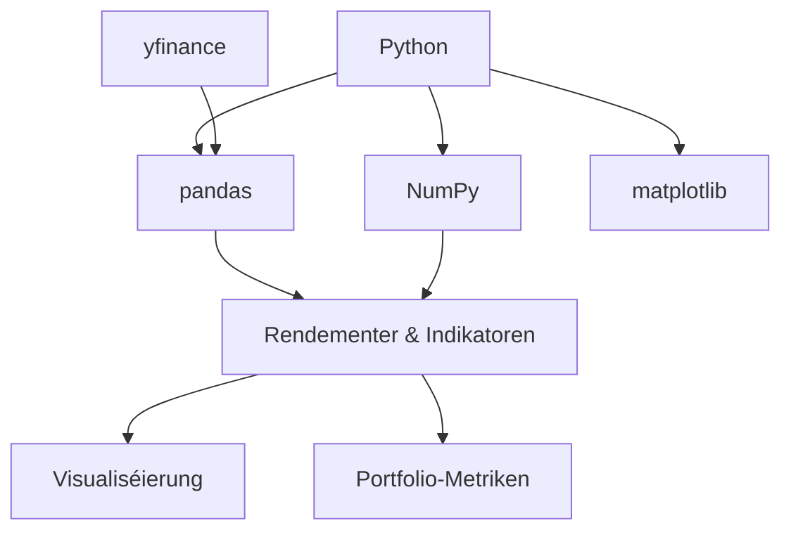

Python ass déi dominant Sprooch vun der moderner Finanz, well säin Ecosystem
alles ofdeckt, vum Datenopraumen bis zur Monte-Carlo-Simulatioun. Dëse Guide
geet duerch d'Kärbibliothéiken mat reale Beispiller.



## NumPy: vectoriséiert Finanz-Mathematik

NumPy gëtt Iech séier, vectoriséiert Arrays — d'Fundament fir all
Finanzberechnung.

```python
import numpy as np

prices = np.array([100, 102, 101, 105, 107])

# simple returns
returns = np.diff(prices) / prices[:-1]
print(returns)  # [ 0.02   -0.0098  0.0396  0.0190]

# log returns
log_returns = np.log(prices[1:] / prices[:-1])

# annualized volatility
volatility = returns.std() * np.sqrt(252)
```

Alles ass elementweis, sou datt Dir Python-Schleifen vermeit an d'Mathematik
séier hält.

## pandas: DataFrames an Zäitserien

pandas wéckelt d'Daten an en `DataFrame` mat mächtegen Zäitserie-Operatiounen.

```python
import pandas as pd

df = pd.DataFrame({
    'date': pd.date_range('2026-01-01', periods=5, freq='D'),
    'close': [100, 102, 101, 105, 107],
})

df['returns'] = df['close'].pct_change()
df['cum_return'] = (1 + df['returns']).cumprod() - 1
```

Resamplet, rullt a verschitt Zäitserien mat agebaute Methoden:

```python
df['sma_3'] = df['close'].rolling(3).mean()
df['prev_close'] = df['close'].shift(1)
```

## Maartdaten mat yfinance kréien

`yfinance` luet historesch Präisser direkt vun Yahoo Finance erof.

```python
import yfinance as yf

ticker = yf.Ticker('AAPL')
history = ticker.history(period='1y', interval='1d')

prices = history['Close']
returns = prices.pct_change().dropna()
```

Dir kënnt och méi Tickers gläichzäiteg mat `yf.download` lueden.

## Rendementer a Portfolio-Metriken

Aus de Rendementer berechent d'Haaptrisikometriken.

```python
def sharpe_ratio(returns, risk_free_rate=0.0):
    excess = returns - risk_free_rate / 252
    return excess.mean() / returns.std() * np.sqrt(252)

sharpe = sharpe_ratio(returns)
vol = returns.std() * np.sqrt(252)
ann_return = (1 + returns.mean()) ** 252 - 1

print(f"Return: {ann_return:.2%}, Vol: {vol:.2%}, Sharpe: {sharpe:.2f}")
```

Korrelatioun tëscht zwee Acteuren:

```python
a = yf.Ticker('AAPL').history(period='1y')['Close'].pct_change()
b = yf.Ticker('MSFT').history(period='1y')['Close'].pct_change()

corr = a.corr(b)
```

## Technesch Indikatoren

Moyenne Mobilité si puer pandas-Opruff.

```python
df['sma_20'] = df['close'].rolling(20).mean()
df['ema_20'] = df['close'].ewm(span=20, adjust=False).mean()
df['signal'] = np.where(df['sma_20'] > df['ema_20'], 1, 0)
```

`rolling` gëtt eng einfach Fënster; `ewm` eng exponentiell. De Crossover vun
enger kuerzer iwwer eng laang Moyenne ass e klassescht Signal.

## Visualiséierung mat matplotlib

Zeechent Präisser an Indikatoren, fir d'Daten z'iwwerpréiwen.

```python
import matplotlib.pyplot as plt

plt.figure(figsize=(10, 5))
plt.plot(df['date'], df['close'], label='Close')
plt.plot(df['date'], df['sma_20'], label='SMA 20')
plt.plot(df['date'], df['ema_20'], label='EMA 20')
plt.legend()
plt.show()
```

## Monte-Carlo-Simulatioun

Simuléiert vill zukünfteg Präispied, andeems Dir zoufälleg Schocken sampelt.

```python
def monte_carlo(initial_price, mu, sigma, days=252, simulations=1000):
    dt = 1 / 252
    paths = np.zeros((days, simulations))
    paths[0] = initial_price
    for t in range(1, days):
        shocks = np.random.normal(mu * dt, sigma * np.sqrt(dt), simulations)
        paths[t] = paths[t - 1] * (1 + shocks)
    return paths

paths = monte_carlo(100, mu=0.07, sigma=0.20)

final_prices = paths[-1]
value_at_risk = np.percentile(final_prices, 5)
```

Dat ënnerleet Risikomoossen wéi Value-at-Risk an d'Optiounspräisser.

## Zum Schluss

NumPy mécht d'Mathematik, pandas formt d'Daten, yfinance liwwert se a
matplotlib weist se. Wann Dir déi véier beherrscht, kënnt Dir Rendementer,
Indikatoren a Monte-Carlo-Simulatiounen berechnen — d'Réckgrat vun der
quantitativer Finanz a Python.
