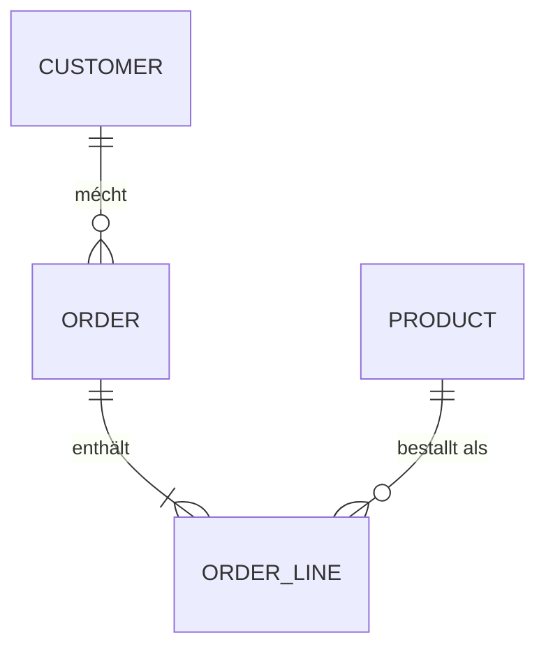
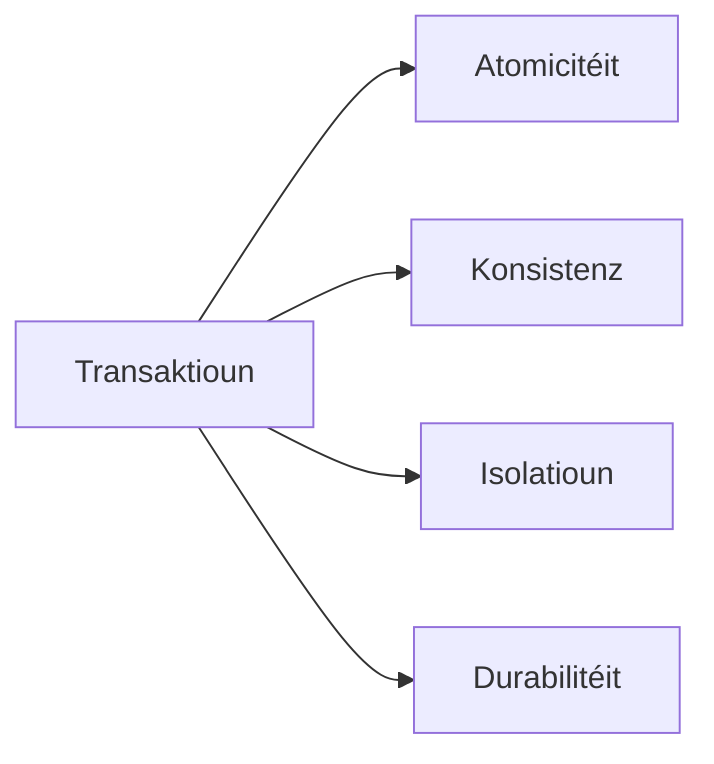
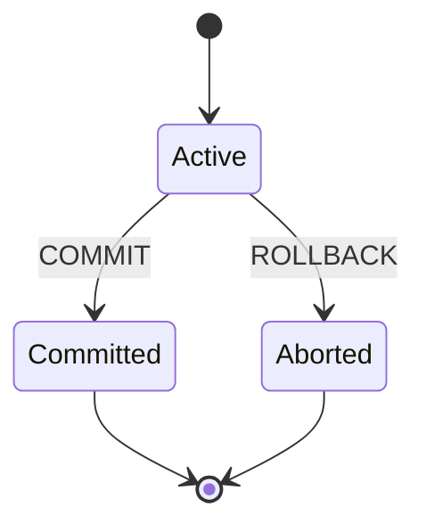
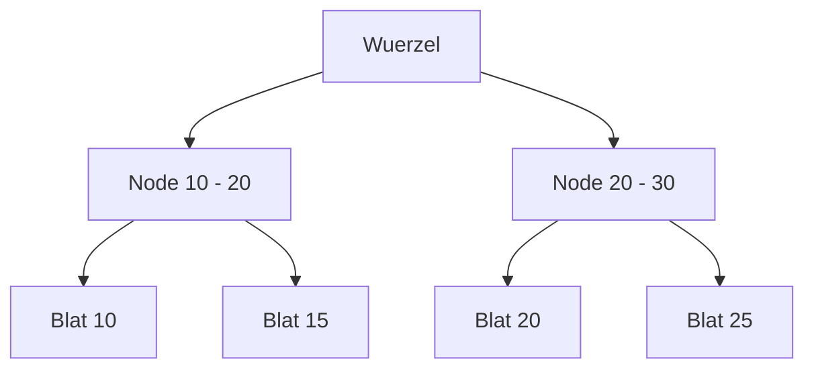

Relationell Datenbanken dreuwen déi meescht Applikatiounen aus engem gudde
Grond: si ginn Iech staark Garantien an e klore Modell. Dëse Guide geet duerch
d'Konzepter, op déi sech all Expert-DBA verléisst, mat SQL-Beispiller an
Diagrammer.



## ACID

ACID beschreift déi véier Garantien, déi eng Transaktioun bitt.



- **Atomicitéit** — all Aussoen erfollegen oder keng.
- **Konsistenz** — d'Datebank wiesselt vun engem gültege Zoustand an en aneren.
- **Isolatioun** — parallel Transaktioune stéieren sech net.
- **Durabilitéit** — committéiert Daten iwwerliewen e Crash.



```sql
BEGIN;

UPDATE accounts SET balance = balance - 100 WHERE id = 1;
UPDATE accounts SET balance = balance + 100 WHERE id = 2;

COMMIT;
```

## Primärschlësselen

E Primärschlëssel identifizéiert all Zeil eendeiteg. En ass ëmmer `NOT NULL` an
eendeiteg. Léiwer e Surrogat-Schlëssel (Identity, UUID) wéi en natierleche
Schlëssel, dee sech ännere kann.

```sql
CREATE TABLE customer (
  id BIGINT GENERATED ALWAYS AS IDENTITY PRIMARY KEY,
  email VARCHAR(255) NOT NULL UNIQUE
);
```

Kompositschlësselen identifizéieren eng Zeil iwwer méi Spalten zesummen — dee
klassesche Fall vun enger Join-Tabelle.

```sql
CREATE TABLE order_line (
  order_id BIGINT NOT NULL,
  product_id BIGINT NOT NULL,
  quantity INT NOT NULL,
  PRIMARY KEY (order_id, product_id)
);
```

## Friemschlësselen

E Friemschlëssel garantéiert d'referenziell Integritéit: all Wäert muss an der
referenzéierter Tabelle existéieren. `ON DELETE` / `ON UPDATE` soen der Engine,
wat se maache soll, wann den Elter sech ännert.

```sql
CREATE TABLE "order" (
  id BIGINT PRIMARY KEY,
  customer_id BIGINT NOT NULL
    REFERENCES customer(id) ON DELETE CASCADE
);
```

`CASCADE` läscht d'Kand, wann den Elter verschwënnt; `SET NULL` läscht d'Spalt;
`RESTRICT` blockéiert d'Ännerung.

## SQL-Commande: DDL, DQL, DML, DCL, TCL

SQL deelt sech a fënnef Commandefamillen op.

### DDL — Data Definition Language

Definéiert an ännert de Schema.

```sql
CREATE TABLE product (
  id BIGINT GENERATED ALWAYS AS IDENTITY PRIMARY KEY,
  name VARCHAR(255) NOT NULL,
  price NUMERIC(10, 2) NOT NULL
);

ALTER TABLE product ADD COLUMN active BOOLEAN DEFAULT true;

DROP TABLE product;
```

### DQL — Data Query Language

Liest Daten. Et ass einfach `SELECT`.

```sql
SELECT id, name, price
FROM product
WHERE active
ORDER BY price DESC;
```

### DML — Data Manipulation Language

Ännert d'Donnéeën: `INSERT`, `UPDATE`, `DELETE`.

```sql
INSERT INTO product (name, price) VALUES ('Keyboard', 89.90);

UPDATE product SET price = 79.90 WHERE name = 'Keyboard';

DELETE FROM product WHERE id = 1;
```

`UPDATE` an `DELETE` mussen eng `WHERE`-Klausel droen — ouni si betreffen se
all Zeil.

### DCL — Data Control Language

Geréiert Permissiounen mat `GRANT` a `REVOKE`.

```sql
GRANT SELECT, INSERT, UPDATE ON product TO app_user;
REVOKE DELETE ON product FROM app_user;
```

### TCL — Transaction Control Language

Kontrolléiert Transaktioune mat `COMMIT`, `ROLLBACK` a `SAVEPOINT`.

```sql
BEGIN;

UPDATE accounts SET balance = balance - 100 WHERE id = 1;
SAVEPOINT before_credit;
UPDATE accounts SET balance = balance + 100 WHERE id = 2;

ROLLBACK TO before_credit;
COMMIT;
```

## Joins (Jointuren)

Joins kombinéieren Zeilen aus zwou oder méi Tabellen iwwer eng Join-Bedingung.

```sql
-- INNER JOIN: only matching rows
SELECT c.name, o.id AS order_id, o.total
FROM customer c
JOIN "order" o ON o.customer_id = c.id;

-- LEFT JOIN: all customers, even without orders (NULL on the right)
SELECT c.name, o.id AS order_id
FROM customer c
LEFT JOIN "order" o ON o.customer_id = c.id;

-- RIGHT JOIN: all orders, even without a customer (NULL on the left)
SELECT c.name, o.id AS order_id
FROM customer c
RIGHT JOIN "order" o ON o.customer_id = c.id;

-- FULL OUTER JOIN: both sides, NULL where missing
SELECT c.name, o.id AS order_id
FROM customer c
FULL OUTER JOIN "order" o ON o.customer_id = c.id;
```

```sql
-- CROSS JOIN: every combination of rows
SELECT c.name, p.name
FROM customer c
CROSS JOIN product p;
```

```sql
-- self join: employees and their managers
SELECT e.name AS employee, m.name AS manager
FROM employee e
LEFT JOIN employee m ON m.id = e.manager_id;
```

Joins passen natierlech mat Aggregatioun zesummen:

```sql
-- order totals from line items
SELECT o.id, SUM(ol.quantity * p.price) AS total
FROM "order" o
JOIN order_line ol ON ol.order_id = o.id
JOIN product p ON p.id = ol.product_id
GROUP BY o.id;
```

Benotzt Table-Aliase (`c`, `o`) fir d'Liesbarkeet, an haalt d'Join-Bedingung am
`ON` amplaz am `WHERE`, fir datt d'Intent kloer bleift.

## Indexen

En Index beschleunegt Lookups op Käschte vu Schreifperformance a Späicher. Déi
meescht Datebanke benotzen e B-tree, deen d'Daten sortéiert hält fir séier
Equality- a Range-Scans.



- **Unique Index** — setzt Eendeitegkeet duerch wéi en Unique Constraint.
- **Kompositindex** — deckt méi Spalten, vu lénks no riets.
- **Covering Index** — späichert zousätzlech Spalten, fir d'Tabelle ni ze beréieren.
- **Partiellen Index** — indexéiert nëmmen d'Zeilen, déi eng Bedingung erfëllen.

```sql
CREATE UNIQUE INDEX idx_customer_email ON customer(email);

CREATE INDEX idx_order_customer ON "order"(customer_id);

CREATE INDEX idx_order_line_product
  ON order_line(product_id) INCLUDE (quantity);
```

Eng einfach Reegel: indexéiert d'Spalten, déi Dir filtert (`WHERE`), joint
(`JOIN`) a sortéiert (`ORDER BY`).

## Triggers

En Trigger leeft automatesch virun oder no `INSERT`, `UPDATE` oder `DELETE`. Si
sinn ideal fir Audit-Loggen an ofgeleet Spalten. A PostgreSQL lieft d'Logik an
enger Trigger-*Funktioun*.

```sql
CREATE FUNCTION audit_order() RETURNS trigger AS $$
BEGIN
  INSERT INTO audit_log (table_name, row_id, action, changed_at)
  VALUES ('order', COALESCE(NEW.id, OLD.id), TG_OP, now());
  RETURN COALESCE(NEW, OLD);
END;
$$ LANGUAGE plpgsql;

CREATE TRIGGER order_audit
AFTER INSERT OR UPDATE OR DELETE ON "order"
FOR EACH ROW EXECUTE FUNCTION audit_order();
```

## Funktiounen

Funktiounen si widderverwendbar, komponéierbar Stécker Logik, déi e Wäert
zeréckginn.

Eng Skalarfunktioun:

```sql
CREATE FUNCTION order_total(order_id BIGINT) RETURNS NUMERIC AS $$
  SELECT COALESCE(SUM(price * quantity), 0)
  FROM order_line
  JOIN product ON product.id = order_line.product_id
  WHERE order_line.order_id = order_total.order_id;
$$ LANGUAGE sql;
```

Eng Table-Funktioun (gëtt e Set vun Zeilen zeréck):

```sql
CREATE FUNCTION customer_orders(customer_id BIGINT)
RETURNS TABLE(order_id BIGINT, total NUMERIC, placed_at TIMESTAMPTZ) AS $$
  SELECT id, total, placed_at
  FROM "order"
  WHERE customer_id = customer_orders.customer_id;
$$ LANGUAGE sql;
```

## Stored Procedures

Proceduren sinn ewéi Funktiounen, kënnen awer hir eege Transaktioune geréieren a
mussen kee Wäert zeréckginn. Benotzt se fir méi-Schrëtt-, transaktional
Operatiounen.

```sql
CREATE PROCEDURE transfer(from_acc BIGINT, to_acc BIGINT, amount NUMERIC)
LANGUAGE plpgsql
AS $$
BEGIN
  UPDATE accounts SET balance = balance - amount WHERE id = from_acc;
  UPDATE accounts SET balance = balance + amount WHERE id = to_acc;
  COMMIT;
END;
$$;
```

## Isolatiounsniveauen

Isolatioun kontrolléiert, wéi vill parallel Transaktioune vunenee gesinn.

```sql
SET TRANSACTION ISOLATION LEVEL READ COMMITTED;
```

- **Read uncommitted** — kann net-committéiert Daten liesen (dirty reads).
- **Read committed** — all Ausso gesäit e stabilen Snapshot.
- **Repeatable read** — déi ganz Transaktioun gesäit ee Snapshot.
- **Serializable** — Transaktioune behuele sech, wéi wa se eng no där anerer lafen.

## Wichteg Praktiken

- **Benotzt Stored Procedures fir de CRUD** — zentraliséiert d'Datelogik op enger
  Plaz a gëtt Zougang op d'Prozedur amplaz op d'Tabelle.
- **Benotzt parametriséiert Querien** — concatenéiert ni Benotzerinput an SQL;
  bindt Wäerter als Parameter, fir SQL-Injektioun ze verhënneren.
- **Gitt Permissiounen** — loosst Benotzer CRUD-Prozeduren ausféieren, ouni
  direkten Tabellenzougang.

```sql
-- parameterized query: the value is bound as data, not SQL
SELECT id, name FROM customer WHERE email = $1;
```

```sql
-- grant execution through a procedure, not the table
GRANT EXECUTE ON PROCEDURE create_customer TO app_user;
REVOKE ALL ON customer FROM app_user;
```

Parametriséiert Aussoen trennen de SQL vun de Wäerter, sou datt Input als Daten
behandelt gëtt. Kombinéiert mat Prozedurniveau-Permissioune bleift d'Uewerfläch
kleng an auditéierbar.

## Zum Schluss

ACID gëtt Iech Korrektheet; Schlësselen ginn Integritéit; Indexe ginn Tempo;
Triggers, Funktiounen a Prozedure ginn eng widderverwendbar, duerchgesat Logik.
Dat alles ze beherrschen — an d'Kompromësser ze kennen — ënnerscheet en DBA vun
engem Entwéckler, deen zoufälleg SQL schreift.
