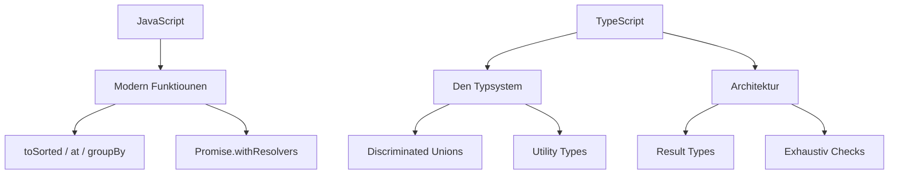

JavaScript kritt dauernd kleng, prezis Features, an TypeScript mécht aus
Runtime-Feeler ëmmer méi Compile-Zäit-Feeler. Dëse Guide deckt dat of, wat haut
fir Front-End-Code an der Produktioun wichteg ass, mat Beispiller.



## JavaScript: déi modern Essentiell

### Optional Chaining an Nullish Coalescing

Verschachtelt Daten liesen ouni ze explodéieren, an nëmmen op `null`/`undefined`
zréckfalen.

```typescript
const city = user?.address?.city
const label = name ?? 'Anonymous'
const retries = config?.retries ?? 3
```

### Logesch Zouwäisung

Eng Variabel nëmmen ännere, wann se falsch, nullish oder wouer ass.

```typescript
user.nickname ||= user.firstName
settings.theme ??= 'dark'
```

### Net-mutéierend Array-Methoden

`toSorted`, `toReversed`, `toSpliced` a `with` ginn nei Arrays zeréck amplaz ze
mutéieren, wat perfekt mat immutablem Zoustand zesummegeet.

```typescript
const sorted = items.toSorted((a, b) => a.score - b.score)
const reversed = items.toReversed()
const first = items.at(0)
const last = items.at(-1)
```

### Gruppéieren a Klonen

`Object.groupBy` verdeelt eng Kollektioun an enger Zeil, an `structuredClone`
macht eng déif Kopie ouni JSON-Gefuddel.

```typescript
const byStatus = Object.groupBy(orders, (o) => o.status)

const copy = structuredClone(original)
```

### Promise-Hëllefen

`Promise.withResolvers` gëtt Iech d'resolve/reject-Funktiounen, ouni eng Promise
an e Konstruktor ze wéckelen.

```typescript
const { promise, resolve, reject } = Promise.withResolvers<string>()

async function nextMessage(): Promise<string> {
  return promise
}
```

`Array.fromAsync` mécht aus engem asynchrone Iterable en Array.

```typescript
const lines = await Array.fromAsync(stream)
```

## Promises an Observables

### Promises

Eng Promise representéiert e Wäert, deen méi spéit verfügbar ass.
`async`/`await` flaacht d'Callbacken of.

```typescript
function fetchUser(id: number): Promise<User> {
  return fetch(`/api/users/${id}`).then((res) => res.json())
}

async function loadUser(id: number): Promise<User | null> {
  try {
    return await fetchUser(id)
  } catch (error) {
    console.error('failed to load user', error)
    return null
  }
}
```

Lausst onofhängeg Aarbecht parallel an sammelt d'Resultater:

```typescript
const [a, b, c] = await Promise.all([
  fetchUser(1),
  fetchUser(2),
  fetchUser(3),
])
```

### Observables

Observables (RxJS) modelléieren e Stroum vu Wäerter iwwer d'Zäit. Baut Pipelines
aus Operatoren an deabonnéiert Iech ëmmer.

```typescript
import { from, fromEvent } from 'rxjs'
import { debounceTime, filter, map, switchMap } from 'rxjs/operators'

const search$ = fromEvent<InputEvent>(input, 'input').pipe(
  debounceTime(300),
  map((event) => (event.target as HTMLInputElement).value),
  filter((term) => term.length >= 3),
  switchMap((term) =>
    from(fetch(`/api/search?q=${term}`).then((res) => res.json())),
  ),
)

const subscription = search$.subscribe({
  next: (results) => console.log(results),
  error: (err) => console.error(err),
})

subscription.unsubscribe()
```

Eng Promise produzéiert ee Wäert; en Observable produzéiert méi iwwer d'Zäit.
Benotzt Promise fir eenzel Resultater, Observables fir Eventer a Stréim.

## TypeScript: den Typsystem, deen zielt

### `unknown` schléit `any`

`any` schalt den Typprüfer aus; `unknown` zwéngt Iech, fir d'éischt anzeschränken.

```typescript
function parse(value: unknown): string {
  if (typeof value === 'string') return value
  throw new Error('not a string')
}
```

### `satisfies` an `as const`

`satisfies` prüft en Objet géint en Typ ouni en ze verbreeden, an `as const`
sperrt d'Wäerter op hir Literaltypen.

```typescript
const palette = {
  primary: '#c770f0',
  danger: '#ef4444',
} satisfies Record<string, string>

const routes = ['/', '/about', '/blog'] as const
type Route = (typeof routes)[number]
```

### Discriminated Unions

Modelléiert all Zoustand mat engem gemeinsame `kind`-Feld, an de Compiler
schränkt fir Iech an — d'Fundament vun typiséierte Reduceren a State-Machinen.

```typescript
type State =
  | { kind: 'idle' }
  | { kind: 'loading' }
  | { kind: 'success'; data: User[] }
  | { kind: 'error'; message: string }

function render(state: State): string {
  switch (state.kind) {
    case 'idle': return 'Waiting…'
    case 'loading': return 'Loading…'
    case 'success': return state.data.map((u) => u.name).join(', ')
    case 'error': return state.message
  }
}
```

### Type Predicates

Schränkt `unknown` sécher op eng konkret Form an.

```typescript
function isUser(value: unknown): value is User {
  return typeof value === 'object' && value !== null && 'id' in value
}
```

### Template Literal Types

Baut String-Typen aus Unione — ideal fir typiséiert Routen an API-Pied.

```typescript
type Route = `/api/${'users' | 'orders'}/${string}`
```

### `const` Typparameter

Haalt Tuple-Literale prezis, ouni iwwerall `as const` ze verstreien.

```typescript
function preserve<const T>(items: T[]): T[] {
  return items
}

const pair = preserve([1, 'two']) // [number, string]
```

### Utility Types

Komponéiert nei Typen aus existéierende, amplaz se vun Hand ze schreiwen.

```typescript
type UserInput = Omit<User, 'id' | 'createdAt'>
type PartialUser = Partial<User>
type ReadonlyUser = Readonly<User>
```

## Rezent TypeScript-Features

### Standard Decorators

Decorators sinn elo Deel vun der Sprooch, ouni experimentelle Fändel.

```typescript
function logged(target: unknown, context: ClassMethodDecoratorContext) {
  // wrap the method
}

class Service {
  @logged
  fetchData() {
    /* ... */
  }
}
```

### Explizit Ressourcemanagement

`using` mécht d'Opraumen deterministesch iwwer `Symbol.dispose`.

```typescript
function readFile(path: string) {
  using handle = openFile(path)
  return handle.read()
}
```

### `NoInfer`

Verhënnert, datt de Compiler en Typargument op enger bestëmmter Positioun
inferéiert.

```typescript
declare function createPair<T>(first: T, second: NoInfer<T>): T

const result = createPair('a', 'b') // T gëtt nëmmen aus dem éischten Argument inferéiert
```

## Architekturmuster

### Result Types amplaz Exceptions

Stellt Erfolleg a Feelerschlag am Typ duer, sou datt Oprufer d'Feelerbehandlung
net vergiesse kënnen.

```typescript
type Result<T, E = Error> =
  | { ok: true; value: T }
  | { ok: false; error: E }

function divide(a: number, b: number): Result<number> {
  if (b === 0) return { ok: false, error: new Error('division by zero') }
  return { ok: true, value: a / b }
}
```

### Exhaustiv Checks

En `never`-Hëllefsmëttel garantéiert, datt all Fall behandelt gëtt, wann d'Unioun
wiisst.

```typescript
function assertNever(value: never): never {
  throw new Error(`Unexpected value: ${value}`)
}

// switch (state.kind) { ... default: assertNever(state) }
```

### Branded Types

Verhënnert, datt een Identifikateure vermëscht, déi de selwechte Basistyp deelen.

```typescript
type UserId = string & { readonly __brand: 'UserId' }
type OrderId = string & { readonly __brand: 'OrderId' }

function toUserId(id: string): UserId {
  return id as UserId
}
```

### Immutabilitéit standardméisseg

Léiwer `readonly`, `as const` an net-mutéierend Methoden, sou datt
Zoustandsännerungen explizit sinn.

```typescript
interface Config {
  readonly apiUrl: string
  readonly retries: number
}
```

### ESM an Tree-Shaking

Benotzt ES-Moduler an named Imports, fir datt Bundler onbenotzte Code kënnen
ewechhuelen, a léiwer Type-Only-Imports, fir datt Typpen ni an d'Runtime-Bundles
kommen.

```typescript
import type { User } from './models'
import { fetchUsers } from './api'
```

## Zum Schluss

De modernen Front-End-Expert verléisst sech op déi nei JavaScript-APIen fir
Dateveraarbechtung, an op TypeScript seng Discriminated Unions, Utility Types a
Result Types, fir Feeler op d'Compile-Zäit ze verleeën. Wann Dir dës Muster
adoptéiert, gëtt Äre Code méi kleng, méi sécher a vill méi einfach ze verstoen.
