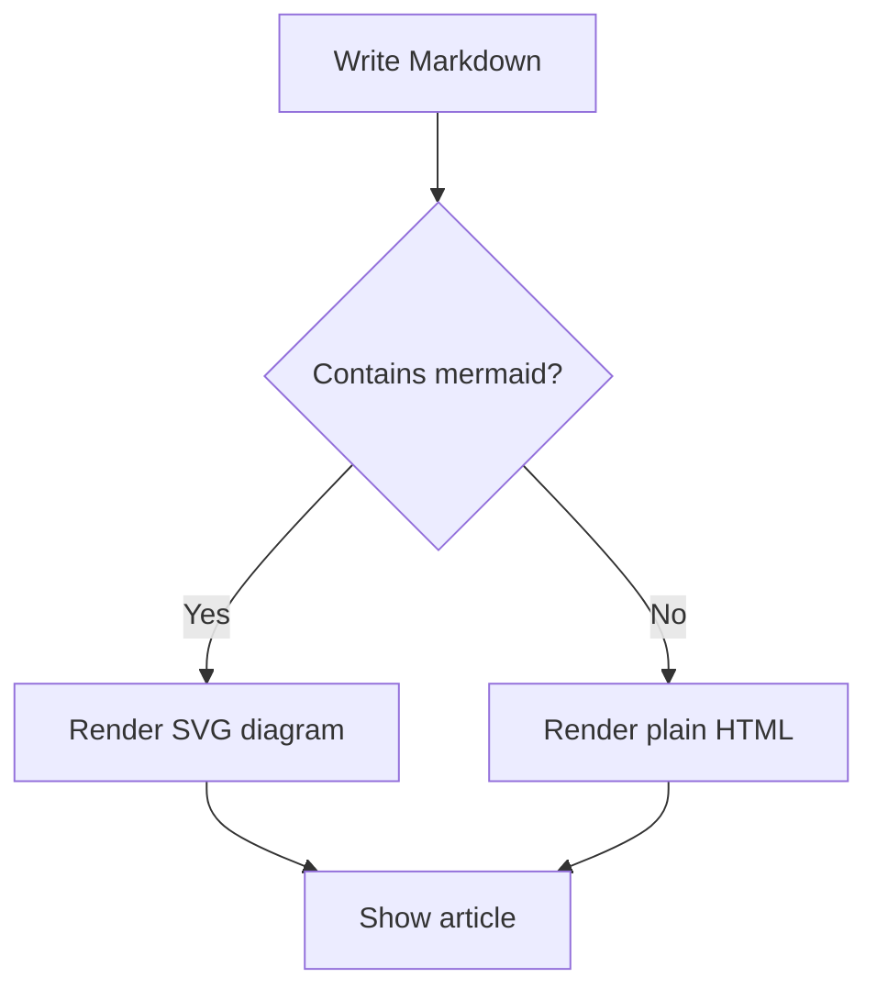
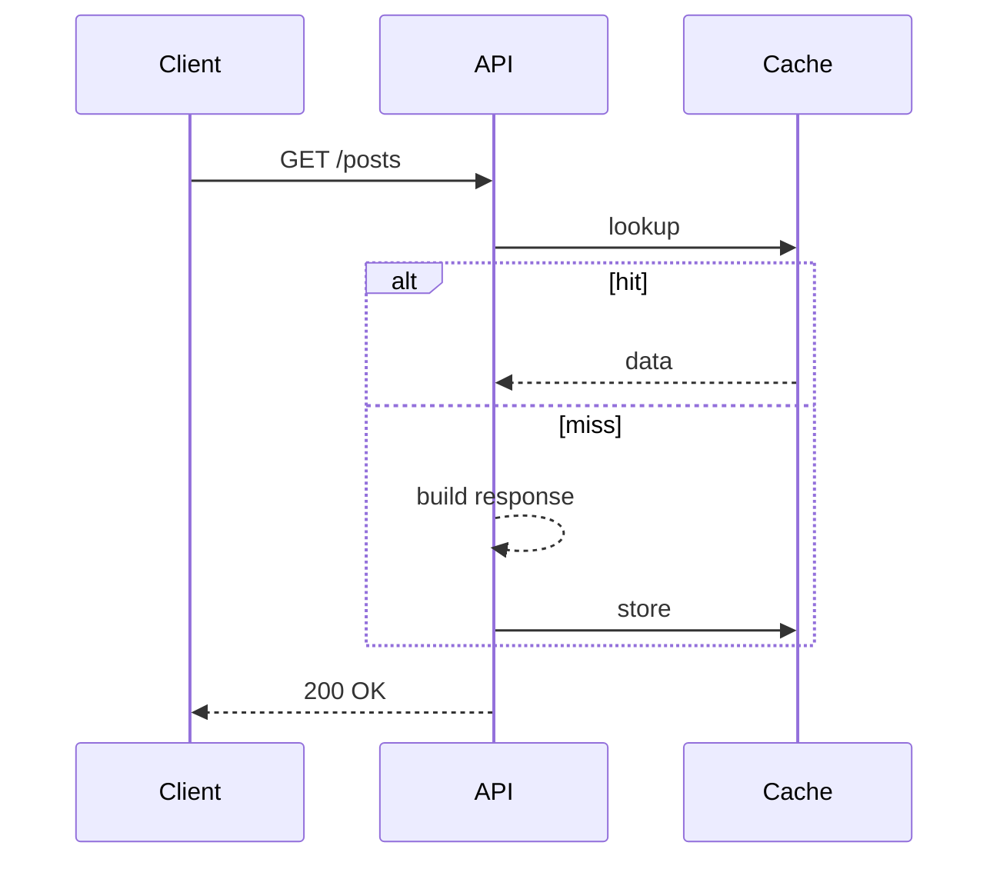

## Firwat e Blog?

Ech hunn dëse Raum gebaut, fir d'Notizen a Lektiounen ze deelen, déi ech beim
Schaffen un Nieweprojeten a Produktiounssystemer sammelen. Et gi déif Ablécker
iwwer **SolidJS**, **.NET**, **Java**, **Angular** an d'Tools dohannert.

## D'Kraaft vu Markdown

D'Artikele ginn als Markdown geschriwwen, sou datt ech mech op den Inhalt
konzentréiere kann. De Renderer ënnerstëtzt dat Wichtegst:

- Iwwerschrëften, Lëschten an Zitater
- Tabellen
- Linken a Biller
- Code-Bléck mat **Syntax-Highlighting**
- **Mermaid**-Diagrammer

## Syntax-Highlighting

Code-Bléck ginn automatesch no der Sprooch gefierft:

```typescript
export interface Feature<T> {
  run(input: T): Promise<T>
}

export const identity = <T,>(value: T): T => value
```

```csharp
public sealed class Greeter
{
    public string Hello(string name) => $"Hello, {name}!";
}
```

## Mermaid-Diagrammer

Diagrammer ginn aus engem `mermaid`-Block gerëndert:



Sequenz-Diagrammer funktionéieren och:



## Zum Schluss

Dat war d'Basis. Bleift drun fir méi detailléiert technesch Artikelen.
