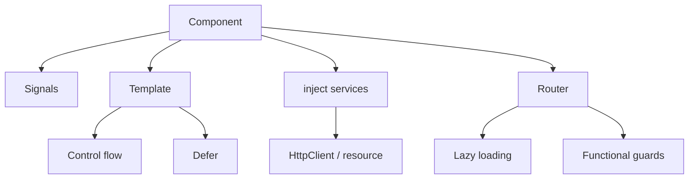

[[para-angular-has-changed-a]]



[[standalone-components]]

[[para-ngmodule-is-now-optional]]

```typescript
import { Component, input, output } from '@angular/core'

@Component({
  selector: 'app-user-card',
  standalone: true,
  imports: [],
  template: `
    <div class="card">
      <h3>{{ name() }}</h3>
      <button (click)="select.emit(id())">Select</button>
    </div>
  `,
})
export class UserCardComponent {
  readonly id = input.required<number>()
  readonly name = input.required<string>()
  readonly select = output<number>()
}
```

[[signals-the-reactivity-core]]

[[para-signals-replaced-most-of]]

```typescript
import { Component, computed, effect, signal } from '@angular/core'

@Component({ /* ... */ })
export class CounterComponent {
  readonly count = signal(0)
  readonly double = computed(() => this.count() * 2)

  constructor() {
    effect(() => console.log('count is now', this.count()))
  }

  increment() {
    this.count.update((n) => n + 1)
  }
}
```

[[para-modern-two-way-binding-uses]]

```typescript
readonly value = model(0)
readonly list = viewChild.required(ElementRef)
```

[[para-for-asynchronous-data-resource]]

```typescript
import { resource, signal } from '@angular/core'

export class UserListComponent {
  readonly search = signal('')

  readonly users = resource({
    request: () => ({ q: this.search() }),
    loader: ({ request }) => fetchUsers(request.q),
  })
}
```

[[para-resource-exposes-value-status]]

[[built-in-control-flow-and-deferred-loading]]

[[para-the-old-ngif]]

```html
@if (user(); as u) {
  <p>Hello {{ u.name }}</p>
} @else {
  <p>Not signed in</p>
}

@for (item of items(); track item.id) {
  <li>{{ item.label }}</li>
} @empty {
  <li>Nothing here</li>
}

@switch (status()) {
  @case ('ok') { <span>OK</span> }
  @case ('error') { <span>Error</span> }
  @default { <span>Unknown</span> }
}
```

[[para-load-heavy-pieces-only]]

```html
@defer (on viewport) {
  <app-heavy-chart />
} @placeholder {
  <p>Chart appears here…</p>
} @loading (minimum 200ms) {
  <p>Loading…</p>
}
```

[[zoneless-change-detection]]

[[para-you-can-now-drop]]

```typescript
import { bootstrapApplication } from '@angular/platform-browser'
import { provideZonelessChangeDetection } from '@angular/core'

bootstrapApplication(AppComponent, {
  providers: [provideZonelessChangeDetection()],
})
```

[[para-zoneless-means-less-runtime]]

[[dependency-injection-with-inject]]

[[para-constructor-injection-is-replaced]]

```typescript
import { inject, Injectable } from '@angular/core'

@Injectable({ providedIn: 'root' })
export class UserService {
  readonly api = inject(ApiService)
  readonly users = this.api.getUsers()
}
```

[[routing-functional-guards-and-lazy-loading]]

[[para-guards-resolvers-and-interceptors]]

```typescript
import { inject } from '@angular/core'
import type { CanActivateFn } from '@angular/router'
import type { HttpInterceptorFn } from '@angular/common/http'

// guard
export const authGuard: CanActivateFn = () => inject(AuthService).isLoggedIn()

// interceptor
export const authInterceptor: HttpInterceptorFn = (req, next) => {
  const token = inject(AuthService).token()
  return next(req.clone({ setHeaders: { Authorization: `Bearer ${token}` } }))
}
```

[[para-lazy-loading-is-per-route]]

```typescript
export const routes: Routes = [
  {
    path: 'admin',
    loadChildren: () =>
      import('./admin/admin.routes').then((m) => m.adminRoutes),
  },
  {
    path: 'profile',
    loadComponent: () =>
      import('./profile/profile.component').then((m) => m.ProfileComponent),
  },
]
```

[[http-with-signals]]

[[para-httpclient-works-directly-with]]

```typescript
import { HttpClient, provideHttpClient } from '@angular/common/http'

@Injectable({ providedIn: 'root' })
export class UserService {
  private readonly http = inject(HttpClient)

  readonly users = this.http.get<User[]>('/api/users')
}
```

[[para-for-request-scoped-loading-that]]

```typescript
import { inject, Injectable, signal } from '@angular/core'
import { HttpClient } from '@angular/common/http'
import { rxResource } from '@angular/core/rxjs-interop'

@Injectable({ providedIn: 'root' })
export class UserService {
  private readonly http = inject(HttpClient)
  readonly query = signal('')

  readonly users = rxResource({
    request: () => this.query(),
    loader: ({ request }) => this.http.get<User[]>(`/api/users?q=${request}`),
  })
}
```

[[para-rxresource-exposes-the-same]]

[[state-management-with-ngrx]]

[[para-for-global-state-ngrx]]

```typescript
import { computed } from '@angular/core'
import { patchState, signalStore, withComputed, withMethods, withState } from '@ngrx/signals'

interface CartState {
  items: CartItem[]
}

export const CartStore = signalStore(
  withState<CartState>({ items: [] }),
  withComputed(({ items }) => ({
    count: computed(() => items().length),
    total: computed(() => items().reduce((sum, item) => sum + item.price, 0)),
  })),
  withMethods((store) => ({
    addItem(item: CartItem) {
      patchState(store, { items: [...store.items(), item] })
    },
    removeItem(id: string) {
      patchState(store, { items: store.items().filter((item) => item.id !== id) })
    },
  })),
)
```

[[para-provide-the-store-and]]

```typescript
@Component({
  selector: 'app-cart',
  standalone: true,
  providers: [CartStore],
  template: `
    <p>{{ cartStore.count() }} items — {{ cartStore.total() | currency }}</p>
    <button (click)="cartStore.addItem({ id: '1', price: 10 })">Add</button>
  `,
})
export class CartComponent {
  readonly cartStore = inject(CartStore)
}
```

[[para-for-collections-withentities-gives]]

```typescript
import { setAllEntities, withEntities } from '@ngrx/signals/entities'

export const UserStore = signalStore(
  withEntities<User>(),
  withMethods((store) => ({
    load(users: User[]) {
      patchState(store, setAllEntities(users))
    },
  })),
)
```

[[para-for-complex-asynchronous-orchestration]]

```typescript
@Injectable()
export class UserEffects {
  private readonly actions$ = inject(Actions)
  private readonly users = inject(UserService)

  loadUsers$ = createEffect(() =>
    this.actions$.pipe(
      ofType(loadUsers),
      switchMap(() => this.users.getAll().pipe(
        map((users) => loadUsersSuccess({ users })),
      )),
    ),
  )
}
```

[[para-signalstore-is-the-modern]]

[[a-modern-architecture]]

[[para-a-clean-scalable-angular]]

[[list-standalone-everything-no-ngmodule-explicit-imports]]

```text
src/app/
  auth/
    login.component.ts
    auth.service.ts
    auth.guard.ts
  orders/
    order-list.component.ts
    order.service.ts
  shared/
    ui/
      button.component.ts
```

[[version-history]]

[[para-a-condensed-timeline-of]]

[[para-version-release]]

[[wrapping-up]]

[[para-the-move-to-signals]]
