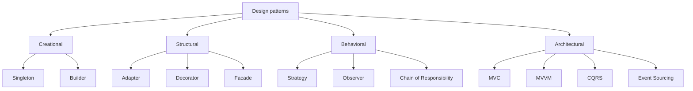

[[para-design-patterns-are-reusable]]



[[strategy]]

[[para-the-idea-pick-an]]

[[para-think-of-a-checkout]]

```csharp
public interface IPaymentStrategy
{
    void Pay(decimal amount);
}

public class CreditCardPayment : IPaymentStrategy
{
    public void Pay(decimal amount) => Console.WriteLine($"Paid {amount} by card");
}

public class PayPalPayment : IPaymentStrategy
{
    public void Pay(decimal amount) => Console.WriteLine($"Paid {amount} via PayPal");
}

public class Checkout
{
    private readonly IPaymentStrategy _strategy;

    public Checkout(IPaymentStrategy strategy) => _strategy = strategy;

    public void Complete(decimal amount) => _strategy.Pay(amount);
}
```

[[decorator]]

[[para-the-idea-add-behavior]]

[[para-like-adding-toppings-to]]

```csharp
public interface ICoffee
{
    string Description { get; }
    decimal Cost { get; }
}

public class Espresso : ICoffee
{
    public string Description => "Espresso";
    public decimal Cost => 2.00m;
}

public class MilkDecorator : ICoffee
{
    private readonly ICoffee _inner;

    public MilkDecorator(ICoffee inner) => _inner = inner;

    public string Description => _inner.Description + ", milk";
    public decimal Cost => _inner.Cost + 0.50m;
}
```

[[observer]]

[[para-the-idea-one-object]]

[[para-like-a-newsletter-people]]

```csharp
public interface IListener
{
    void Notify(string message);
}

public class NewsFeed
{
    private readonly List<IListener> _listeners = new();

    public void Subscribe(IListener listener) => _listeners.Add(listener);

    public void Publish(string message) =>
        _listeners.ForEach(listener => listener.Notify(message));
}
```

[[chain-of-responsibility]]

[[para-the-idea-pass-a]]

[[para-like-customer-support-a]]

```csharp
public interface IHandler
{
    IHandler SetNext(IHandler handler);
    void Handle(string request);
}

public abstract class BaseHandler : IHandler
{
    private IHandler? _next;

    public IHandler SetNext(IHandler handler)
    {
        _next = handler;
        return handler;
    }

    public virtual void Handle(string request)
    {
        _next?.Handle(request);
    }
}

public class AuthHandler : BaseHandler
{
    public override void Handle(string request)
    {
        if (request.StartsWith("auth"))
        {
            Console.WriteLine("Auth passed");
            base.Handle(request);
        }
        else
        {
            Console.WriteLine("Auth failed — stop");
        }
    }
}

public class LoggingHandler : BaseHandler
{
    public override void Handle(string request)
    {
        Console.WriteLine($"Logging: {request}");
        base.Handle(request);
    }
}

var logging = new LoggingHandler();
var auth = new AuthHandler();
logging.SetNext(auth);

logging.Handle("auth:user-42");
```

[[para-each-handler-only-knows]]

[[singleton]]

[[para-the-idea-guarantee-there]]

[[para-like-a-single-settings]]

```csharp
public sealed class Configuration
{
    public static Configuration Instance { get; } = new Configuration();

    private Configuration() { }

    public string AppName => "MyApp";
}
```

[[facade]]

[[para-the-idea-hide-a]]

[[para-like-a-car-ignition]]

```csharp
public class OrderFacade
{
    private readonly PaymentService _payment = new();
    private readonly InventoryService _inventory = new();

    public void PlaceOrder(Order order)
    {
        _payment.Charge(order);
        _inventory.Reserve(order);
    }
}
```

[[builder]]

[[para-the-idea-build-a]]

[[para-like-ordering-a-custom]]

```csharp
public class Burger
{
    public bool Cheese { get; set; }
    public bool Bacon { get; set; }
}

public class BurgerBuilder
{
    private readonly Burger _burger = new();

    public BurgerBuilder AddCheese() { _burger.Cheese = true; return this; }

    public BurgerBuilder AddBacon() { _burger.Bacon = true; return this; }

    public Burger Build() => _burger;
}
```

[[adapter]]

[[para-the-idea-make-two]]

[[para-like-a-travel-plug]]

```csharp
public interface IShape
{
    double Area();
}

public class LegacyRectangle
{
    public double Width { get; set; }
    public double Height { get; set; }
}

public class RectangleAdapter : IShape
{
    private readonly LegacyRectangle _rect;

    public RectangleAdapter(LegacyRectangle rect) => _rect = rect;

    public double Area() => _rect.Width * _rect.Height;
}
```

[[mvc-model-view-controller]]

[[para-the-idea-separate-data]]

[[para-the-model-holds-the]]

```csharp
public class User
{
    public string Name { get; set; } = "Olivier";
}

public class UserController
{
    public string GetUserName() => new User().Name;
}
```

[[mvvm-model-view-viewmodel]]

[[para-the-idea-bind-the]]

[[para-popular-in-desktop-and]]

```csharp
public class CounterViewModel : INotifyPropertyChanged
{
    private int _count;

    public int Count
    {
        get => _count;
        set { _count = value; OnPropertyChanged(); }
    }

    public void Increment() => Count++;

    // INotifyPropertyChanged implementation omitted for brevity
}
```

[[cqrs-command-query-responsibility-segregation]]

[[para-the-idea-separate-writes]]

[[para-reads-and-writes-often]]

```csharp
public record CreateOrderCommand(int Id, decimal Total);

public record GetOrderQuery(int Id);

public class CreateOrderHandler
{
    public void Handle(CreateOrderCommand command) { /* save the order */ }
}

public class GetOrderHandler
{
    public Order Handle(GetOrderQuery query) => /* load the order */ null!;
}
```

[[event-sourcing]]

[[para-the-idea-store-every]]

[[para-instead-of-saving-the]]

```csharp
public interface IEvent { }

public record AccountOpened(Guid AccountId, string Owner) : IEvent;
public record MoneyDeposited(Guid AccountId, decimal Amount) : IEvent;
public record MoneyWithdrawn(Guid AccountId, decimal Amount) : IEvent;

public class Account
{
    public Guid Id { get; private set; }
    public decimal Balance { get; private set; }

    public void Apply(IEvent @event)
    {
        switch (@event)
        {
            case AccountOpened e:
                Id = e.AccountId;
                break;
            case MoneyDeposited e:
                Balance += e.Amount;
                break;
            case MoneyWithdrawn e:
                Balance -= e.Amount;
                break;
        }
    }
}
```

```csharp
// load = replay the history
var account = new Account();
foreach (var @event in eventStore.Load(accountId))
{
    account.Apply(@event);
}
```

[[para-event-sourcing-gives-you]]

[[wrapping-up]]

[[para-you-will-not-use]]
