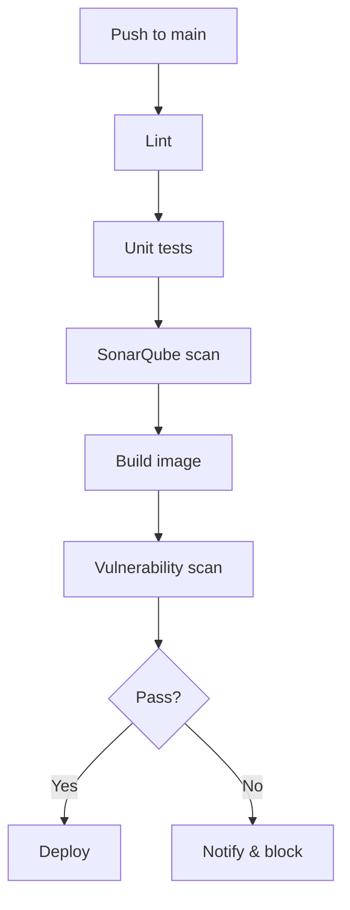
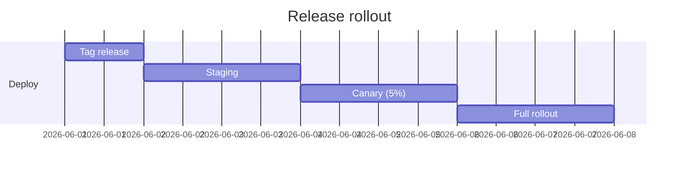
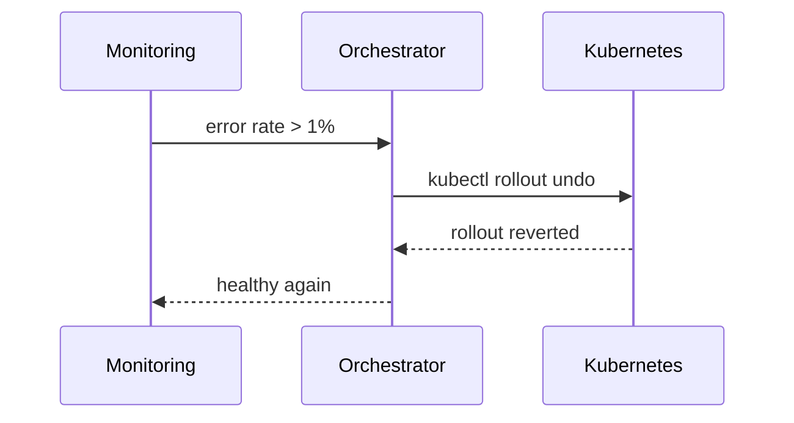

[[para-automating-your-delivery-pipeline]]

[[overview]]



[[the-workflow-file]]

```yaml
name: ci

on:
  push:
    branches: [main]
  pull_request:

jobs:
  build:
    runs-on: ubuntu-latest
    steps:
      - uses: actions/checkout@v4
      - uses: actions/setup-node@v4
        with:
          node-version: 22
          cache: npm
      - run: npm ci
      - run: npm run lint
      - run: npm run test -- --coverage
      - run: npm run build
```

[[release-process]]

[[para-releases-are-cut-from]]



[[rollback-sequence]]

[[para-if-a-release-breaks]]



[[para-keep-the-pipeline-fast]]
