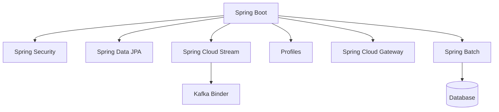
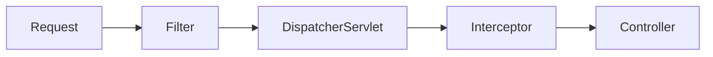

[[para-java-keeps-getting-more]]



[[modern-java]]

[[lambdas]]

[[para-a-lambda-is-a]]

```java
List<String> names = List.of("Ada", "Bob", "Cara");

// lambda
names.forEach(name -> System.out.println(name));

// method reference
names.forEach(System.out::println);
```

[[para-the-jdk-ships-the]]

```java
Predicate<String> isLong = s -> s.length() > 3;
Function<String, Integer> length = String::length;
Consumer<String> print = System.out::println;
Supplier<String> id = () -> UUID.randomUUID().toString();
```

[[streams]]

[[para-a-stream-is-a]]

```java
List<Order> orders = List.of(/* ... */);

List<String> emails = orders.stream()
  .filter(o -> o.total() > 100)
  .sorted(Comparator.comparing(Order::total).reversed())
  .map(Order::customerEmail)
  .distinct()
  .limit(10)
  .toList();
```

[[para-common-terminal-operations]]

```java
double sum = orders.stream().mapToDouble(Order::total).sum();

Map<Status, List<Order>> byStatus =
  orders.stream().collect(Collectors.groupingBy(Order::status));

boolean anyLarge = orders.stream().anyMatch(o -> o.total() > 1000);
```

[[para-filter-map-sorted-distinct]]

[[records]]

[[para-records-give-you-immutable]]

```java
public record User(String name, int age) { }
```

[[pattern-matching]]

[[para-instanceof-narrows-the-variable]]

```java
if (obj instanceof String s) {
  System.out.println(s.length());
}
```

[[para-switch-expressions-combine-with]]

```java
String result = switch (obj) {
  case Integer i -> "int " + i;
  case String s  -> "str " + s;
  default        -> "other";
};
```

[[sealed-classes]]

[[para-sealed-hierarchies-declare-every]]

```java
public sealed interface Shape permits Circle, Square { }

public record Circle(double radius) implements Shape { }
public record Square(double side) implements Shape { }
```

[[virtual-threads]]

[[para-project-loom-stable-since]]

```java
try (var executor = Executors.newVirtualThreadPerTaskExecutor()) {
  executor.submit(() -> handleRequest());
}
```

[[spring-boot]]

[[para-spring-boot-wires-an]]

```java
@SpringBootApplication
public class Application {
  public static void main(String[] args) {
    SpringApplication.run(Application.class, args);
  }
}
```

[[para-starters-pull-in-a]]

[[spring-beans-and-components]]

[[para-a-bean-is-any]]

```java
@Component
public class EmailService { }

@Service
public class OrderService { }

@Repository
public class OrderRepository { }

@Controller
public class OrderController { }
```

[[para-component-is-the-generic]]

[[para-for-third-party-or-manually]]

```java
@Configuration
public class AppConfig {
  @Bean
  OrderValidator orderValidator() {
    return new OrderValidator();
  }
}
```

[[para-inject-dependencies-through-the]]

```java
@Service
public class OrderService {
  private final OrderRepository repository;
  private final EmailService email;

  public OrderService(OrderRepository repository, EmailService email) {
    this.repository = repository;
    this.email = email;
  }
}
```

[[para-autowired-is-the-older]]

```java
@Service
public class OrderService {

  @Autowired
  private OrderRepository repository;

  private EmailService email;

  @Autowired
  public void setEmailService(EmailService email) {
    this.email = email;
  }
}
```

[[para-field-and-setter-injection]]

[[para-when-several-beans-share]]

```java
@Service
public class CreditCardPayment implements PaymentService { }

@Service
public class PayPalPayment implements PaymentService { }
```

```java
@Service
public class CheckoutService {

  private final PaymentService payment;

  public CheckoutService(@Qualifier("payPalPayment") PaymentService payment) {
    this.payment = payment;
  }
}
```

[[para-the-qualifier-is-the]]

[[para-spring-provides-several-bean]]

```java
// singleton (default) — one instance per container
@Component
public class SingletonService { }

// prototype — a new instance on every injection
@Component
@Scope("prototype")
public class ShoppingCart { }

// request — one instance per HTTP request
@Component
@Scope(value = WebApplicationContext.SCOPE_REQUEST,
       proxyMode = ScopedProxyMode.TARGET_CLASS)
public class RequestContext { }

// session — one instance per HTTP session
@Component
@Scope(value = WebApplicationContext.SCOPE_SESSION,
       proxyMode = ScopedProxyMode.TARGET_CLASS)
public class UserSession { }

// application — one instance per ServletContext
@Component
@Scope(value = WebApplicationContext.SCOPE_APPLICATION)
public class AppWideConfig { }

// websocket — one instance per WebSocket session
@Component
@Scope(value = "websocket",
       proxyMode = ScopedProxyMode.TARGET_CLASS)
public class ChatSession { }
```

[[para-the-short-lived-scopes-request]]

[[para-spring-ships-shorthand-annotations]]

```java
@Component
@RequestScope
public class RequestContext { }

@Component
@SessionScope
public class UserSession { }

@Component
@ApplicationScope
public class AppWideConfig { }
```

[[para-requestscope-and-sessionscope-are]]

[[para-here-is-the-complete]]

[[para-scope-lifetime]]

[[para-in-short-the-shorthand]]

[[para-springbootapplication-enables-component-scanning]]

[[spring-security]]

[[para-security-is-configured-through]]

```java
@Bean
SecurityFilterChain filterChain(HttpSecurity http) throws Exception {
  return http
    .authorizeHttpRequests(auth -> auth
      .requestMatchers("/api/public/**").permitAll()
      .anyRequest().authenticated())
    .oauth2ResourceServer(oauth -> oauth.jwt(Customizer.withDefaults()))
    .build();
}
```

[[para-jwt-resource-servers-are]]

```java
@RestController
@RequestMapping("/api/orders")
public class OrderController {

  private final OrderService orders;

  public OrderController(OrderService orders) {
    this.orders = orders;
  }

  @PreAuthorize("hasRole('ADMIN')")
  @DeleteMapping("/{id}")
  public void cancel(@PathVariable Long id) {
    orders.cancel(id);
  }
}
```

[[para-preauthorize-accepts-spel-so]]

[[filters-vs-interceptors]]

[[para-both-wrap-requests-but]]



[[para-a-filter-is-for]]

```java
@Component
public class RequestLoggingFilter extends OncePerRequestFilter {

  @Override
  protected void doFilterInternal(
      HttpServletRequest request,
      HttpServletResponse response,
      FilterChain chain) throws ServletException, IOException {

    long start = System.currentTimeMillis();
    chain.doFilter(request, response);
    log.info("{} {} took {} ms", request.getMethod(),
        request.getRequestURI(), System.currentTimeMillis() - start);
  }
}
```

[[para-an-interceptor-is-for]]

```java
@Component
public class TimingInterceptor implements HandlerInterceptor {

  @Override
  public boolean preHandle(HttpServletRequest request,
      HttpServletResponse response, Object handler) {
    request.setAttribute("startTime", System.currentTimeMillis());
    return true;
  }

  @Override
  public void afterCompletion(HttpServletRequest request,
      HttpServletResponse response, Object handler, Exception ex) {
    long start = (long) request.getAttribute("startTime");
    log.info("Handler {} took {} ms", handler,
        System.currentTimeMillis() - start);
  }
}
```

```java
@Configuration
public class WebConfig implements WebMvcConfigurer {

  @Override
  public void addInterceptors(InterceptorRegistry registry) {
    registry.addInterceptor(new TimingInterceptor())
        .addPathPatterns("/api/**");
  }
}
```

[[para-filter]]

[[para-in-short-filters-for]]

[[restcontroller-vs-controller]]

[[para-controller-is-the-classic]]

```java
@Controller
public class PageController {

  @GetMapping("/")
  public String home() {
    return "index"; // view name, not JSON
  }
}
```

```java
@RestController
@RequestMapping("/api/users")
public class UserController {

  private final UserService users;

  public UserController(UserService users) {
    this.users = users;
  }

  @GetMapping
  public List<User> list() {
    return users.findAll(); // serialized to JSON
  }
}
```

[[para-getmapping-postmapping-putmapping-and]]

[[spring-data-jpa]]

[[para-entities-map-classes-to]]

```java
@Entity
@Table(name = "customer")
public class Customer {
  @Id
  @GeneratedValue(strategy = GenerationType.IDENTITY)
  private Long id;

  @Column(nullable = false)
  private String name;
}
```

```java
public interface CustomerRepository extends JpaRepository<Customer, Long> {
  List<Customer> findByNameContainingIgnoreCase(String name);

  Page<Customer> findByNameContainingIgnoreCase(String name, Pageable pageable);
}
```

[[para-pagination-uses-pageable-with]]

```java
Page<Customer> page = repository.findByNameContainingIgnoreCase(
    "a", PageRequest.of(0, 20, Sort.by("name")));

List<Customer> content = page.getContent();
long total = page.getTotalElements();
int pages = page.getTotalPages();
```

[[para-pagerequest-of-page-size-maps-to]]

[[para-use-transactional-on-service]]

```java
@Service
public class OrderService {

  private final OrderRepository orders;
  private final PaymentService payments;

  public OrderService(OrderRepository orders, PaymentService payments) {
    this.orders = orders;
    this.payments = payments;
  }

  @Transactional
  public Order placeOrder(Order order) {
    Order saved = orders.save(order);
    payments.charge(order.getTotal());
    return saved;
  }
}
```

[[para-if-any-step-throws]]

[[lombok-and-mapstruct]]

[[lombok]]

[[para-lombok-removes-boilerplate-with]]

```java
@Getter
@Setter
@Builder
@NoArgsConstructor
@AllArgsConstructor
@Entity
public class Customer {
  @Id
  @GeneratedValue(strategy = GenerationType.IDENTITY)
  private Long id;

  private String name;
}
```

[[para-requiredargsconstructor-generates-a-constructor]]

```java
@Service
@RequiredArgsConstructor
public class OrderService {
  private final OrderRepository orders;
  private final PaymentService payments;

  public void place(Order order) {
    orders.save(order);
  }
}
```

[[para-data-bundles-accessors-with]]

[[mapstruct]]

[[para-mapstruct-generates-type-safe-mappers]]

```java
@Mapper(componentModel = "spring")
public interface CustomerMapper {

  CustomerDto toDto(Customer customer);

  @Mapping(target = "id", ignore = true)
  Customer toEntity(CreateCustomerRequest request);
}
```

[[para-with-componentmodel-spring]]

```java
@Service
@RequiredArgsConstructor
public class CustomerService {
  private final CustomerRepository repository;
  private final CustomerMapper mapper;

  public CustomerDto create(CreateCustomerRequest request) {
    return mapper.toDto(repository.save(mapper.toEntity(request)));
  }
}
```

[[para-unlike-reflection-based-mappers-mapstruct]]

[[spring-cloud-stream-with-the-kafka-binder]]

[[para-cloud-stream-abstracts-the]]

```java
@Bean
Function<Order, Order> processOrder() {
  return order -> {
    // validate, enrich, or transform
    return order;
  };
}
```

```yaml
spring:
  cloud:
    stream:
      bindings:
        processOrder-in-0:
          destination: orders
        processOrder-out-0:
          destination: orders-processed
      kafka:
        binder:
          brokers: localhost:9092
```

[[para-swap-the-binder-kafka]]

[[profiles]]

[[para-profiles-load-different-configuration]]

```yaml
spring:
  profiles:
    active: dev
```

```yaml
# application-dev.yml
server:
  port: 8080
```

[[loading-multiple-profiles]]

[[para-profiles-are-additive-and]]

```yaml
spring:
  profiles:
    active: dev,local
```

[[para-loading-rules]]

[[list-a-later-profile-overrides-an-earlier-one]]

[[para-a-profile-can-pull]]

```yaml
spring:
  profiles:
    include: common,metrics
```

[[para-you-can-also-gate]]

```java
@Component
@Profile("!prod")
public class DevDataSeeder { }
```

[[spring-cloud-gateway]]

[[para-the-gateway-routes-requests]]

```yaml
spring:
  cloud:
    gateway:
      routes:
        - id: order-service
          uri: lb://ORDER-SERVICE
          predicates:
            - Path=/api/orders/**
          filters:
            - StripPrefix=1
```

[[para-predicates-match-the-request]]

[[spring-batch]]

[[para-spring-batch-handles-large]]

```java
@Configuration
@EnableBatchProcessing
public class BatchConfig {

  @Bean
  public Job importUsersJob(JobRepository jobRepository, Step step) {
    return new JobBuilder("importUsersJob", jobRepository)
        .start(step)
        .build();
  }

  @Bean
  public Step step(JobRepository jobRepository,
      PlatformTransactionManager transactionManager,
      ItemReader<User> reader,
      ItemProcessor<User, User> processor,
      ItemWriter<User> writer) {
    return new StepBuilder("step", jobRepository)
        .<User, User>chunk(100, transactionManager)
        .reader(reader)
        .processor(processor)
        .writer(writer)
        .build();
  }

  @Bean
  public ItemReader<User> reader() {
    return new FlatFileItemReaderBuilder<User>()
        .name("userReader")
        .resource(new FileSystemResource("users.csv"))
        .delimited()
        .names("name", "email")
        .targetType(User.class)
        .build();
  }

  @Bean
  public ItemProcessor<User, User> processor() {
    return user -> {
      user.setEmail(user.getEmail().toLowerCase());
      return user;
    };
  }
}
```

[[list-job-the-whole-batch-process]]

[[para-spring-batch-records-job]]

[[java-version-history]]

[[para-a-condensed-timeline-of]]

[[para-version-release]]

[[wrapping-up]]

[[para-modern-java-leans-on]]
