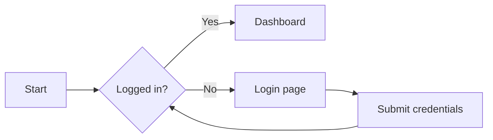
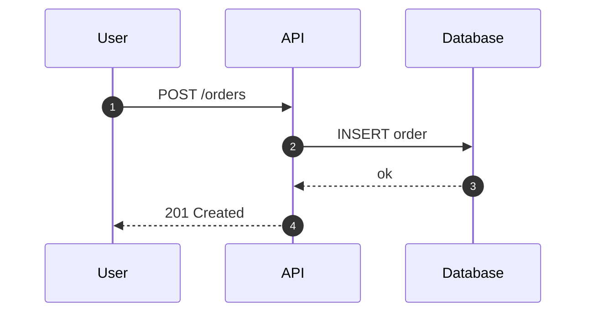
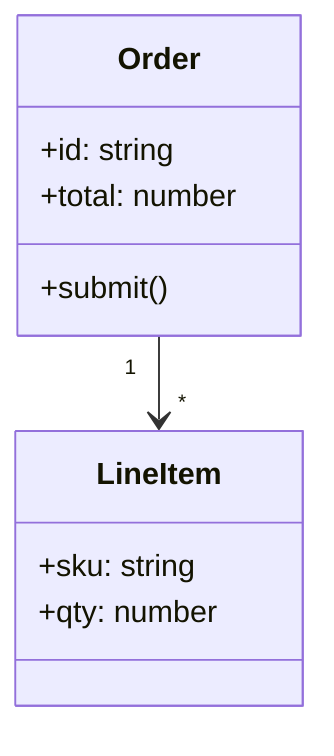
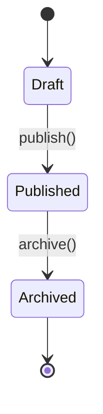
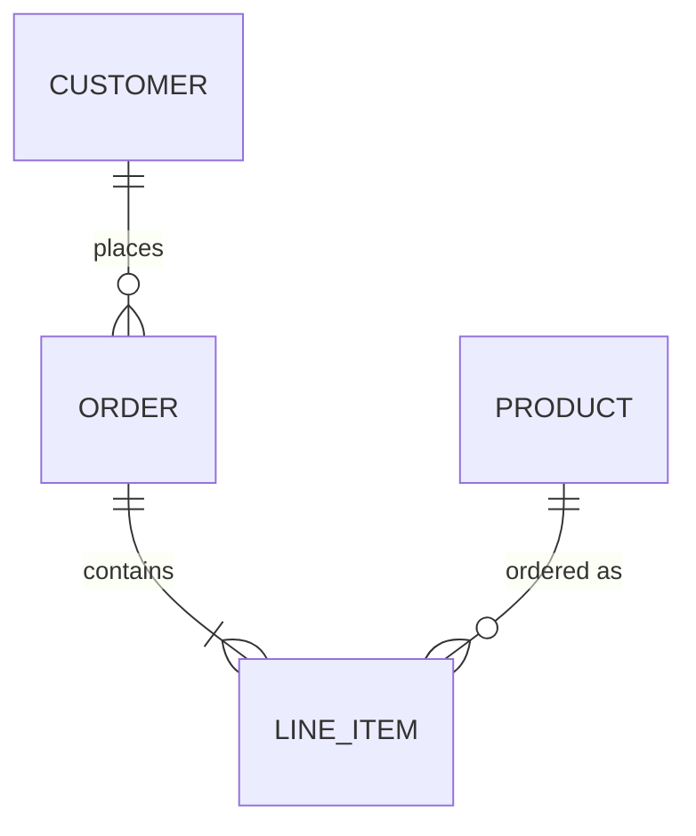
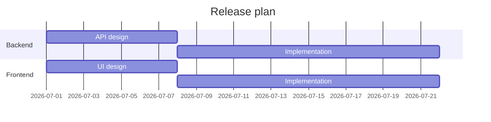
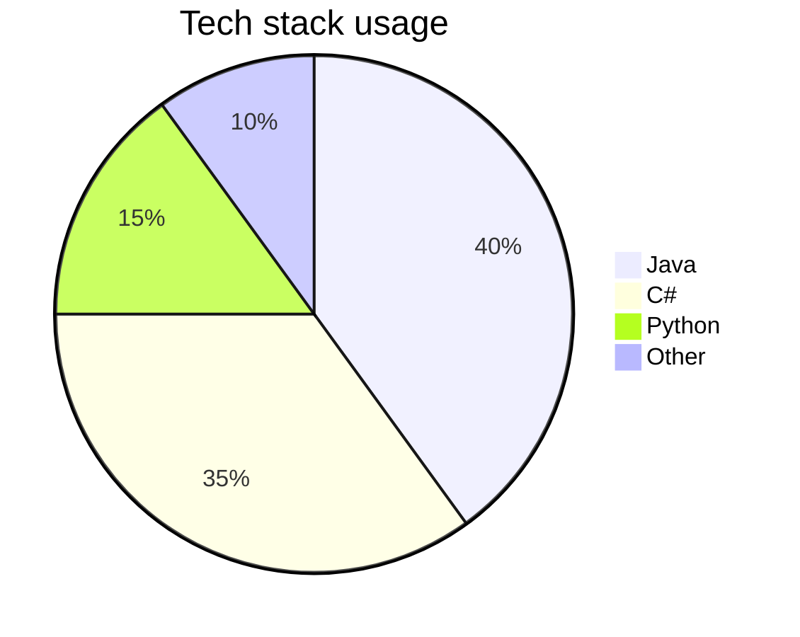
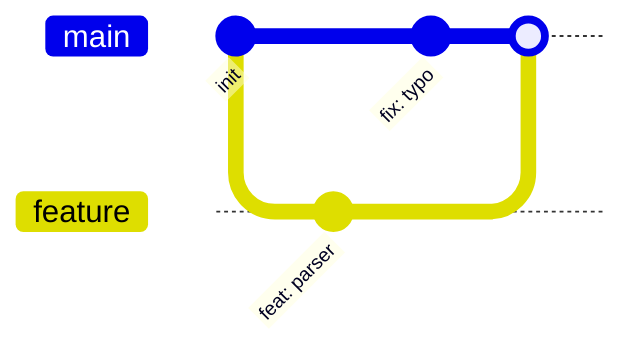
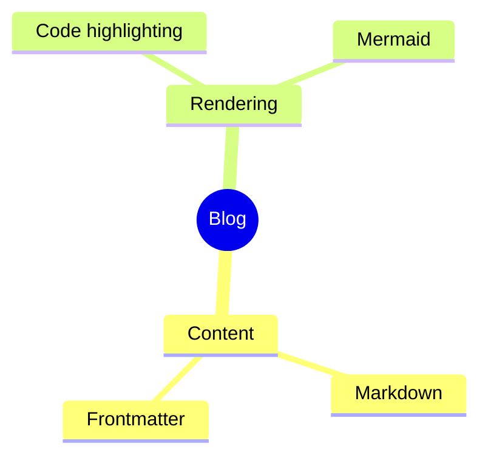
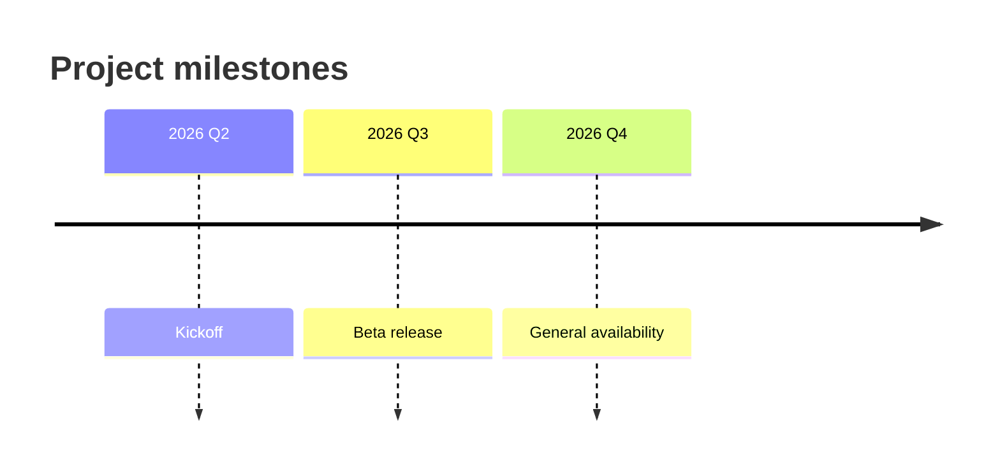

[[para-any-fenced-code-block]]

[[flowchart]]

[[sequence]]

[[class-diagram]]

[[state-diagram]]

[[entity-relationship]]

[[gantt-chart]]

[[pie-chart]]

[[git-graph]]

[[mindmap]]

[[timeline]]

[[para-wrap-any-of-these]]
