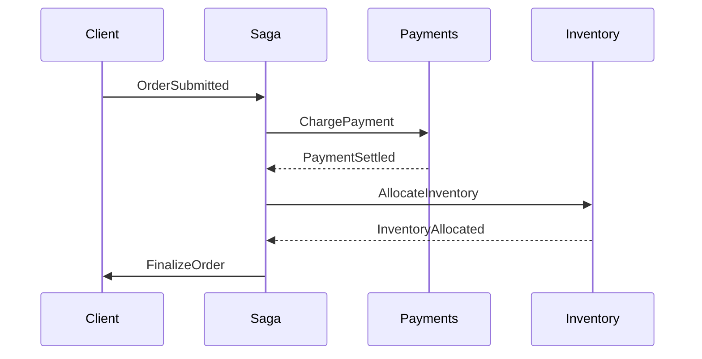
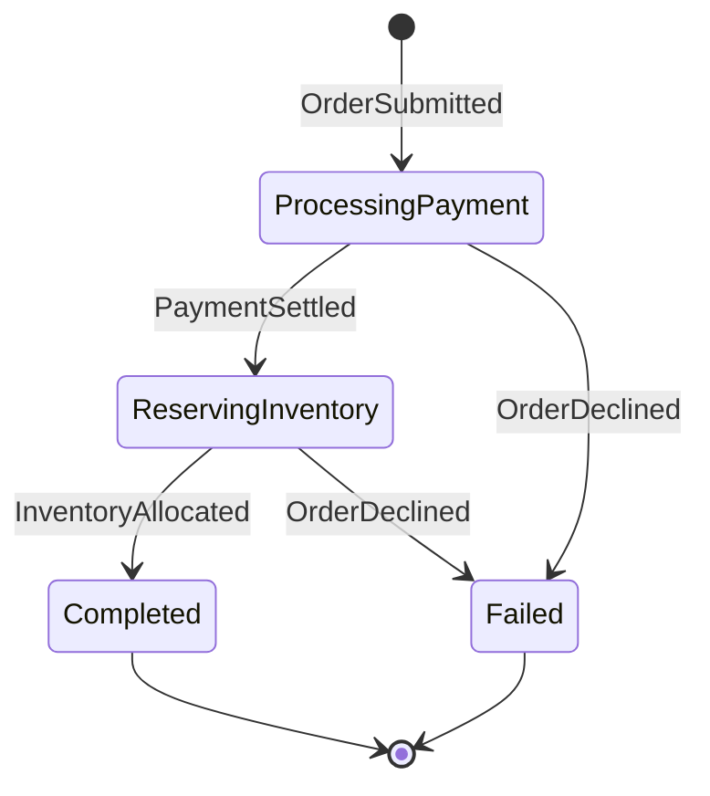

[[the-problem-with-a-single-transaction]]

[[para-a-checkout-rarely-completes]]

[[para-the-catch-is-that]]

[[para-a-saga-sidesteps-this]]

[[what-a-saga-actually-is]]

[[para-a-saga-is-a]]

[[para-take-an-order-as]]



[[para-if-the-inventory-step]]

[[masstransit-sagas-are-state-machines]]

[[para-masstransit-https-masstransit-io-implements-sagas-through]]

[[list-states-the-positions-a-workflow-can-be-in]]

[[para-every-state-machine-ships]]

[[para-here-is-the-state]]



[[the-saga-instance]]

[[para-the-instance-is-the]]

```csharp
public class OrderState : SagaStateMachineInstance
{
    public Guid CorrelationId { get; set; }
    public string CurrentState { get; set; } = string.Empty;

    public decimal Total { get; set; }
    public string? PaymentReference { get; set; }
    public DateTime? PlacedAt { get; set; }
    public string? BuyerEmail { get; set; }
}
```

[[para-correlationid-is-the-identifier]]

[[the-events]]

[[para-events-are-the-messages]]

```csharp
public record OrderSubmitted(Guid OrderId, decimal Total, string Email);

public record PaymentSettled(Guid OrderId, string PaymentReference);

public record InventoryAllocated(Guid OrderId);

public record OrderDeclined(Guid OrderId, string Reason);
```

[[para-these-records-travel-over]]

[[building-the-state-machine]]

[[para-the-state-machine-ties]]

```csharp
public class OrderStateMachine : MassTransitStateMachine<OrderState>
{
    public OrderStateMachine()
    {
        InstanceState(x => x.CurrentState);

        Event(() => OrderSubmitted, x => x.CorrelateById(c => c.Message.OrderId));
        Event(() => PaymentSettled, x => x.CorrelateById(c => c.Message.OrderId));
        Event(() => InventoryAllocated, x => x.CorrelateById(c => c.Message.OrderId));
        Event(() => OrderDeclined, x => x.CorrelateById(c => c.Message.OrderId));

        Initially(
            When(OrderSubmitted)
                .Then(c =>
                {
                    c.Saga.Total = c.Message.Total;
                    c.Saga.BuyerEmail = c.Message.Email;
                    c.Saga.PlacedAt = DateTime.UtcNow;
                })
                .PublishAsync(c => c.Init<ChargePayment>(new
                {
                    OrderId = c.Saga.CorrelationId,
                    Amount = c.Saga.Total
                }))
                .TransitionTo(ProcessingPayment)
        );

        During(ProcessingPayment,
            When(PaymentSettled)
                .Then(c => c.Saga.PaymentReference = c.Message.PaymentReference)
                .PublishAsync(c => c.Init<AllocateInventory>(new
                {
                    OrderId = c.Saga.CorrelationId
                }))
                .TransitionTo(ReservingInventory),
            When(OrderDeclined)
                .TransitionTo(Failed)
                .Finalize()
        );

        During(ReservingInventory,
            When(InventoryAllocated)
                .PublishAsync(c => c.Init<FinalizeOrder>(new
                {
                    OrderId = c.Saga.CorrelationId
                }))
                .TransitionTo(Completed)
                .Finalize(),
            When(OrderDeclined)
                .PublishAsync(c => c.Init<ReimbursePayment>(new
                {
                    OrderId = c.Saga.CorrelationId,
                    Amount = c.Saga.Total
                }))
                .TransitionTo(Failed)
                .Finalize()
        );

        SetCompletedWhenFinalized();
    }

    public State ProcessingPayment { get; private set; } = null!;
    public State ReservingInventory { get; private set; } = null!;
    public State Completed { get; private set; } = null!;
    public State Failed { get; private set; } = null!;

    public Event<OrderSubmitted> OrderSubmitted { get; private set; } = null!;
    public Event<PaymentSettled> PaymentSettled { get; private set; } = null!;
    public Event<InventoryAllocated> InventoryAllocated { get; private set; } = null!;
    public Event<OrderDeclined> OrderDeclined { get; private set; } = null!;
}
```

[[para-notice-the-compensation-logic]]

[[the-consumers]]

[[para-the-saga-is-the]]

```csharp
public class ChargePaymentConsumer(
    IPaymentGateway gateway,
    ILogger<ChargePaymentConsumer> logger) : IConsumer<ChargePayment>
{
    public async Task Consume(ConsumeContext<ChargePayment> context)
    {
        try
        {
            var result = await gateway.ChargeAsync(
                context.Message.OrderId,
                context.Message.Amount);

            if (result.Succeeded)
            {
                await context.Publish<PaymentSettled>(new
                {
                    OrderId = context.Message.OrderId,
                    PaymentReference = result.Reference
                });
            }
            else
            {
                await context.Publish<OrderDeclined>(new
                {
                    OrderId = context.Message.OrderId,
                    Reason = result.RejectionReason
                });
            }
        }
        catch (Exception ex)
        {
            logger.LogError(ex, "Payment failed for order {OrderId}", context.Message.OrderId);

            await context.Publish<OrderDeclined>(new
            {
                OrderId = context.Message.OrderId,
                Reason = "Payment gateway error"
            });
        }
    }
}
```

[[para-splitting-responsibilities-this-way]]

[[wiring-it-up-with-azure-service-bus]]

[[para-persisting-saga-state-requires]]

[[para-first-the-required-packages]]

```powershell
Install-Package MassTransit.EntityFrameworkCore
Install-Package MassTransit.Azure.ServiceBus.Core
Install-Package Microsoft.EntityFrameworkCore.SqlServer
```

[[para-define-a-dbcontext-and]]

```csharp
public class OrderSagaDbContext : SagaDbContext
{
    public OrderSagaDbContext(DbContextOptions options) : base(options) { }

    protected override IEnumerable<ISagaClassMap> Configurations
    {
        get { yield return new OrderStateMap(); }
    }
}

public class OrderStateMap : SagaClassMap<OrderState>
{
    protected override void Configure(EntityTypeBuilder<OrderState> entity, ModelBuilder model)
    {
        entity.Property(x => x.CurrentState).HasMaxLength(64);
        entity.Property(x => x.BuyerEmail).HasMaxLength(256);
        entity.Property(x => x.PaymentReference).HasMaxLength(64);
    }
}
```

[[para-finally-register-everything-in]]

```csharp
builder.Services.AddDbContext<OrderSagaDbContext>(options =>
    options.UseSqlServer(builder.Configuration.GetConnectionString("SqlServer")));

builder.Services.AddMassTransit(x =>
{
    x.AddSagaStateMachine<OrderStateMachine, OrderState>()
        .EntityFrameworkRepository(r =>
        {
            r.ConcurrencyMode = ConcurrencyMode.Pessimistic;
            r.AddDbContext<DbContext, OrderSagaDbContext>();
        });

    x.UsingAzureServiceBus((context, cfg) =>
    {
        cfg.Host(builder.Configuration.GetConnectionString("ServiceBus"));
        cfg.ConfigureEndpoints(context);
    });
});
```

[[why-reach-for-sagas]]

[[list-resilience-every-step-can-be-retried-on-its-own-and-failures-trigger]]

[[para-the-state-machine-also]]

[[wrapping-up]]

[[para-modeling-a-checkout-as]]
