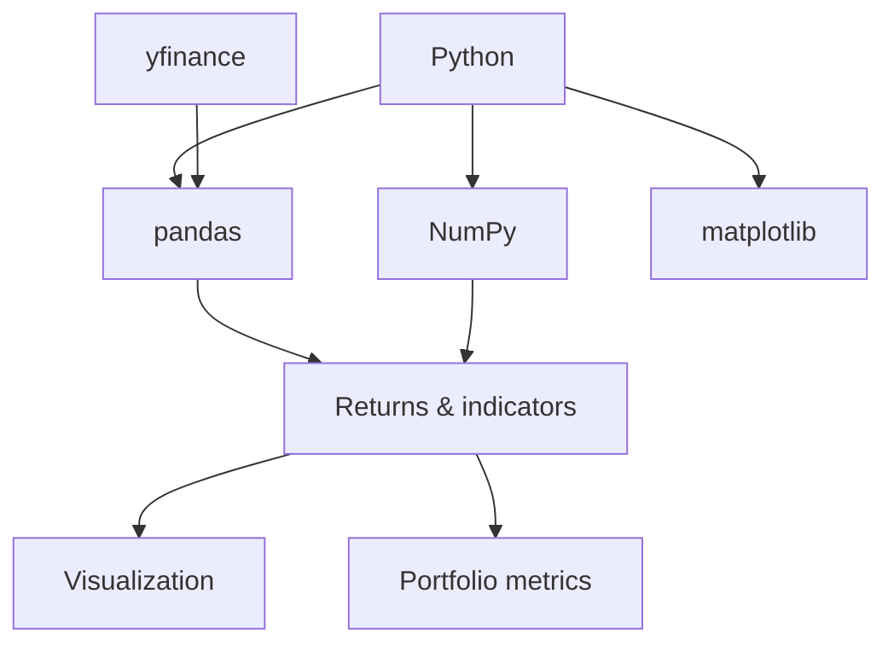

[[para-python-is-the-default]]



[[numpy-vectorized-financial-math]]

[[para-numpy-gives-you-fast]]

```python
import numpy as np

prices = np.array([100, 102, 101, 105, 107])

# simple returns
returns = np.diff(prices) / prices[:-1]
print(returns)  # [ 0.02   -0.0098  0.0396  0.0190]

# log returns
log_returns = np.log(prices[1:] / prices[:-1])

# annualized volatility
volatility = returns.std() * np.sqrt(252)
```

[[para-everything-is-element-wise-so]]

[[pandas-dataframes-and-time-series]]

[[para-pandas-wraps-data-in]]

```python
import pandas as pd

df = pd.DataFrame({
    'date': pd.date_range('2026-01-01', periods=5, freq='D'),
    'close': [100, 102, 101, 105, 107],
})

df['returns'] = df['close'].pct_change()
df['cum_return'] = (1 + df['returns']).cumprod() - 1
```

[[para-resample-roll-and-shift]]

```python
df['sma_3'] = df['close'].rolling(3).mean()
df['prev_close'] = df['close'].shift(1)
```

[[getting-market-data-with-yfinance]]

[[para-yfinance-downloads-historical-prices]]

```python
import yfinance as yf

ticker = yf.Ticker('AAPL')
history = ticker.history(period='1y', interval='1d')

prices = history['Close']
returns = prices.pct_change().dropna()
```

[[para-you-can-also-pull]]

[[returns-and-portfolio-metrics]]

[[para-from-returns-compute-the]]

```python
def sharpe_ratio(returns, risk_free_rate=0.0):
    excess = returns - risk_free_rate / 252
    return excess.mean() / returns.std() * np.sqrt(252)

sharpe = sharpe_ratio(returns)
vol = returns.std() * np.sqrt(252)
ann_return = (1 + returns.mean()) ** 252 - 1

print(f"Return: {ann_return:.2%}, Vol: {vol:.2%}, Sharpe: {sharpe:.2f}")
```

[[para-correlation-between-two-assets]]

```python
a = yf.Ticker('AAPL').history(period='1y')['Close'].pct_change()
b = yf.Ticker('MSFT').history(period='1y')['Close'].pct_change()

corr = a.corr(b)
```

[[technical-indicators]]

[[para-moving-averages-are-a]]

```python
df['sma_20'] = df['close'].rolling(20).mean()
df['ema_20'] = df['close'].ewm(span=20, adjust=False).mean()
df['signal'] = np.where(df['sma_20'] > df['ema_20'], 1, 0)
```

[[para-rolling-gives-a-simple]]

[[visualization-with-matplotlib]]

[[para-plot-prices-and-indicators]]

```python
import matplotlib.pyplot as plt

plt.figure(figsize=(10, 5))
plt.plot(df['date'], df['close'], label='Close')
plt.plot(df['date'], df['sma_20'], label='SMA 20')
plt.plot(df['date'], df['ema_20'], label='EMA 20')
plt.legend()
plt.show()
```

[[monte-carlo-simulation]]

[[para-simulate-many-future-price]]

```python
def monte_carlo(initial_price, mu, sigma, days=252, simulations=1000):
    dt = 1 / 252
    paths = np.zeros((days, simulations))
    paths[0] = initial_price
    for t in range(1, days):
        shocks = np.random.normal(mu * dt, sigma * np.sqrt(dt), simulations)
        paths[t] = paths[t - 1] * (1 + shocks)
    return paths

paths = monte_carlo(100, mu=0.07, sigma=0.20)

final_prices = paths[-1]
value_at_risk = np.percentile(final_prices, 5)
```

[[para-this-underpins-risk-measures]]

[[wrapping-up]]

[[para-numpy-does-the-math]]
