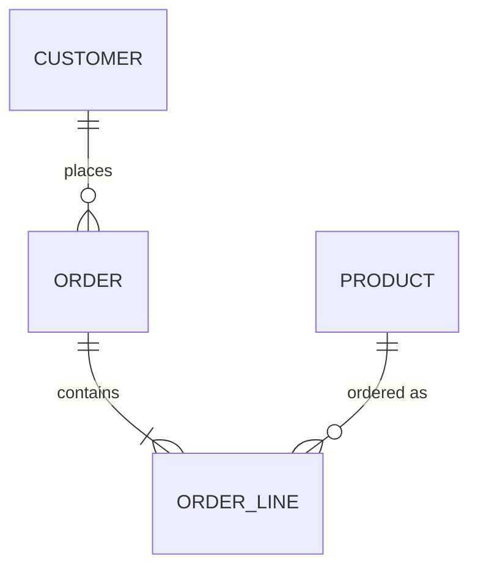
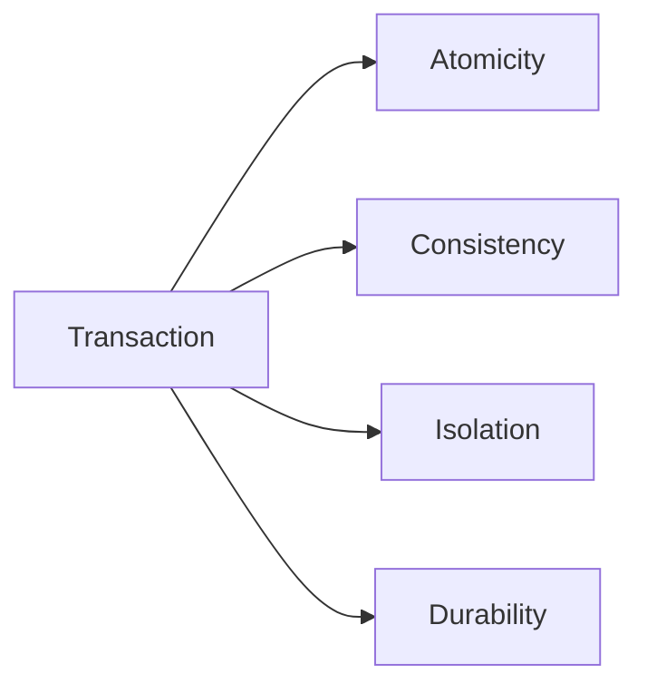
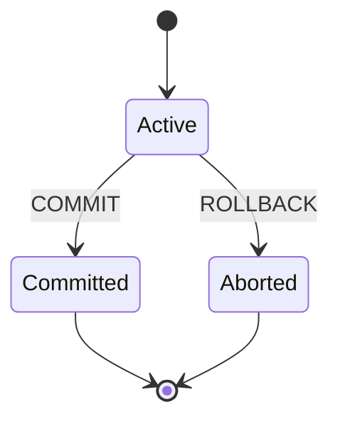
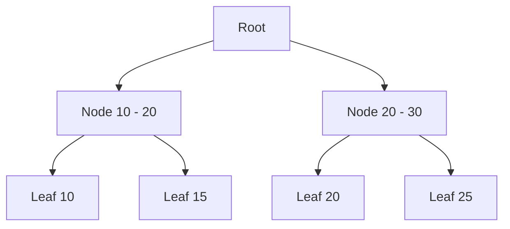

[[para-relational-databases-power-most]]



[[acid]]

[[para-acid-describes-the-four]]



[[list-atomicity-all-statements-succeed-or-none-do]]



```sql
BEGIN;

UPDATE accounts SET balance = balance - 100 WHERE id = 1;
UPDATE accounts SET balance = balance + 100 WHERE id = 2;

COMMIT;
```

[[primary-keys]]

[[para-a-primary-key-uniquely]]

```sql
CREATE TABLE customer (
  id BIGINT GENERATED ALWAYS AS IDENTITY PRIMARY KEY,
  email VARCHAR(255) NOT NULL UNIQUE
);
```

[[para-composite-keys-identify-a]]

```sql
CREATE TABLE order_line (
  order_id BIGINT NOT NULL,
  product_id BIGINT NOT NULL,
  quantity INT NOT NULL,
  PRIMARY KEY (order_id, product_id)
);
```

[[foreign-keys]]

[[para-a-foreign-key-enforces]]

```sql
CREATE TABLE "order" (
  id BIGINT PRIMARY KEY,
  customer_id BIGINT NOT NULL
    REFERENCES customer(id) ON DELETE CASCADE
);
```

[[para-cascade-deletes-the-child]]

[[sql-commands-ddl-dql-dml-dcl-tcl]]

[[para-sql-divides-into-five]]

[[ddl-data-definition-language]]

[[para-defines-and-changes-the]]

```sql
CREATE TABLE product (
  id BIGINT GENERATED ALWAYS AS IDENTITY PRIMARY KEY,
  name VARCHAR(255) NOT NULL,
  price NUMERIC(10, 2) NOT NULL
);

ALTER TABLE product ADD COLUMN active BOOLEAN DEFAULT true;

DROP TABLE product;
```

[[dql-data-query-language]]

[[para-reads-data-it-is]]

```sql
SELECT id, name, price
FROM product
WHERE active
ORDER BY price DESC;
```

[[dml-data-manipulation-language]]

[[para-changes-the-data-insert]]

```sql
INSERT INTO product (name, price) VALUES ('Keyboard', 89.90);

UPDATE product SET price = 79.90 WHERE name = 'Keyboard';

DELETE FROM product WHERE id = 1;
```

[[para-update-and-delete-must]]

[[dcl-data-control-language]]

[[para-manages-permissions-with-grant]]

```sql
GRANT SELECT, INSERT, UPDATE ON product TO app_user;
REVOKE DELETE ON product FROM app_user;
```

[[tcl-transaction-control-language]]

[[para-controls-transactions-with-commit]]

```sql
BEGIN;

UPDATE accounts SET balance = balance - 100 WHERE id = 1;
SAVEPOINT before_credit;
UPDATE accounts SET balance = balance + 100 WHERE id = 2;

ROLLBACK TO before_credit;
COMMIT;
```

[[joins]]

[[para-joins-combine-rows-from]]

```sql
-- INNER JOIN: only matching rows
SELECT c.name, o.id AS order_id, o.total
FROM customer c
JOIN "order" o ON o.customer_id = c.id;

-- LEFT JOIN: all customers, even without orders (NULL on the right)
SELECT c.name, o.id AS order_id
FROM customer c
LEFT JOIN "order" o ON o.customer_id = c.id;

-- RIGHT JOIN: all orders, even without a customer (NULL on the left)
SELECT c.name, o.id AS order_id
FROM customer c
RIGHT JOIN "order" o ON o.customer_id = c.id;

-- FULL OUTER JOIN: both sides, NULL where missing
SELECT c.name, o.id AS order_id
FROM customer c
FULL OUTER JOIN "order" o ON o.customer_id = c.id;
```

```sql
-- CROSS JOIN: every combination of rows
SELECT c.name, p.name
FROM customer c
CROSS JOIN product p;
```

```sql
-- self join: employees and their managers
SELECT e.name AS employee, m.name AS manager
FROM employee e
LEFT JOIN employee m ON m.id = e.manager_id;
```

[[para-joins-pair-naturally-with]]

```sql
-- order totals from line items
SELECT o.id, SUM(ol.quantity * p.price) AS total
FROM "order" o
JOIN order_line ol ON ol.order_id = o.id
JOIN product p ON p.id = ol.product_id
GROUP BY o.id;
```

[[para-use-table-aliases-c]]

[[indexes]]

[[para-an-index-speeds-up]]



[[list-unique-index-enforces-uniqueness-like-a-unique-constraint]]

```sql
CREATE UNIQUE INDEX idx_customer_email ON customer(email);

CREATE INDEX idx_order_customer ON "order"(customer_id);

CREATE INDEX idx_order_line_product
  ON order_line(product_id) INCLUDE (quantity);
```

[[para-a-rule-of-thumb]]

[[triggers]]

[[para-a-trigger-runs-automatically]]

```sql
CREATE FUNCTION audit_order() RETURNS trigger AS $$
BEGIN
  INSERT INTO audit_log (table_name, row_id, action, changed_at)
  VALUES ('order', COALESCE(NEW.id, OLD.id), TG_OP, now());
  RETURN COALESCE(NEW, OLD);
END;
$$ LANGUAGE plpgsql;

CREATE TRIGGER order_audit
AFTER INSERT OR UPDATE OR DELETE ON "order"
FOR EACH ROW EXECUTE FUNCTION audit_order();
```

[[functions]]

[[para-functions-are-reusable-composable]]

[[para-a-scalar-function]]

```sql
CREATE FUNCTION order_total(order_id BIGINT) RETURNS NUMERIC AS $$
  SELECT COALESCE(SUM(price * quantity), 0)
  FROM order_line
  JOIN product ON product.id = order_line.product_id
  WHERE order_line.order_id = order_total.order_id;
$$ LANGUAGE sql;
```

[[para-a-table-valued-function-returns]]

```sql
CREATE FUNCTION customer_orders(customer_id BIGINT)
RETURNS TABLE(order_id BIGINT, total NUMERIC, placed_at TIMESTAMPTZ) AS $$
  SELECT id, total, placed_at
  FROM "order"
  WHERE customer_id = customer_orders.customer_id;
$$ LANGUAGE sql;
```

[[stored-procedures]]

[[para-procedures-are-like-functions]]

```sql
CREATE PROCEDURE transfer(from_acc BIGINT, to_acc BIGINT, amount NUMERIC)
LANGUAGE plpgsql
AS $$
BEGIN
  UPDATE accounts SET balance = balance - amount WHERE id = from_acc;
  UPDATE accounts SET balance = balance + amount WHERE id = to_acc;
  COMMIT;
END;
$$;
```

[[isolation-levels]]

[[para-isolation-controls-how-much]]

```sql
SET TRANSACTION ISOLATION LEVEL READ COMMITTED;
```

[[list-read-uncommitted-can-read-uncommitted-data-dirty-reads]]

[[key-practices]]

[[list-use-stored-procedures-for-crud-centralize-the-data-logic-in-one-place]]

```sql
-- parameterized query: the value is bound as data, not SQL
SELECT id, name FROM customer WHERE email = $1;
```

```sql
-- grant execution through a procedure, not the table
GRANT EXECUTE ON PROCEDURE create_customer TO app_user;
REVOKE ALL ON customer FROM app_user;
```

[[para-parameterized-statements-separate-the]]

[[wrapping-up]]

[[para-acid-gives-you-correctness]]
