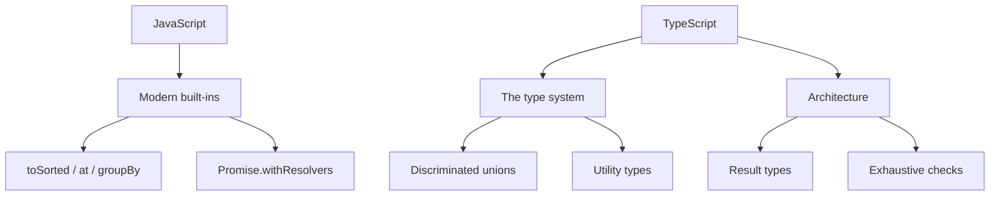

[[para-javascript-keeps-gaining-small]]



[[javascript-the-modern-essentials]]

[[optional-chaining-and-nullish-coalescing]]

[[para-read-nested-data-without]]

```typescript
const city = user?.address?.city
const label = name ?? 'Anonymous'
const retries = config?.retries ?? 3
```

[[logical-assignment]]

[[para-mutate-a-variable-only]]

```typescript
user.nickname ||= user.firstName
settings.theme ??= 'dark'
```

[[non-mutating-array-methods]]

[[para-tosorted-toreversed-tospliced-and]]

```typescript
const sorted = items.toSorted((a, b) => a.score - b.score)
const reversed = items.toReversed()
const first = items.at(0)
const last = items.at(-1)
```

[[grouping-and-cloning]]

[[para-object-groupby-buckets-a-collection]]

```typescript
const byStatus = Object.groupBy(orders, (o) => o.status)

const copy = structuredClone(original)
```

[[promise-helpers]]

[[para-promise-withresolvers-gives-you-the]]

```typescript
const { promise, resolve, reject } = Promise.withResolvers<string>()

async function nextMessage(): Promise<string> {
  return promise
}
```

[[para-array-fromasync-turns-an-async]]

```typescript
const lines = await Array.fromAsync(stream)
```

[[promises-and-observables]]

[[promises]]

[[para-a-promise-represents-a]]

```typescript
function fetchUser(id: number): Promise<User> {
  return fetch(`/api/users/${id}`).then((res) => res.json())
}

async function loadUser(id: number): Promise<User | null> {
  try {
    return await fetchUser(id)
  } catch (error) {
    console.error('failed to load user', error)
    return null
  }
}
```

[[para-run-independent-work-in]]

```typescript
const [a, b, c] = await Promise.all([
  fetchUser(1),
  fetchUser(2),
  fetchUser(3),
])
```

[[observables]]

[[para-observables-rxjs-model-a]]

```typescript
import { from, fromEvent } from 'rxjs'
import { debounceTime, filter, map, switchMap } from 'rxjs/operators'

const search$ = fromEvent<InputEvent>(input, 'input').pipe(
  debounceTime(300),
  map((event) => (event.target as HTMLInputElement).value),
  filter((term) => term.length >= 3),
  switchMap((term) =>
    from(fetch(`/api/search?q=${term}`).then((res) => res.json())),
  ),
)

const subscription = search$.subscribe({
  next: (results) => console.log(results),
  error: (err) => console.error(err),
})

subscription.unsubscribe()
```

[[para-a-promise-produces-one]]

[[typescript-the-type-system-that-matters]]

[[unknown-beats-any]]

[[para-any-turns-the-type]]

```typescript
function parse(value: unknown): string {
  if (typeof value === 'string') return value
  throw new Error('not a string')
}
```

[[satisfies-and-as-const]]

[[para-satisfies-checks-an-object]]

```typescript
const palette = {
  primary: '#c770f0',
  danger: '#ef4444',
} satisfies Record<string, string>

const routes = ['/', '/about', '/blog'] as const
type Route = (typeof routes)[number]
```

[[discriminated-unions]]

[[para-model-each-state-with]]

```typescript
type State =
  | { kind: 'idle' }
  | { kind: 'loading' }
  | { kind: 'success'; data: User[] }
  | { kind: 'error'; message: string }

function render(state: State): string {
  switch (state.kind) {
    case 'idle': return 'Waiting…'
    case 'loading': return 'Loading…'
    case 'success': return state.data.map((u) => u.name).join(', ')
    case 'error': return state.message
  }
}
```

[[type-predicates]]

[[para-narrow-unknown-into-a]]

```typescript
function isUser(value: unknown): value is User {
  return typeof value === 'object' && value !== null && 'id' in value
}
```

[[template-literal-types]]

[[para-build-string-types-from]]

```typescript
type Route = `/api/${'users' | 'orders'}/${string}`
```

[[const-type-parameters]]

[[para-keep-tuple-literals-precise]]

```typescript
function preserve<const T>(items: T[]): T[] {
  return items
}

const pair = preserve([1, 'two']) // [number, string]
```

[[utility-types]]

[[para-compose-new-types-from]]

```typescript
type UserInput = Omit<User, 'id' | 'createdAt'>
type PartialUser = Partial<User>
type ReadonlyUser = Readonly<User>
```

[[recent-typescript-features]]

[[standard-decorators]]

[[para-decorators-are-now-part]]

```typescript
function logged(target: unknown, context: ClassMethodDecoratorContext) {
  // wrap the method
}

class Service {
  @logged
  fetchData() {
    /* ... */
  }
}
```

[[explicit-resource-management]]

[[para-using-runs-cleanup-deterministically]]

```typescript
function readFile(path: string) {
  using handle = openFile(path)
  return handle.read()
}
```

[[noinfer]]

[[para-stop-the-compiler-from]]

```typescript
declare function createPair<T>(first: T, second: NoInfer<T>): T

const result = createPair('a', 'b') // T is inferred from the first arg only
```

[[architecture-patterns]]

[[result-types-instead-of-exceptions]]

[[para-represent-success-and-failure]]

```typescript
type Result<T, E = Error> =
  | { ok: true; value: T }
  | { ok: false; error: E }

function divide(a: number, b: number): Result<number> {
  if (b === 0) return { ok: false, error: new Error('division by zero') }
  return { ok: true, value: a / b }
}
```

[[exhaustive-checks]]

[[para-a-never-helper-guarantees]]

```typescript
function assertNever(value: never): never {
  throw new Error(`Unexpected value: ${value}`)
}

// switch (state.kind) { ... default: assertNever(state) }
```

[[branded-types]]

[[para-prevent-mixing-up-identifiers]]

```typescript
type UserId = string & { readonly __brand: 'UserId' }
type OrderId = string & { readonly __brand: 'OrderId' }

function toUserId(id: string): UserId {
  return id as UserId
}
```

[[immutability-by-default]]

[[para-prefer-readonly-as-const]]

```typescript
interface Config {
  readonly apiUrl: string
  readonly retries: number
}
```

[[esm-and-tree-shaking]]

[[para-use-es-modules-and]]

```typescript
import type { User } from './models'
import { fetchUsers } from './api'
```

[[wrapping-up]]

[[para-the-modern-front-end-expert]]
