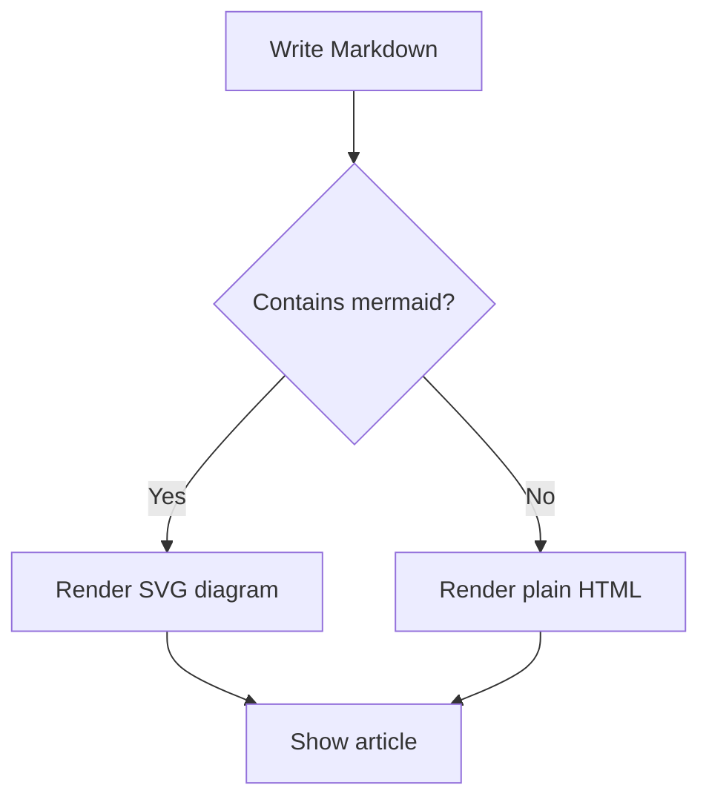
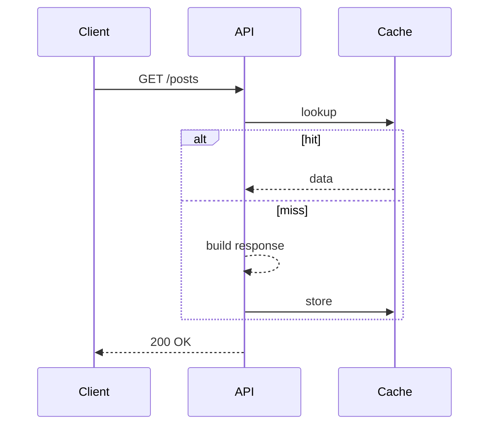

## [[why-a-blog]]

[[para-i-built-this-space]]

## [[markdown-power]]

[[para-articles-are-written-as]]

- [[list-headings-lists-and-blockquotes]]
- [[list-tables]]
- [[list-links-and-images]]
- [[list-fenced-code-blocks-with-syntax-highlighting]]
- [[list-mermaid-diagrams]]

## [[syntax-highlighting]]

[[para-code-blocks-are-highlighted]]

```typescript
export interface Feature<T> {
  run(input: T): Promise<T>
}

export const identity = <T,>(value: T): T => value
```

```csharp
public sealed class Greeter
{
    public string Hello(string name) => $"Hello, {name}!";
}
```

## [[mermaid-diagrams]]

[[para-diagrams-render-from-a]]



[[para-sequence-diagrams-work-too]]



## [[wrapping-up]]

[[para-that-is-the-basics]]
