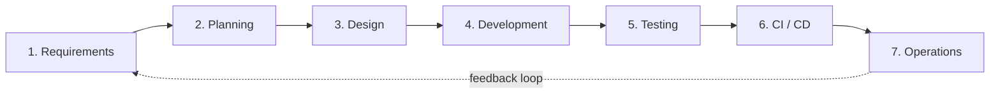
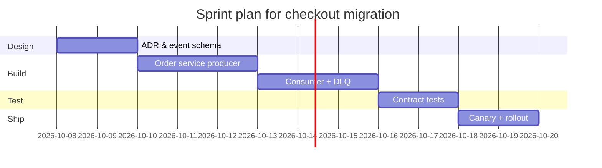
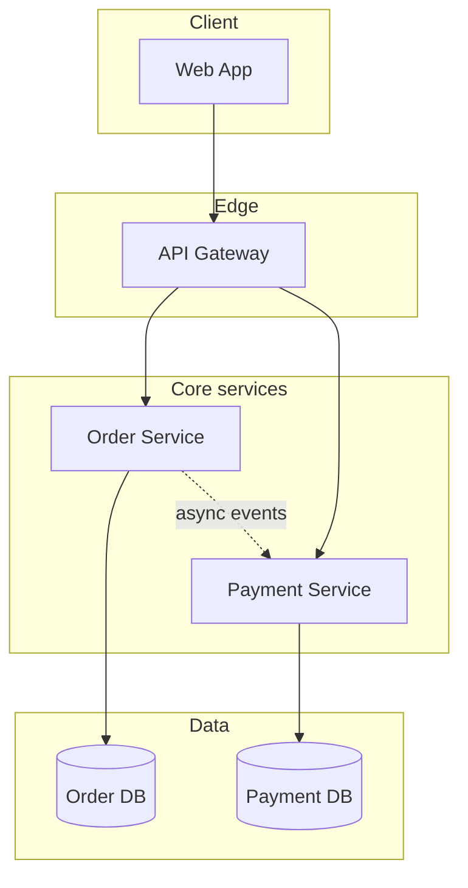
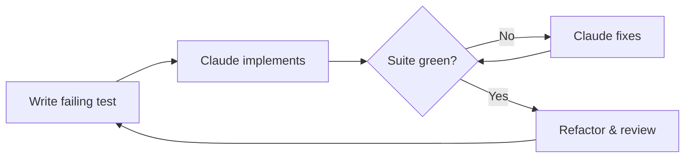
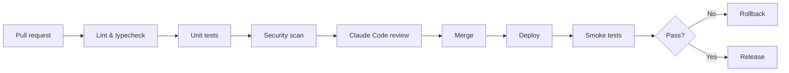
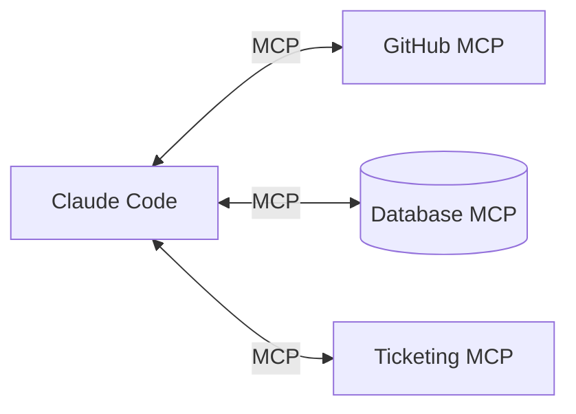

[[para-claude-code-is-an]]

[[the-sdlc-in-seven-phases]]

[[para-claude-code-fits]]



[[requirements]]

[[para-distill-requirements]]

```text
Turn notes/requirements.md into a structured backlog:
- Rewrite each functional requirement as "As a <role>, I want <goal>,
  so that <value>".
- List non-functional requirements (security, performance, availability)
  as separate items.
- Flag anything ambiguous or missing as an open question.
- Output a markdown table: ID | Requirement | Priority | Acceptance criteria.
```

[[planning]]

[[para-break-the-work]]

```text
Break this epic into tasks no larger than one day, ordered by dependency.
For each task give: title, affected files, effort (S/M/L), and definition
of done. Start with the riskiest task.

Epic: migrate order checkout from REST to async messaging.
```

[[para-plan-then-build]]



[[design]]

[[para-review-architecture]]



[[para-record-decisions]]

```markdown
# ADR-007: Move checkout to async messaging

## Status
Proposed

## Context
Checkout currently calls the payment service synchronously over REST.
Under peak load this couples availability and pushes latency past SLO.

## Decision
Publish an OrderPlaced event to the broker; the payment service consumes
it and publishes PaymentCaptured. Use an outbox pattern for reliability.

## Consequences
- Lower coupling and better tail latency.
- New failure modes need a dead-letter queue and idempotent consumers.
```

[[development]]

[[para-set-the-context]]

```markdown
# CLAUDE.md

## Build & test
- `dotnet build` — build the solution (src/Orders.sln)
- `dotnet test` — run the xUnit suite
- `dotnet format` — apply code style from .editorconfig
- `dotnet ef migrations add <Name>` — add an EF Core migration

## Architecture
- `src/Orders.Api` — HTTP API (ASP.NET Core minimal APIs)
- `src/Orders.Application` — use cases, no I/O
- `src/Orders.Infrastructure` — EF Core, Azure Service Bus
- `src/Orders.Domain` — entities and value objects, no dependencies
- `tests/Orders.UnitTests` — one xUnit project per layer

## Security rules (never break these)
- Never log or commit secrets, tokens, or appsettings.Production.json
- Use parameterized queries; never concatenate SQL strings
- Do not add a package without mentioning it in the summary

## Testing
- New code ships with unit tests (xUnit + FluentAssertions)
- Mock external calls (HTTP, DB) — no network in unit tests
- Integration tests use Testcontainers

## Style
- Enable nullable reference types in every project
- Prefer records for DTOs and primary constructors for services
- Comments only explain "why", never "what"
```

[[para-codify-routines]]

```markdown
---
name: write-tests
description: Add unit tests for a changed class following project conventions.
---

1. Read the diff and find every public method that changed.
2. Write an xUnit test (with FluentAssertions) for the happy path plus one edge case each.
3. Mock dependencies with NSubstitute — no real I/O.
4. Run `dotnet test` and fix anything red before reporting.
```

[[para-delegate]]

```markdown
---
name: code-reviewer
description: Expert reviewer for pull requests.
tools: Read, Grep, Bash
model: sonnet
---

Review the diff for correctness, performance, and security.
Return findings ordered by severity (blocker, major, minor).
```

[[para-script-your-commands]]

```markdown
---
description: Generate unit tests for a given file.
---

Read the file at $ARGUMENTS and its dependencies. Write an xUnit
test at `tests/` covering the public methods, the happy path, and
one failure case. Run `dotnet test` and fix anything red.
```

[[testing]]

[[para-tdd-loop]]



```text
Act as the implementer. I have written this failing xUnit test:

<test code>

Implement the minimal change that makes it pass. Do not add features
the test does not require. Run `dotnet test` and confirm green.
```

[[para-review-before-merge]]

[[cicd]]

[[para-gate-every-merge]]



```yaml
name: Claude Code Review
on:
  pull_request:
    types: [opened, synchronize]

jobs:
  review:
    runs-on: ubuntu-latest
    permissions:
      contents: read
      pull-requests: write
    steps:
      - uses: actions/checkout@v4
      - uses: actions/setup-dotnet@v4
        with:
          dotnet-version: 8.0.x
      - run: dotnet restore
      - uses: anthropics/claude-code-action@v1
        with:
          anthropic_api_key: ${{ secrets.ANTHROPIC_API_KEY }}
          prompt: >
            Review the changes in this pull request. Summarize the
            behaviour change, flag correctness and security issues,
            and post inline comments on the files.
```

[[para-headless-mode]]

```bash
claude -p "Run the release checklist and report failures" \
  --output-format stream-json \
  --permission-mode acceptEdits
```

[[para-hooks-enforce]]

```bash
#!/usr/bin/env bash
# .claude/hooks/guard.sh — block destructive commands
set -euo pipefail

read -r INPUT

if echo "$INPUT" | grep -qE 'rm -rf|git push --force|DROP TABLE'; then
  echo "Blocked a potentially destructive command." >&2
  exit 2
fi

exit 0
```

[[operations]]

[[para-oncall-and-observability]]



```json
{
  "mcpServers": {
    "github": {
      "command": "npx",
      "args": ["-y", "@modelcontextprotocol/server-github"],
      "env": { "GITHUB_PERSONAL_ACCESS_TOKEN": "<token>" }
    },
    "postgres": {
      "command": "npx",
      "args": ["-y", "@modelcontextprotocol/server-postgres", "postgresql://localhost:5432/app"]
    }
  }
}
```

[[para-build-your-own]]

```typescript
import { McpServer } from '@modelcontextprotocol/sdk/server/mcp.js'
import { StdioServerTransport } from '@modelcontextprotocol/sdk/server/stdio.js'
import { z } from 'zod'

const server = new McpServer({ name: 'ticketing', version: '1.0.0' })

server.tool(
  'search_tickets',
  'Search support tickets by keyword',
  { query: z.string().describe('Search term') },
  async ({ query }) => {
    const rows = await db.tickets.find({ subject: { $like: `%${query}%` } })
    return { content: [{ type: 'text', text: JSON.stringify(rows, null, 2) }] }
  },
)

const transport = new StdioServerTransport()
await server.connect(transport)
```

[[wrapping-up]]

[[para-claude-code-shifts]]
