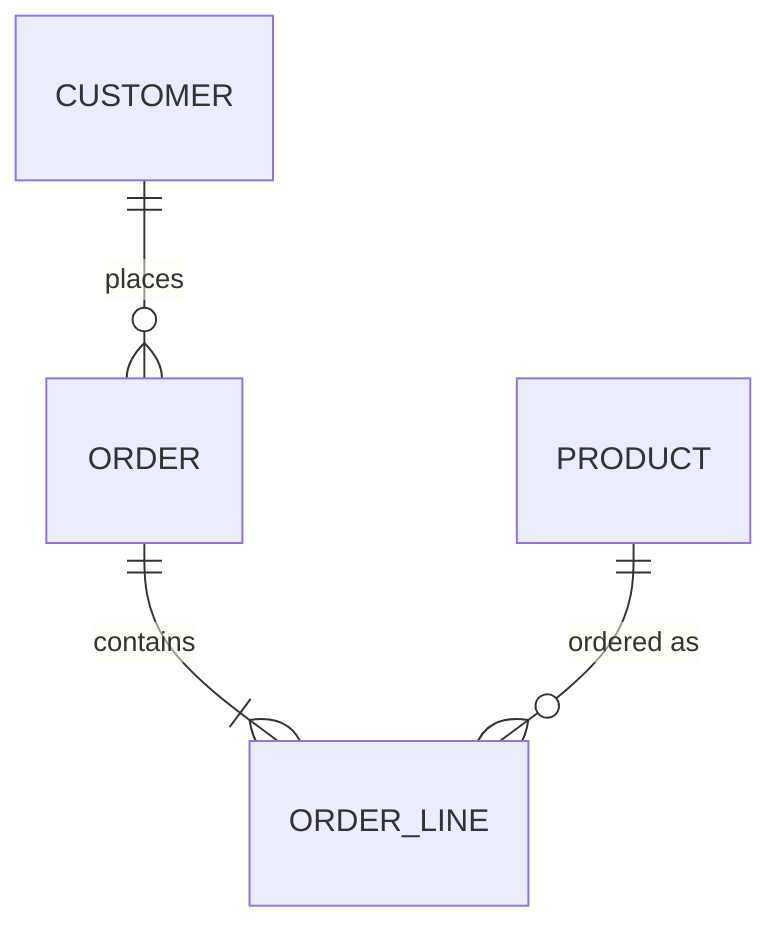
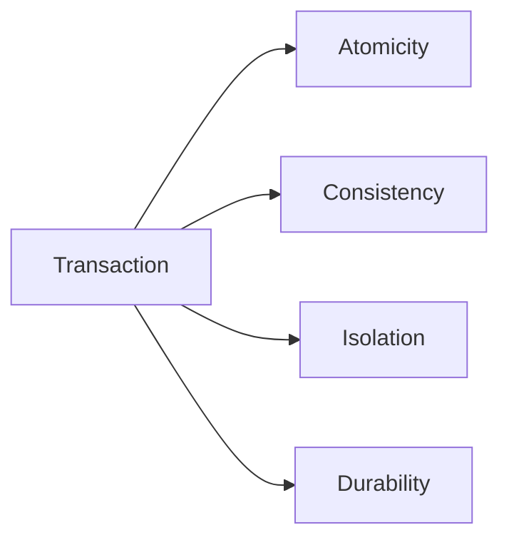
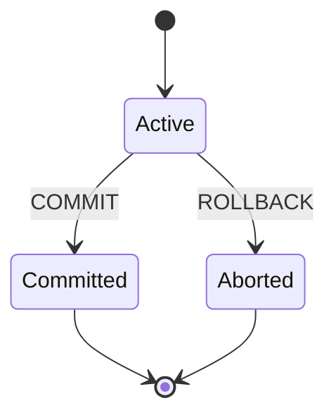
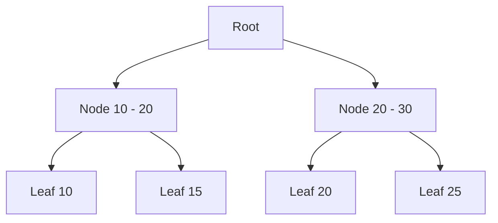

Relational databases power most applications for good reason: they give you
strong guarantees and a clear model. This guide walks through the concepts every
expert DBA lives by, with SQL examples and diagrams.



## ACID

ACID describes the four guarantees a transaction provides.



- **Atomicity** — all statements succeed or none do.
- **Consistency** — the database moves from one valid state to another.
- **Isolation** — concurrent transactions do not interfere.
- **Durability** — committed data survives a crash.



```sql
BEGIN;

UPDATE accounts SET balance = balance - 100 WHERE id = 1;
UPDATE accounts SET balance = balance + 100 WHERE id = 2;

COMMIT;
```

## Primary keys

A primary key uniquely identifies every row. It is always `NOT NULL` and unique.
Prefer a surrogate key (identity, UUID) over a natural key that can change.

```sql
CREATE TABLE customer (
  id BIGINT GENERATED ALWAYS AS IDENTITY PRIMARY KEY,
  email VARCHAR(255) NOT NULL UNIQUE
);
```

Composite keys identify a row by several columns together — the classic
join-table case.

```sql
CREATE TABLE order_line (
  order_id BIGINT NOT NULL,
  product_id BIGINT NOT NULL,
  quantity INT NOT NULL,
  PRIMARY KEY (order_id, product_id)
);
```

## Foreign keys

A foreign key enforces referential integrity: every value must exist in the
referenced table. `ON DELETE` / `ON UPDATE` tell the engine what to do when the
parent changes.

```sql
CREATE TABLE "order" (
  id BIGINT PRIMARY KEY,
  customer_id BIGINT NOT NULL
    REFERENCES customer(id) ON DELETE CASCADE
);
```

`CASCADE` deletes the child when the parent goes; `SET NULL` clears the column;
`RESTRICT` blocks the change.

## Indexes

An index speeds up lookups at the cost of write performance and storage. Most
databases use a B-tree, which keeps data sorted for fast range and equality
scans.



- **Unique index** — enforces uniqueness like a unique constraint.
- **Composite index** — covers multiple columns, left-to-right.
- **Covering index** — stores extra columns so the query never touches the table.
- **Partial index** — only indexes rows matching a condition.

```sql
CREATE UNIQUE INDEX idx_customer_email ON customer(email);

CREATE INDEX idx_order_customer ON "order"(customer_id);

CREATE INDEX idx_order_line_product
  ON order_line(product_id) INCLUDE (quantity);
```

A rule of thumb: index the columns you filter (`WHERE`), join (`JOIN`), and sort
(`ORDER BY`) on.

## Triggers

A trigger runs automatically before or after `INSERT`, `UPDATE`, or `DELETE`.
They are great for audit trails and derived columns. In PostgreSQL the logic
lives in a trigger *function*.

```sql
CREATE FUNCTION audit_order() RETURNS trigger AS $$
BEGIN
  INSERT INTO audit_log (table_name, row_id, action, changed_at)
  VALUES ('order', COALESCE(NEW.id, OLD.id), TG_OP, now());
  RETURN COALESCE(NEW, OLD);
END;
$$ LANGUAGE plpgsql;

CREATE TRIGGER order_audit
AFTER INSERT OR UPDATE OR DELETE ON "order"
FOR EACH ROW EXECUTE FUNCTION audit_order();
```

## Functions

Functions are reusable, composable pieces of logic that return a value.

A scalar function:

```sql
CREATE FUNCTION order_total(order_id BIGINT) RETURNS NUMERIC AS $$
  SELECT COALESCE(SUM(price * quantity), 0)
  FROM order_line
  JOIN product ON product.id = order_line.product_id
  WHERE order_line.order_id = order_total.order_id;
$$ LANGUAGE sql;
```

A table-valued function (returns a set of rows):

```sql
CREATE FUNCTION customer_orders(customer_id BIGINT)
RETURNS TABLE(order_id BIGINT, total NUMERIC, placed_at TIMESTAMPTZ) AS $$
  SELECT id, total, placed_at
  FROM "order"
  WHERE customer_id = customer_orders.customer_id;
$$ LANGUAGE sql;
```

## Stored procedures

Procedures are like functions but can manage their own transactions and do not
have to return a value. Use them for multi-step, transactional operations.

```sql
CREATE PROCEDURE transfer(from_acc BIGINT, to_acc BIGINT, amount NUMERIC)
LANGUAGE plpgsql
AS $$
BEGIN
  UPDATE accounts SET balance = balance - amount WHERE id = from_acc;
  UPDATE accounts SET balance = balance + amount WHERE id = to_acc;
  COMMIT;
END;
$$;
```

## Isolation levels

Isolation controls how much concurrent transactions see of each other.

```sql
SET TRANSACTION ISOLATION LEVEL READ COMMITTED;
```

- **Read uncommitted** — can read uncommitted data (dirty reads).
- **Read committed** — each statement sees a stable snapshot.
- **Repeatable read** — the whole transaction sees one snapshot.
- **Serializable** — transactions behave as if run one at a time.

## Wrapping up

ACID gives you correctness; keys give you integrity; indexes give you speed;
triggers, functions, and procedures give you reusable, enforced logic. Mastering
these — and knowing the trade-offs of each — is what separates a DBA from a
developer who happens to write SQL.
