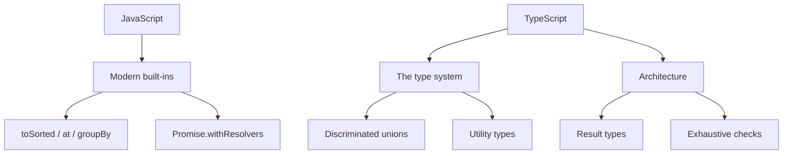

JavaScript keeps gaining small, sharp features, and TypeScript keeps turning
runtime mistakes into compile-time errors. This guide covers the parts that
matter for production front-end code today, with examples.



## JavaScript: the modern essentials

### Optional chaining and nullish coalescing

Read nested data without exploding, and fall back only on `null`/`undefined`.

```typescript
const city = user?.address?.city
const label = name ?? 'Anonymous'
const retries = config?.retries ?? 3
```

### Logical assignment

Mutate a variable only when it is falsy, nullish, or truthy.

```typescript
user.nickname ||= user.firstName
settings.theme ??= 'dark'
```

### Non-mutating array methods

`toSorted`, `toReversed`, `toSpliced`, and `with` return new arrays instead of
mutating, which pairs perfectly with immutable state.

```typescript
const sorted = items.toSorted((a, b) => a.score - b.score)
const reversed = items.toReversed()
const first = items.at(0)
const last = items.at(-1)
```

### Grouping and cloning

`Object.groupBy` buckets a collection in one line, and `structuredClone` deep
copies without JSON hacks.

```typescript
const byStatus = Object.groupBy(orders, (o) => o.status)

const copy = structuredClone(original)
```

### Promise helpers

`Promise.withResolvers` gives you the resolve/reject functions without wrapping
a promise in a constructor.

```typescript
const { promise, resolve, reject } = Promise.withResolvers<string>()

async function nextMessage(): Promise<string> {
  return promise
}
```

`Array.fromAsync` turns an async iterable into an array.

```typescript
const lines = await Array.fromAsync(stream)
```

## TypeScript: the type system that matters

### `unknown` beats `any`

`any` turns the type checker off; `unknown` forces you to narrow first.

```typescript
function parse(value: unknown): string {
  if (typeof value === 'string') return value
  throw new Error('not a string')
}
```

### `satisfies` and `as const`

`satisfies` checks an object against a type without widening it, and `as const`
locks values to their literal types.

```typescript
const palette = {
  primary: '#c770f0',
  danger: '#ef4444',
} satisfies Record<string, string>

const routes = ['/', '/about', '/blog'] as const
type Route = (typeof routes)[number]
```

### Discriminated unions

Model each state with a shared `kind` field, and the compiler narrows it for
you — the backbone of typed reducers and state machines.

```typescript
type State =
  | { kind: 'idle' }
  | { kind: 'loading' }
  | { kind: 'success'; data: User[] }
  | { kind: 'error'; message: string }

function render(state: State): string {
  switch (state.kind) {
    case 'idle': return 'Waiting…'
    case 'loading': return 'Loading…'
    case 'success': return state.data.map((u) => u.name).join(', ')
    case 'error': return state.message
  }
}
```

### Type predicates

Narrow `unknown` into a concrete shape safely.

```typescript
function isUser(value: unknown): value is User {
  return typeof value === 'object' && value !== null && 'id' in value
}
```

### Template literal types

Build string types from unions — great for typed routes and API paths.

```typescript
type Route = `/api/${'users' | 'orders'}/${string}`
```

### `const` type parameters

Keep tuple literals precise without spreading `as const` everywhere.

```typescript
function preserve<const T>(items: T[]): T[] {
  return items
}

const pair = preserve([1, 'two']) // [number, string]
```

### Utility types

Compose new types from existing ones instead of hand-writing them.

```typescript
type UserInput = Omit<User, 'id' | 'createdAt'>
type PartialUser = Partial<User>
type ReadonlyUser = Readonly<User>
```

## Recent TypeScript features

### Standard decorators

Decorators are now part of the language, no experimental flag required.

```typescript
function logged(target: unknown, context: ClassMethodDecoratorContext) {
  // wrap the method
}

class Service {
  @logged
  fetchData() {
    /* ... */
  }
}
```

### Explicit resource management

`using` runs cleanup deterministically via `Symbol.dispose`.

```typescript
function readFile(path: string) {
  using handle = openFile(path)
  return handle.read()
}
```

### `NoInfer`

Stop the compiler from inferring a type argument in a specific position.

```typescript
declare function createPair<T>(first: T, second: NoInfer<T>): T

const result = createPair('a', 'b') // T is inferred from the first arg only
```

## Architecture patterns

### Result types instead of exceptions

Represent success and failure in the type, so callers cannot forget to handle
errors.

```typescript
type Result<T, E = Error> =
  | { ok: true; value: T }
  | { ok: false; error: E }

function divide(a: number, b: number): Result<number> {
  if (b === 0) return { ok: false, error: new Error('division by zero') }
  return { ok: true, value: a / b }
}
```

### Exhaustive checks

A `never` helper guarantees every case is handled when the union grows.

```typescript
function assertNever(value: never): never {
  throw new Error(`Unexpected value: ${value}`)
}

// switch (state.kind) { ... default: assertNever(state) }
```

### Branded types

Prevent mixing up identifiers that share the same underlying type.

```typescript
type UserId = string & { readonly __brand: 'UserId' }
type OrderId = string & { readonly __brand: 'OrderId' }

function toUserId(id: string): UserId {
  return id as UserId
}
```

### Immutability by default

Prefer `readonly`, `as const`, and non-mutating methods so state changes are
explicit.

```typescript
interface Config {
  readonly apiUrl: string
  readonly retries: number
}
```

### ESM and tree-shaking

Use ES modules and named imports so bundlers can drop unused code, and prefer
type-only imports so types never leak into runtime bundles.

```typescript
import type { User } from './models'
import { fetchUsers } from './api'
```

## Wrapping up

The modern front-end expert leans on the sharp new JavaScript APIs for data
handling, and on TypeScript's discriminated unions, utility types, and result
types to push errors to compile time. Adopt these patterns and your code gets
smaller, safer, and far easier to reason about.
