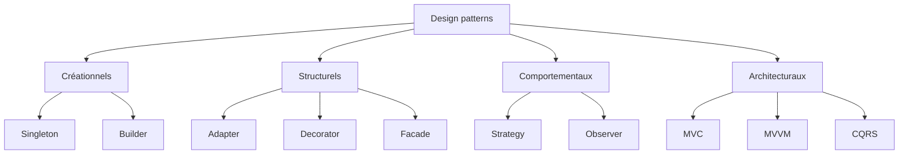

Les design patterns sont des solutions réutilisables à des problèmes courants.
Ce ne sont pas des modèles à copier-coller — ce sont des idées que l'on adapte à
sa propre situation. Ce guide présente dix des plus utiles, regroupés par rôle.



## Strategy (Stratégie)

**L'idée :** choisir un algorithme à l'exécution sans changer le code qui
l'appelle.

Pensez à une page de paiement : le client peut payer par carte, PayPal ou
virement. Chaque option est une stratégie différente derrière le même bouton.

```csharp
public interface IPaymentStrategy
{
    void Pay(decimal amount);
}

public class CreditCardPayment : IPaymentStrategy
{
    public void Pay(decimal amount) => Console.WriteLine($"Paid {amount} by card");
}

public class PayPalPayment : IPaymentStrategy
{
    public void Pay(decimal amount) => Console.WriteLine($"Paid {amount} via PayPal");
}

public class Checkout
{
    private readonly IPaymentStrategy _strategy;

    public Checkout(IPaymentStrategy strategy) => _strategy = strategy;

    public void Complete(decimal amount) => _strategy.Pay(amount);
}
```

## Decorator (Décorateur)

**L'idée :** ajouter un comportement à un objet en l'enveloppant, couche par
couche.

Comme ajouter des suppléments à un café : on part d'un espresso et on empile le
lait, le sucre ou le caramel sans modifier l'espresso lui-même.

```csharp
public interface ICoffee
{
    string Description { get; }
    decimal Cost { get; }
}

public class Espresso : ICoffee
{
    public string Description => "Espresso";
    public decimal Cost => 2.00m;
}

public class MilkDecorator : ICoffee
{
    private readonly ICoffee _inner;

    public MilkDecorator(ICoffee inner) => _inner = inner;

    public string Description => _inner.Description + ", milk";
    public decimal Cost => _inner.Cost + 0.50m;
}
```

## Observer (Observateur)

**L'idée :** un objet notifie plusieurs abonnés lorsqu'il change.

Comme une newsletter : les gens s'abonnent et chacun reçoit une mise à jour à
chaque nouvelle édition.

```csharp
public interface IListener
{
    void Notify(string message);
}

public class NewsFeed
{
    private readonly List<IListener> _listeners = new();

    public void Subscribe(IListener listener) => _listeners.Add(listener);

    public void Publish(string message) =>
        _listeners.ForEach(listener => listener.Notify(message));
}
```

## Singleton

**L'idée :** garantir qu'il n'existe qu'une seule instance d'une classe.

Comme un fichier de configuration unique pour une application — tout le monde
lit le même.

```csharp
public sealed class Configuration
{
    public static Configuration Instance { get; } = new Configuration();

    private Configuration() { }

    public string AppName => "MyApp";
}
```

## Facade (Façade)

**L'idée :** masquer un système complexe derrière une porte d'entrée simple.

Comme le contact d'une voiture : on tourne une clé et de nombreux éléments
travaillent ensemble en dessous.

```csharp
public class OrderFacade
{
    private readonly PaymentService _payment = new();
    private readonly InventoryService _inventory = new();

    public void PlaceOrder(Order order)
    {
        _payment.Charge(order);
        _inventory.Reserve(order);
    }
}
```

## Builder (Monteur)

**L'idée :** construire un objet complexe étape par étape plutôt qu'avec un
énorme constructeur.

Comme commander un burger personnalisé : on choisit le pain, le fromage, les
extras — puis on assemble.

```csharp
public class Burger
{
    public bool Cheese { get; set; }
    public bool Bacon { get; set; }
}

public class BurgerBuilder
{
    private readonly Burger _burger = new();

    public BurgerBuilder AddCheese() { _burger.Cheese = true; return this; }

    public BurgerBuilder AddBacon() { _burger.Bacon = true; return this; }

    public Burger Build() => _burger;
}
```

## Adapter (Adaptateur)

**L'idée :** faire fonctionner ensemble deux interfaces incompatibles.

Comme un adaptateur de prise de voyage qui permet à votre chargeur de se
brancher sur une prise étrangère.

```csharp
public interface IShape
{
    double Area();
}

public class LegacyRectangle
{
    public double Width { get; set; }
    public double Height { get; set; }
}

public class RectangleAdapter : IShape
{
    private readonly LegacyRectangle _rect;

    public RectangleAdapter(LegacyRectangle rect) => _rect = rect;

    public double Area() => _rect.Width * _rect.Height;
}
```

## MVC (Model-View-Controller)

**L'idée :** séparer les données, la présentation et la logique de contrôle.

Le **model** détient les données, la **view** les affiche et le **controller**
réagit aux actions de l'utilisateur.

```csharp
public class User
{
    public string Name { get; set; } = "Olivier";
}

public class UserController
{
    public string GetUserName() => new User().Name;
}
```

## MVVM (Model-View-ViewModel)

**L'idée :** lier directement la vue à un **view model**, afin que l'interface se
mette à jour automatiquement quand les données changent.

Populaire dans les applications desktop et mobiles : un clic modifie une
propriété et l'écran le reflète sans câblage manuel.

```csharp
public class CounterViewModel : INotifyPropertyChanged
{
    private int _count;

    public int Count
    {
        get => _count;
        set { _count = value; OnPropertyChanged(); }
    }

    public void Increment() => Count++;

    // INotifyPropertyChanged implementation omitted for brevity
}
```

## CQRS (Séparation commande/requête)

**L'idée :** séparer les écritures (commandes) des lectures (requêtes).

Les lectures et les écritures ont souvent besoin de modèles et de stockages
différents. Les séparer garde chaque côté simple et scalable.

```csharp
public record CreateOrderCommand(int Id, decimal Total);

public record GetOrderQuery(int Id);

public class CreateOrderHandler
{
    public void Handle(CreateOrderCommand command) { /* save the order */ }
}

public class GetOrderHandler
{
    public Order Handle(GetOrderQuery query) => /* load the order */ null!;
}
```

## Pour conclure

Vous n'utiliserez pas chaque pattern tous les jours — mais les reconnaître vous
aide à lire le code des autres, à discuter clairement des conceptions et à
choisir le bon outil quand un problème vous semble familier.
