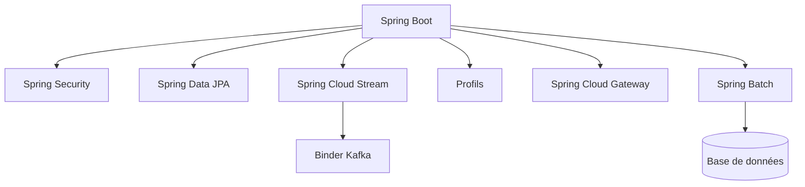
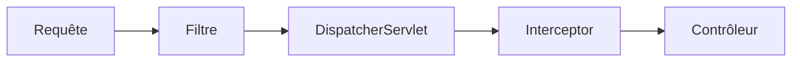

Java ne cesse de devenir plus concis, et l'écosystème Spring ne cesse de
supprimer le boilerplate. Ce guide couvre les fonctionnalités du langage et les
modules Spring qu'un développeur backend expert utilise au quotidien, puis se
termine par une chronologie des versions.



## Java moderne

### Lambdas

Un lambda est une implémentation compacte d'une interface fonctionnelle (une
interface à une seule méthode abstraite). Il alimente l'API Stream et les DSL
fonctionnels de Spring.

```java
List<String> names = List.of("Ada", "Bob", "Cara");

// lambda
names.forEach(name -> System.out.println(name));

// method reference
names.forEach(System.out::println);
```

Le JDK fournit les interfaces fonctionnelles courantes, vous en écrivez donc
rarement.

```java
Predicate<String> isLong = s -> s.length() > 3;
Function<String, Integer> length = String::length;
Consumer<String> print = System.out::println;
Supplier<String> id = () -> UUID.randomUUID().toString();
```

### Streams

Un stream est un pipeline sur une collection : une source, une chaîne
d'opérations intermédiaires paresseuses, et une opération terminale qui
l'exécute.

```java
List<Order> orders = List.of(/* ... */);

List<String> emails = orders.stream()
  .filter(o -> o.total() > 100)
  .sorted(Comparator.comparing(Order::total).reversed())
  .map(Order::customerEmail)
  .distinct()
  .limit(10)
  .toList();
```

Opérations terminales courantes :

```java
double sum = orders.stream().mapToDouble(Order::total).sum();

Map<Status, List<Order>> byStatus =
  orders.stream().collect(Collectors.groupingBy(Order::status));

boolean anyLarge = orders.stream().anyMatch(o -> o.total() > 1000);
```

`filter`, `map`, `sorted`, `distinct` et `limit` sont paresseuses ; `toList`,
`collect`, `reduce` et `forEach` déclenchent le pipeline. Les streams
encouragent un traitement de données immuable et déclaratif.

### Records

Les records offrent des porteurs de données immuables sans boilerplate.

```java
public record User(String name, int age) { }
```

### Pattern matching

`instanceof` rétrécit la variable sur place.

```java
if (obj instanceof String s) {
  System.out.println(s.length());
}
```

Les expressions switch se combinent au pattern matching pour une logique typée
et exhaustive.

```java
String result = switch (obj) {
  case Integer i -> "int " + i;
  case String s  -> "str " + s;
  default        -> "other";
};
```

### Classes scellées

Les hiérarchies scellées déclarent chaque sous-type autorisé, pour que le
compilateur puisse vérifier l'exhaustivité.

```java
public sealed interface Shape permits Circle, Square { }

public record Circle(double radius) implements Shape { }
public record Square(double side) implements Shape { }
```

### Threads virtuels

Le projet Loom (stable depuis Java 21) fait évoluer le code bloquant avec des
threads légers et peu coûteux.

```java
try (var executor = Executors.newVirtualThreadPerTaskExecutor()) {
  executor.submit(() -> handleRequest());
}
```

## Spring Boot

Spring Boot câble une application à partir d'une seule annotation et de valeurs
par défaut sensées, configurées via `application.yml`.

```java
@SpringBootApplication
public class Application {
  public static void main(String[] args) {
    SpringApplication.run(Application.class, args);
  }
}
```

Les starters apportent toute une fonctionnalité (web, data, security) avec une
seule dépendance, et l'auto-configuration s'adapte à ce qui est sur le classpath.

## Beans et composants Spring

Un **bean** est tout objet géré par le conteneur IoC de Spring. Les
**composants** sont des classes auto-détectées par le scan de composants via des
annotations stéréotypes.

```java
@Component
public class EmailService { }

@Service
public class OrderService { }

@Repository
public class OrderRepository { }

@Controller
public class OrderController { }
```

`@Component` est le stéréotype générique ; `@Service`, `@Repository` et
`@Controller` sont des spécialisations qui ajoutent du sens et des
comportements futurs.

Pour les objets tiers ou construits manuellement, déclarez un bean dans une
classe `@Configuration`.

```java
@Configuration
public class AppConfig {
  @Bean
  OrderValidator orderValidator() {
    return new OrderValidator();
  }
}
```

Injectez les dépendances par le constructeur — le choix moderne et testable.

```java
@Service
public class OrderService {
  private final OrderRepository repository;
  private final EmailService email;

  public OrderService(OrderRepository repository, EmailService email) {
    this.repository = repository;
    this.email = email;
  }
}
```

`@Autowired` est l'ancienne méthode pilotée par annotations. Elle peut cibler les
champs, les setters ou les constructeurs.

```java
@Service
public class OrderService {

  @Autowired
  private OrderRepository repository;

  private EmailService email;

  @Autowired
  public void setEmailService(EmailService email) {
    this.email = email;
  }
}
```

L'injection par champ et par setter est flexible mais rend les dépendances
mutables et plus difficiles à tester. Préférez l'injection par constructeur —
sur un constructeur unique, `@Autowired` est même optionnel.

Quand plusieurs beans partagent le même type, `@Qualifier` choisit le bon.

```java
@Service
public class CreditCardPayment implements PaymentService { }

@Service
public class PayPalPayment implements PaymentService { }
```

```java
@Service
public class CheckoutService {

  private final PaymentService payment;

  public CheckoutService(@Qualifier("payPalPayment") PaymentService payment) {
    this.payment = payment;
  }
}
```

Le qualifier est le nom du bean — par défaut le nom de classe avec une première
lettre minuscule. Vous pouvez fixer un nom explicite avec `@Service("paypal")`
ou `@Bean("paypal")`.

Les beans sont des **singletons** par défaut ; demandez d'autres scopes
explicitement.

```java
@Component
@Scope("prototype")
public class ShoppingCart { }
```

`@SpringBootApplication` active le scan de composants sur son package, donc
toute classe annotée y est détectée automatiquement.

## Spring Security

La sécurité se configure via un bean `SecurityFilterChain`. Le DSL lambda est le
style moderne et lisible.

```java
@Bean
SecurityFilterChain filterChain(HttpSecurity http) throws Exception {
  return http
    .authorizeHttpRequests(auth -> auth
      .requestMatchers("/api/public/**").permitAll()
      .anyRequest().authenticated())
    .oauth2ResourceServer(oauth -> oauth.jwt(Customizer.withDefaults()))
    .build();
}
```

Les resource servers JWT sont la norme pour les API sans état ; la sécurité par
méthode (`@PreAuthorize`) protège les appels de service individuels. Activez-la
avec `@EnableMethodSecurity` et annotez les méthodes à protéger.

```java
@RestController
@RequestMapping("/api/orders")
public class OrderController {

  private final OrderService orders;

  public OrderController(OrderService orders) {
    this.orders = orders;
  }

  @PreAuthorize("hasRole('ADMIN')")
  @DeleteMapping("/{id}")
  public void cancel(@PathVariable Long id) {
    orders.cancel(id);
  }
}
```

`@PreAuthorize` accepte SpEL : vous pouvez vérifier les rôles (`hasRole`), les
autorités (`hasAuthority`) ou la requête elle-même (`#id ==
authentication.name`). Utilisez `@PostAuthorize` pour filtrer la valeur
retournée après l'exécution.

## Filtres vs interceptors

Les deux enveloppent les requêtes, mais à des couches différentes. Un **filtre**
fait partie de l'API Servlet et s'exécute autour de toute la requête, avant le
`DispatcherServlet` de Spring. Un **interceptor** est Spring MVC et s'exécute
dans le dispatcher, avec accès au contrôleur cible.



Un filtre sert aux préoccupations qui doivent s'exécuter avant même que Spring
ne voie la requête :

```java
@Component
public class RequestLoggingFilter extends OncePerRequestFilter {

  @Override
  protected void doFilterInternal(
      HttpServletRequest request,
      HttpServletResponse response,
      FilterChain chain) throws ServletException, IOException {

    long start = System.currentTimeMillis();
    chain.doFilter(request, response);
    log.info("{} {} took {} ms", request.getMethod(),
        request.getRequestURI(), System.currentTimeMillis() - start);
  }
}
```

Un interceptor sert aux préoccupations qui ont besoin du contrôleur, comme
chronométrer un handler précis :

```java
@Component
public class TimingInterceptor implements HandlerInterceptor {

  @Override
  public boolean preHandle(HttpServletRequest request,
      HttpServletResponse response, Object handler) {
    request.setAttribute("startTime", System.currentTimeMillis());
    return true;
  }

  @Override
  public void afterCompletion(HttpServletRequest request,
      HttpServletResponse response, Object handler, Exception ex) {
    long start = (long) request.getAttribute("startTime");
    log.info("Handler {} took {} ms", handler,
        System.currentTimeMillis() - start);
  }
}
```

```java
@Configuration
public class WebConfig implements WebMvcConfigurer {

  @Override
  public void addInterceptors(InterceptorRegistry registry) {
    registry.addInterceptor(new TimingInterceptor())
        .addPathPatterns("/api/**");
  }
}
```

| | Filtre | Interceptor |
| --- | --- | --- |
| Couche | API Servlet | Spring MVC |
| S'exécute | Avant le `DispatcherServlet` | Dans le `DispatcherServlet` |
| Voit le contrôleur | Non | Oui (`HandlerMethod`) |
| Usages types | Auth, CORS, encodage, journalisation | Chronométrage, attributs de modèle, journalisation par handler |

En bref : les filtres pour le niveau conteneur, les interceptors pour le niveau
MVC.

## @RestController vs @Controller

`@Controller` est le stéréotype MVC classique : ses méthodes renvoient un **nom
de vue** résolu par un `ViewResolver`. `@RestController` est la combinaison de
`@Controller` + `@ResponseBody`, donc ses méthodes renvoient des **données**
sérialisées en JSON.

```java
@Controller
public class PageController {

  @GetMapping("/")
  public String home() {
    return "index"; // nom de vue, pas du JSON
  }
}
```

```java
@RestController
@RequestMapping("/api/users")
public class UserController {

  private final UserService users;

  public UserController(UserService users) {
    this.users = users;
  }

  @GetMapping
  public List<User> list() {
    return users.findAll(); // sérialisé en JSON
  }
}
```

`@GetMapping`, `@PostMapping`, `@PutMapping` et `@DeleteMapping` sont des
raccourcis pour `@RequestMapping(method = ...)`. Utilisez `@Controller` pour les
pages rendues côté serveur et `@RestController` pour les API.

## Spring Data JPA

Les entités mappent les classes aux tables, et les interfaces de repository
génèrent les requêtes à partir des noms de méthode.

```java
@Entity
@Table(name = "customer")
public class Customer {
  @Id
  @GeneratedValue(strategy = GenerationType.IDENTITY)
  private Long id;

  @Column(nullable = false)
  private String name;
}
```

```java
public interface CustomerRepository extends JpaRepository<Customer, Long> {
  List<Customer> findByNameContainingIgnoreCase(String name);

  Page<Customer> findByNameContainingIgnoreCase(String name, Pageable pageable);
}
```

La pagination utilise `Pageable` avec `Page` ou `Slice` :

```java
Page<Customer> page = repository.findByNameContainingIgnoreCase(
    "a", PageRequest.of(0, 20, Sort.by("name")));

List<Customer> content = page.getContent();
long total = page.getTotalElements();
int pages = page.getTotalPages();
```

`PageRequest.of(page, size)` correspond à `offset = page * size` et
`limit = size`. `Page` exécute une requête `COUNT` supplémentaire pour le total ;
utilisez `Slice` pour l'éviter quand vous n'avez besoin que d'un indicateur
« a-t-il une suite ».

Utilisez `@Transactional` sur les frontières de service pour que plusieurs
écritures soient validées ou annulées ensemble.

```java
@Service
public class OrderService {

  private final OrderRepository orders;
  private final PaymentService payments;

  public OrderService(OrderRepository orders, PaymentService payments) {
    this.orders = orders;
    this.payments = payments;
  }

  @Transactional
  public Order placeOrder(Order order) {
    Order saved = orders.save(order);
    payments.charge(order.getTotal());
    return saved;
  }
}
```

Si une étape lève une `RuntimeException`, toute la méthode est annulée.
Ajustez-la avec `rollbackFor` (pour les exceptions vérifiées), `readOnly = true`
(pour les requêtes en lecture seule) et `propagation` (pour rejoindre ou exiger
une nouvelle transaction).

## Lombok et MapStruct

### Lombok

Lombok supprime le boilerplate avec des annotations à la compilation.
`@Getter`/`@Setter` génèrent les accesseurs, `@Builder` un builder et `@Slf4j`
un logger.

```java
@Getter
@Setter
@Builder
@NoArgsConstructor
@AllArgsConstructor
@Entity
public class Customer {
  @Id
  @GeneratedValue(strategy = GenerationType.IDENTITY)
  private Long id;

  private String name;
}
```

`@RequiredArgsConstructor` génère un constructeur pour les champs `final`, ce qui
se marie parfaitement avec l'injection par constructeur.

```java
@Service
@RequiredArgsConstructor
public class OrderService {
  private final OrderRepository orders;
  private final PaymentService payments;

  public void place(Order order) {
    orders.save(order);
  }
}
```

`@Data` regroupe les accesseurs avec `equals`/`hashCode`/`toString`, mais
évitez-le sur les entités JPA, où le `equals` généré peut mal se comporter sur un
état mutable.

### MapStruct

MapStruct génère des mappers typés entre DTO et entités à la compilation.
Déclarez une interface et il produit l'implémentation.

```java
@Mapper(componentModel = "spring")
public interface CustomerMapper {

  CustomerDto toDto(Customer customer);

  @Mapping(target = "id", ignore = true)
  Customer toEntity(CreateCustomerRequest request);
}
```

Avec `componentModel = "spring"`, le mapper est un bean Spring injectable.

```java
@Service
@RequiredArgsConstructor
public class CustomerService {
  private final CustomerRepository repository;
  private final CustomerMapper mapper;

  public CustomerDto create(CreateCustomerRequest request) {
    return mapper.toDto(repository.save(mapper.toEntity(request)));
  }
}
```

Contrairement aux mappers à réflexion, MapStruct est type-safe et échoue à la
compilation quand les champs ne correspondent pas.

## Spring Cloud Stream avec le binder Kafka

Cloud Stream abstrait l'infrastructure de messagerie derrière un modèle de
binding, de sorte que votre code parle fonctions, pas clients Kafka.

```java
@Bean
Function<Order, Order> processOrder() {
  return order -> {
    // validate, enrich, or transform
    return order;
  };
}
```

```yaml
spring:
  cloud:
    stream:
      bindings:
        processOrder-in-0:
          destination: orders
        processOrder-out-0:
          destination: orders-processed
      kafka:
        binder:
          brokers: localhost:9092
```

Changez le binder (Kafka, Rabbit, Kafka Streams) sans toucher à la fonction.

## Profils

Les profils chargent une configuration différente par environnement. Les
fichiers se nomment `application-{profile}.yml`, et `spring.profiles.active` les
sélectionne.

```yaml
spring:
  profiles:
    active: dev
```

```yaml
# application-dev.yml
server:
  port: 8080
```

### Chargement de plusieurs profils

Les profils sont additifs et ordonnés — activez-en plusieurs à la fois :

```yaml
spring:
  profiles:
    active: dev,local
```

Règles de chargement :

- Un profil **plus tardif** remplace un profil **plus précoce**.
- Chaque `application-{profile}.yml` remplace le `application.yml` de base.
- Sans profil actif, Spring utilise le profil `default` (`application.yml`
  seulement).
- Activez-les en externe avec la variable d'environnement `SPRING_PROFILES_ACTIVE`
  ou `--spring.profiles.active=dev,local`.

Un profil peut aussi en inclure d'autres avec `include` :

```yaml
spring:
  profiles:
    include: common,metrics
```

Vous pouvez aussi conditionner des beans avec `@Profile`.

```java
@Component
@Profile("!prod")
public class DevDataSeeder { }
```

## Spring Cloud Gateway

La gateway route les requêtes vers les services en aval à l'aide de prédicats et
de filtres.

```yaml
spring:
  cloud:
    gateway:
      routes:
        - id: order-service
          uri: lb://ORDER-SERVICE
          predicates:
            - Path=/api/orders/**
          filters:
            - StripPrefix=1
```

Les prédicats font correspondre la requête ; les filtres la transforment
(réécrire le chemin, ajouter des en-têtes, couper le circuit). Avec un client de
découverte, `lb://` répartit la charge entre les instances.

## Spring Batch

Spring Batch gère de grands traitements de données planifiés : lire par blocs,
traiter, écrire, avec reprise et nouvelle tentative intégrées. Un job est
constitué d'étapes orientées par blocs (chunk).

```java
@Configuration
@EnableBatchProcessing
public class BatchConfig {

  @Bean
  public Job importUsersJob(JobRepository jobRepository, Step step) {
    return new JobBuilder("importUsersJob", jobRepository)
        .start(step)
        .build();
  }

  @Bean
  public Step step(JobRepository jobRepository,
      PlatformTransactionManager transactionManager,
      ItemReader<User> reader,
      ItemProcessor<User, User> processor,
      ItemWriter<User> writer) {
    return new StepBuilder("step", jobRepository)
        .<User, User>chunk(100, transactionManager)
        .reader(reader)
        .processor(processor)
        .writer(writer)
        .build();
  }

  @Bean
  public ItemReader<User> reader() {
    return new FlatFileItemReaderBuilder<User>()
        .name("userReader")
        .resource(new FileSystemResource("users.csv"))
        .delimited()
        .names("name", "email")
        .targetType(User.class)
        .build();
  }

  @Bean
  public ItemProcessor<User, User> processor() {
    return user -> {
      user.setEmail(user.getEmail().toLowerCase());
      return user;
    };
  }
}
```

- **Job** — tout le processus batch.
- **Step** — une phase ; ici une étape par blocs qui lit, transforme et écrit.
- **Reader / Processor / Writer** — le pipeline de blocs.
- **chunk(100)** — traite 100 éléments par transaction, pour qu'un échec annule
  un bloc, pas tout le job.

Spring Batch enregistre l'état du job et des étapes dans un stockage de
métadonnées, pour que les jobs puissent reprendre là où ils ont échoué.

## Historique des versions Java

Une chronologie condensée des versions majeures et de leurs changements clés.

| Version | Sortie | Changements majeurs / breaking changes |
| ------- | ------ | -------------------------------------- |
| 8 | Mars 2014 | Lambdas, Streams, `Optional`, `java.time` ; PermGen supprimé (Metaspace) |
| 9 | Sept 2017 | Système de modules (JPMS/Jigsaw), JShell, `List.of`/`Map.of` |
| 10 | Mars 2018 | Inférence de type `var` pour les variables locales |
| 11 | Sept 2018 | LTS ; `HttpClient`, `var` dans les lambdas ; modules Java EE & CORBA supprimés |
| 12 | Mars 2019 | Expressions switch (aperçu), Shenandoah GC |
| 13 | Sept 2019 | Blocs de texte (aperçu), ZGC |
| 14 | Mars 2020 | Expressions switch standard ; records & pattern matching (aperçu) |
| 15 | Sept 2020 | Blocs de texte standard ; classes scellées (aperçu) |
| 16 | Mars 2021 | Records standard ; pattern matching pour `instanceof` standard |
| 17 | Sept 2021 | LTS ; classes scellées standard ; forte encapsulation des internes du JDK |
| 18 | Mars 2022 | Jeu de caractères UTF-8 par défaut ; serveur web simple |
| 19 | Sept 2022 | Threads virtuels (aperçu) ; record patterns (aperçu) |
| 20 | Mars 2023 | Record patterns standard ; threads virtuels (2e aperçu) |
| 21 | Sept 2023 | LTS ; threads virtuels standard, pattern matching pour switch, collections séquencées |
| 22 | Mars 2024 | Variables & motifs sans nom ; instructions avant `super()` |
| 23 | Sept 2024 | Déclarations d'import de module (aperçu) ; motifs primitifs (aperçu) |
| 24 | Mars 2025 | En-têtes d'objets compacts, API class-file, stream gatherers |
| 25 | Sept 2025 | LTS ; concurrence structurée & scoped values stables |

## Pour conclure

Le Java moderne s'appuie sur les records, le pattern matching, les types
scellés et les threads virtuels pour réduire le boilerplate et passer à
l'échelle. L'écosystème Spring empile l'auto-configuration de Boot, la chaîne de
filtres de Security, les repositories de JPA, les bindings de Cloud Stream, les
profils et une gateway. Ensemble, ils donnent un backend de production concis,
typé et facile à raisonner.
