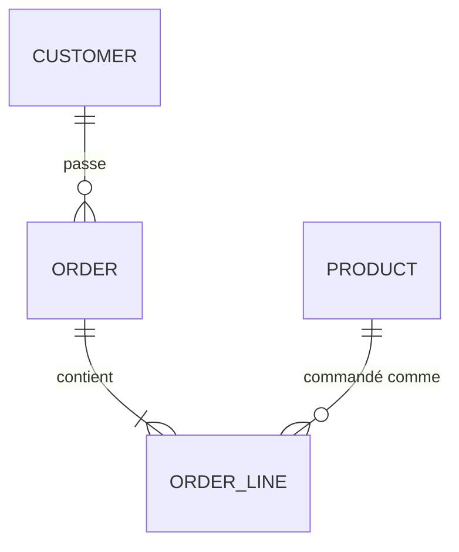
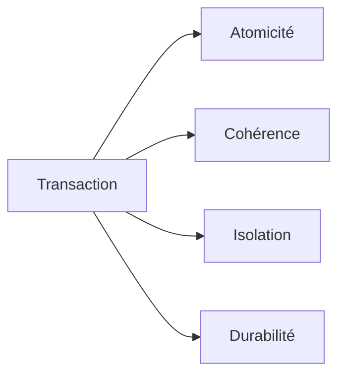
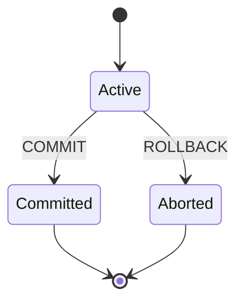
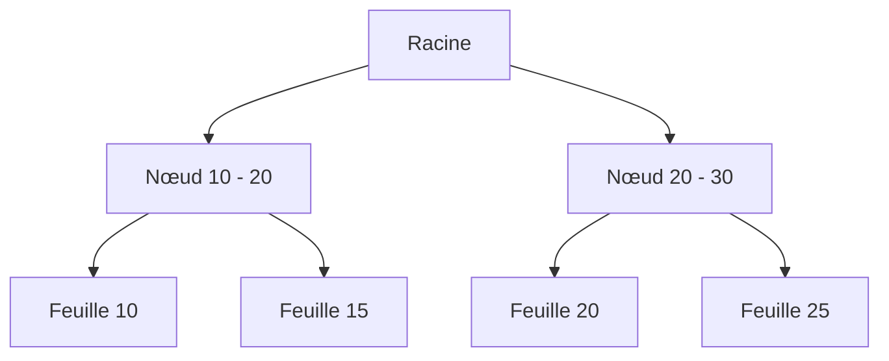

Les bases de données relationnelles font tourner la plupart des applications
pour une bonne raison : elles offrent de solides garanties et un modèle clair.
Ce guide parcourt les concepts sur lesquels tout DBA expert s'appuie, avec des
exemples SQL et des diagrammes.



## ACID

ACID décrit les quatre garanties qu'offre une transaction.



- **Atomicité** — toutes les instructions réussissent ou aucune.
- **Cohérence** — la base passe d'un état valide à un autre état valide.
- **Isolation** — les transactions concurrentes n'interfèrent pas.
- **Durabilité** — les données validées survivent à un crash.



```sql
BEGIN;

UPDATE accounts SET balance = balance - 100 WHERE id = 1;
UPDATE accounts SET balance = balance + 100 WHERE id = 2;

COMMIT;
```

## Clés primaires

Une clé primaire identifie chaque ligne de façon unique. Elle est toujours
`NOT NULL` et unique. Préférez une clé de substitution (identité, UUID) à une
clé naturelle qui peut changer.

```sql
CREATE TABLE customer (
  id BIGINT GENERATED ALWAYS AS IDENTITY PRIMARY KEY,
  email VARCHAR(255) NOT NULL UNIQUE
);
```

Les clés composites identifient une ligne par plusieurs colonnes ensemble — le
cas classique d'une table de jointure.

```sql
CREATE TABLE order_line (
  order_id BIGINT NOT NULL,
  product_id BIGINT NOT NULL,
  quantity INT NOT NULL,
  PRIMARY KEY (order_id, product_id)
);
```

## Clés étrangères

Une clé étrangère garantit l'intégrité référentielle : chaque valeur doit
exister dans la table référencée. `ON DELETE` / `ON UPDATE` indiquent au moteur
quoi faire quand le parent change.

```sql
CREATE TABLE "order" (
  id BIGINT PRIMARY KEY,
  customer_id BIGINT NOT NULL
    REFERENCES customer(id) ON DELETE CASCADE
);
```

`CASCADE` supprime l'enfant quand le parent disparaît ; `SET NULL` efface la
colonne ; `RESTRICT` bloque le changement.

## Index

Un index accélère les recherches au prix de performances d'écriture et de
stockage. La plupart des bases utilisent un B-tree, qui garde les données triées
pour des recherches rapides par égalité et par plage.



- **Index unique** — impose l'unicité comme une contrainte unique.
- **Index composite** — couvre plusieurs colonnes, de gauche à droite.
- **Index couvrant** — stocke des colonnes supplémentaires pour ne jamais toucher la table.
- **Index partiel** — n'indexe que les lignes qui satisfont une condition.

```sql
CREATE UNIQUE INDEX idx_customer_email ON customer(email);

CREATE INDEX idx_order_customer ON "order"(customer_id);

CREATE INDEX idx_order_line_product
  ON order_line(product_id) INCLUDE (quantity);
```

Une règle simple : indexez les colonnes que vous filtrez (`WHERE`), joignez
(`JOIN`) et triez (`ORDER BY`).

## Déclencheurs (triggers)

Un trigger s'exécute automatiquement avant ou après `INSERT`, `UPDATE` ou
`DELETE`. Ils sont parfaits pour les journaux d'audit et les colonnes dérivées.
En PostgreSQL, la logique vit dans une *fonction* de trigger.

```sql
CREATE FUNCTION audit_order() RETURNS trigger AS $$
BEGIN
  INSERT INTO audit_log (table_name, row_id, action, changed_at)
  VALUES ('order', COALESCE(NEW.id, OLD.id), TG_OP, now());
  RETURN COALESCE(NEW, OLD);
END;
$$ LANGUAGE plpgsql;

CREATE TRIGGER order_audit
AFTER INSERT OR UPDATE OR DELETE ON "order"
FOR EACH ROW EXECUTE FUNCTION audit_order();
```

## Fonctions

Les fonctions sont des morceaux de logique réutilisables et composables qui
renvoient une valeur.

Une fonction scalaire :

```sql
CREATE FUNCTION order_total(order_id BIGINT) RETURNS NUMERIC AS $$
  SELECT COALESCE(SUM(price * quantity), 0)
  FROM order_line
  JOIN product ON product.id = order_line.product_id
  WHERE order_line.order_id = order_total.order_id;
$$ LANGUAGE sql;
```

Une fonction table (renvoie un ensemble de lignes) :

```sql
CREATE FUNCTION customer_orders(customer_id BIGINT)
RETURNS TABLE(order_id BIGINT, total NUMERIC, placed_at TIMESTAMPTZ) AS $$
  SELECT id, total, placed_at
  FROM "order"
  WHERE customer_id = customer_orders.customer_id;
$$ LANGUAGE sql;
```

## Procédures stockées

Les procédures ressemblent aux fonctions mais peuvent gérer leurs propres
transactions et n'ont pas à renvoyer de valeur. Utilisez-les pour des opérations
transactionnelles en plusieurs étapes.

```sql
CREATE PROCEDURE transfer(from_acc BIGINT, to_acc BIGINT, amount NUMERIC)
LANGUAGE plpgsql
AS $$
BEGIN
  UPDATE accounts SET balance = balance - amount WHERE id = from_acc;
  UPDATE accounts SET balance = balance + amount WHERE id = to_acc;
  COMMIT;
END;
$$;
```

## Niveaux d'isolation

L'isolation contrôle ce que les transactions concurrentes voient les unes des
autres.

```sql
SET TRANSACTION ISOLATION LEVEL READ COMMITTED;
```

- **Read uncommitted** — peut lire des données non validées (lectures sales).
- **Read committed** — chaque instruction voit un instantané stable.
- **Repeatable read** — toute la transaction voit un seul instantané.
- **Serializable** — les transactions se comportent comme si elles s'exécutaient une à une.

## Pour conclure

ACID vous donne la correction ; les clés donnent l'intégrité ; les index donnent
la vitesse ; les triggers, fonctions et procédures donnent une logique
réutilisable et imposée. Maîtriser tout cela — et en connaître les compromis —
c'est ce qui distingue un DBA d'un développeur qui écrit du SQL par hasard.
