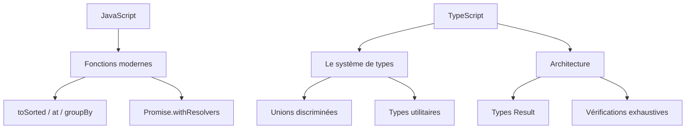

JavaScript gagne sans cesse de petites fonctionnalités précises, et TypeScript
transforme sans cesse les erreurs d'exécution en erreurs de compilation. Ce
guide couvre ce qui compte pour du code front-end de production aujourd'hui,
avec des exemples.



## JavaScript : les essentiels modernes

### Chaînage optionnel et coalescence des nuls

Lire des données imbriquées sans exploser, et ne retomber que sur
`null`/`undefined`.

```typescript
const city = user?.address?.city
const label = name ?? 'Anonymous'
const retries = config?.retries ?? 3
```

### Affectation logique

Ne modifier une variable que lorsqu'elle est fausse, nulle ou vraie.

```typescript
user.nickname ||= user.firstName
settings.theme ??= 'dark'
```

### Méthodes de tableau non mutantes

`toSorted`, `toReversed`, `toSpliced` et `with` renvoient de nouveaux tableaux
au lieu de muter, ce qui se marie parfaitement avec l'état immuable.

```typescript
const sorted = items.toSorted((a, b) => a.score - b.score)
const reversed = items.toReversed()
const first = items.at(0)
const last = items.at(-1)
```

### Groupement et clonage

`Object.groupBy` répartit une collection en une ligne, et `structuredClone` fait
une copie profonde sans bidouillage JSON.

```typescript
const byStatus = Object.groupBy(orders, (o) => o.status)

const copy = structuredClone(original)
```

### Aides pour les promesses

`Promise.withResolvers` vous donne les fonctions resolve/reject sans envelopper
une promesse dans un constructeur.

```typescript
const { promise, resolve, reject } = Promise.withResolvers<string>()

async function nextMessage(): Promise<string> {
  return promise
}
```

`Array.fromAsync` transforme un itérable asynchrone en tableau.

```typescript
const lines = await Array.fromAsync(stream)
```

## TypeScript : le système de types qui compte

### `unknown` bat `any`

`any` désactive le vérificateur de types ; `unknown` vous oblige à rétrécir
d'abord.

```typescript
function parse(value: unknown): string {
  if (typeof value === 'string') return value
  throw new Error('not a string')
}
```

### `satisfies` et `as const`

`satisfies` vérifie un objet contre un type sans l'élargir, et `as const` fige
les valeurs sur leurs types littéraux.

```typescript
const palette = {
  primary: '#c770f0',
  danger: '#ef4444',
} satisfies Record<string, string>

const routes = ['/', '/about', '/blog'] as const
type Route = (typeof routes)[number]
```

### Unions discriminées

Modélisez chaque état avec un champ `kind` partagé, et le compilateur rétrécit
pour vous — le socle des reducers et machines à états typés.

```typescript
type State =
  | { kind: 'idle' }
  | { kind: 'loading' }
  | { kind: 'success'; data: User[] }
  | { kind: 'error'; message: string }

function render(state: State): string {
  switch (state.kind) {
    case 'idle': return 'Waiting…'
    case 'loading': return 'Loading…'
    case 'success': return state.data.map((u) => u.name).join(', ')
    case 'error': return state.message
  }
}
```

### Prédicats de type

Rétrécissez `unknown` vers une forme concrète en toute sécurité.

```typescript
function isUser(value: unknown): value is User {
  return typeof value === 'object' && value !== null && 'id' in value
}
```

### Types template littéraux

Construisez des types de chaînes à partir d'unions — idéal pour les routes et
chemins d'API typés.

```typescript
type Route = `/api/${'users' | 'orders'}/${string}`
```

### Paramètres de type `const`

Gardez les littéraux de tuples précis sans saupoudrer `as const` partout.

```typescript
function preserve<const T>(items: T[]): T[] {
  return items
}

const pair = preserve([1, 'two']) // [number, string]
```

### Types utilitaires

Composez de nouveaux types à partir d'existants au lieu de les écrire à la main.

```typescript
type UserInput = Omit<User, 'id' | 'createdAt'>
type PartialUser = Partial<User>
type ReadonlyUser = Readonly<User>
```

## Fonctionnalités TypeScript récentes

### Décorateurs standard

Les décorateurs font désormais partie du langage, sans drapeau expérimental.

```typescript
function logged(target: unknown, context: ClassMethodDecoratorContext) {
  // wrap the method
}

class Service {
  @logged
  fetchData() {
    /* ... */
  }
}
```

### Gestion explicite des ressources

`using` exécute le nettoyage de manière déterministe via `Symbol.dispose`.

```typescript
function readFile(path: string) {
  using handle = openFile(path)
  return handle.read()
}
```

### `NoInfer`

Empêchez le compilateur d'inférer un argument de type à une position précise.

```typescript
declare function createPair<T>(first: T, second: NoInfer<T>): T

const result = createPair('a', 'b') // T est inféré depuis le premier argument uniquement
```

## Modèles d'architecture

### Types Result au lieu d'exceptions

Représentez le succès et l'échec dans le type, pour que les appelants ne puissent
pas oublier de gérer les erreurs.

```typescript
type Result<T, E = Error> =
  | { ok: true; value: T }
  | { ok: false; error: E }

function divide(a: number, b: number): Result<number> {
  if (b === 0) return { ok: false, error: new Error('division by zero') }
  return { ok: true, value: a / b }
}
```

### Vérifications exhaustives

Un utilitaire `never` garantit que chaque cas est traité quand l'union grandit.

```typescript
function assertNever(value: never): never {
  throw new Error(`Unexpected value: ${value}`)
}

// switch (state.kind) { ... default: assertNever(state) }
```

### Types marqués (branded types)

Évitez de confondre des identifiants qui partagent le même type sous-jacent.

```typescript
type UserId = string & { readonly __brand: 'UserId' }
type OrderId = string & { readonly __brand: 'OrderId' }

function toUserId(id: string): UserId {
  return id as UserId
}
```

### Immutabilité par défaut

Préférez `readonly`, `as const` et les méthodes non mutantes pour que les
changements d'état soient explicites.

```typescript
interface Config {
  readonly apiUrl: string
  readonly retries: number
}
```

### ESM et tree-shaking

Utilisez les modules ES et les imports nommés pour que les bundlers puissent
supprimer le code inutilisé, et préférez les imports de type pour que les types
ne s'infiltrent jamais dans les bundles d'exécution.

```typescript
import type { User } from './models'
import { fetchUsers } from './api'
```

## Pour conclure

L'expert front-end moderne s'appuie sur les nouvelles API JavaScript pour le
traitement des données, et sur les unions discriminées, les types utilitaires et
les types Result de TypeScript pour repousser les erreurs à la compilation.
Adoptez ces motifs et votre code devient plus petit, plus sûr et bien plus
facile à raisonner.
