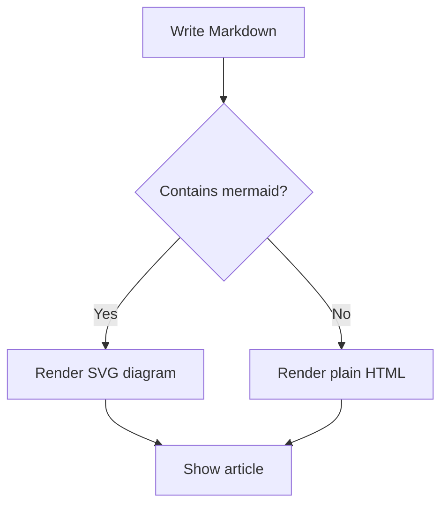
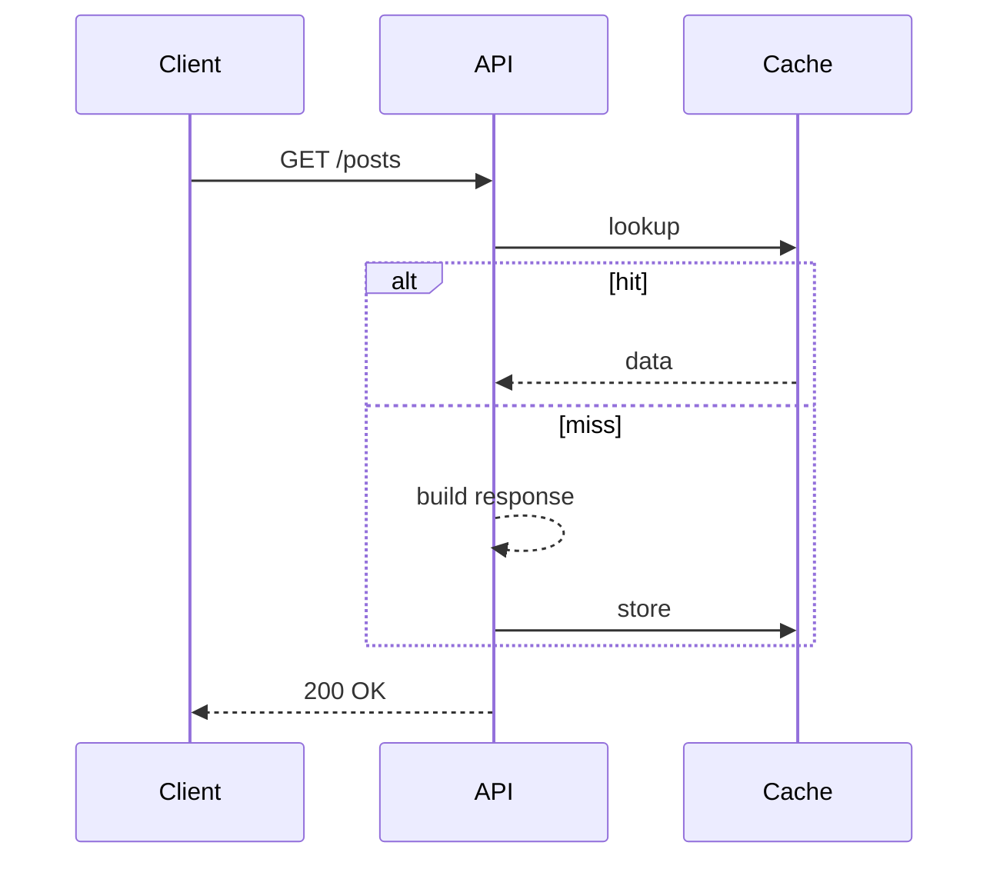

## Pourquoi un blog ?

J'ai créé cet espace pour partager les notes et leçons que je recueille au fil de
mes projets personnels et de mes missions en production. Attendez-vous à des
articles de fond sur **SolidJS**, **.NET**, **Java**, **Angular** et leurs outils.

## La puissance du Markdown

Les articles sont rédigés en Markdown, ce qui me permet de me concentrer sur le
contenu. Le moteur de rendu prend en charge l'essentiel :

- Titres, listes et citations
- Tableaux
- Liens et images
- Blocs de code avec **coloration syntaxique**
- Diagrammes **Mermaid**

## Coloration syntaxique

Les blocs de code sont colorés automatiquement selon le langage indiqué :

```typescript
export interface Feature<T> {
  run(input: T): Promise<T>
}

export const identity = <T,>(value: T): T => value
```

```csharp
public sealed class Greeter
{
    public string Hello(string name) => $"Hello, {name}!";
}
```

## Diagrammes Mermaid

Les diagrammes sont rendus à partir d'un bloc `mermaid` :



Les diagrammes de séquence fonctionnent aussi :



## Pour finir

Voilà l'essentiel. Restez à l'écoute pour des articles techniques plus détaillés.
