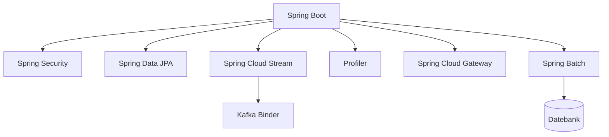

Java gëtt ëmmer méi kompakt, an den Spring-Ecosystem hëlt ëmmer méi Boilerplate
ewech. Dëse Guide deckt d'Sproochfeatures an d'Spring-Moduler of, déi en
Expert-Backend-Entwéckler all Dag benotzt, a schléisst mat enger
Versiounschronologie.



## Modernt Java

### Lambdas

E Lambda ass eng kompakt Ëmsetzung vun engem funktionellen Interface (en
Interface mat enger eenzeger abstrakter Method). Et dreift d'Stream API an déi
funktionell DSLen vu Spring.

```java
List<String> names = List.of("Ada", "Bob", "Cara");

// lambda
names.forEach(name -> System.out.println(name));

// method reference
names.forEach(System.out::println);
```

D'JDK liwwert déi heefeg funktionell Interfaces, Dir schreift se also selten.

```java
Predicate<String> isLong = s -> s.length() > 3;
Function<String, Integer> length = String::length;
Consumer<String> print = System.out::println;
Supplier<String> id = () -> UUID.randomUUID().toString();
```

### Streams

E Stream ass e Pipeline iwwer eng Kollektioun: eng Quell, eng Kette vu faulen
Zwëschenoperatiounen, an eng terminal Operatioun, déi e leeft.

```java
List<Order> orders = List.of(/* ... */);

List<String> emails = orders.stream()
  .filter(o -> o.total() > 100)
  .sorted(Comparator.comparing(Order::total).reversed())
  .map(Order::customerEmail)
  .distinct()
  .limit(10)
  .toList();
```

Heefeg terminal Operatiounen:

```java
double sum = orders.stream().mapToDouble(Order::total).sum();

Map<Status, List<Order>> byStatus =
  orders.stream().collect(Collectors.groupingBy(Order::status));

boolean anyLarge = orders.stream().anyMatch(o -> o.total() > 1000);
```

`filter`, `map`, `sorted`, `distinct` a `limit` si faul; `toList`, `collect`,
`reduce` a `forEach` starten de Pipeline. Streams encouragéieren immutable,
deklarativ Dateveraarbechtung.

### Records

Records ginn Iech immutable Daten-Droen ouni Boilerplate.

```java
public record User(String name, int age) { }
```

### Pattern Matching

`instanceof` schränkt d'Variabel direkt an.

```java
if (obj instanceof String s) {
  System.out.println(s.length());
}
```

Switch Expressions kombinéiere sech mam Pattern Matching fir exhaustiv,
typiséiert Logik.

```java
String result = switch (obj) {
  case Integer i -> "int " + i;
  case String s  -> "str " + s;
  default        -> "other";
};
```

### Sealed Classes

Sealed Hierarchie deklaréieren all erlaabten Ënnertyp, sou datt de Compiler
d'Exhaustivitéit ka kontrolléieren.

```java
public sealed interface Shape permits Circle, Square { }

public record Circle(double radius) implements Shape { }
public record Square(double side) implements Shape { }
```

### Virtuell Threads

De Projet Loom (stabil zënter Java 21) léisst blockéierende Code mat liichten,
bëllege Threads skaléieren.

```java
try (var executor = Executors.newVirtualThreadPerTaskExecutor()) {
  executor.submit(() -> handleRequest());
}
```

## Spring Boot

Spring Boot verdrot eng Applikatioun aus enger eenzeger Annotatioun a vernünftege
Standardwäerter, konfiguréiert iwwer `application.yml`.

```java
@SpringBootApplication
public class Application {
  public static void main(String[] args) {
    SpringApplication.run(Application.class, args);
  }
}
```

Starters bréngen eng ganz Funktioun (Web, Data, Security) mat enger eenzeger
Ofhängegkeet, an d'Auto-Configuratioun passt sech un dat un, wat um Classpath
ass.

## Spring Beans a Komponenten

E **Bean** ass all Objet, dee vum Spring IoC-Container geréiert gëtt.
**Komponenten** si Klassen, déi duerch Component Scanning iwwer Stereotyp-
Annotatiounen automatesch fonnt ginn.

```java
@Component
public class EmailService { }

@Service
public class OrderService { }

@Repository
public class OrderRepository { }

@Controller
public class OrderController { }
```

`@Component` ass de generesche Stereotyp; `@Service`, `@Repository` an
`@Controller` si Spezialisatiounen, déi Bedeitung an zukünftegt Verhalen
derbäisetzen.

Fir Drëtt-Partei- oder manuell gebauten Objeten, deklaréiert e Bean an enger
`@Configuration`-Klass.

```java
@Configuration
public class AppConfig {
  @Bean
  OrderValidator orderValidator() {
    return new OrderValidator();
  }
}
```

Injizéiert Ofhängegkeeten iwwer de Konstruktor — de modernen, testbaren
Standard.

```java
@Service
public class OrderService {
  private final OrderRepository repository;
  private final EmailService email;

  public OrderService(OrderRepository repository, EmailService email) {
    this.repository = repository;
    this.email = email;
  }
}
```

`@Autowired` ass déi eeler, annotatiounsgedriwwen Aart. Et kann Felder, Setteren
oder Konstruktoren zielen.

```java
@Service
public class OrderService {

  @Autowired
  private OrderRepository repository;

  private EmailService email;

  @Autowired
  public void setEmailService(EmailService email) {
    this.email = email;
  }
}
```

Feld- a Setter-Injektioun si flexibel, maachen awer Ofhängegkeeten mutabel a
méi schwéier ze testen. Léiwer Konstruktor-Injektioun — bei engem eenzege
Konstruktor ass `@Autowired` souguer fakultativ.

Wann méi Beans dee selwechten Typ deelen, wielt `@Qualifier` de richtegen aus.

```java
@Service
public class CreditCardPayment implements PaymentService { }

@Service
public class PayPalPayment implements PaymentService { }
```

```java
@Service
public class CheckoutService {

  private final PaymentService payment;

  public CheckoutService(@Qualifier("payPalPayment") PaymentService payment) {
    this.payment = payment;
  }
}
```

De Qualifier ass de Bean-Numm — standardméisseg de Klassennumm mat engem klengen
éischte Buschtaf. Dir kënnt en expliziten Numm mat `@Service("paypal")` oder
`@Bean("paypal")` setzen.

Beans sinn standardméisseg **Singletons**; freet aner Scopes explizit un.

```java
@Component
@Scope("prototype")
public class ShoppingCart { }
```

`@SpringBootApplication` aktivéiert de Component Scanning iwwer säi Package, sou
datt all annotéiert Klass do automatesch opgeholl gëtt.

## Spring Security

Security gëtt iwwer e `SecurityFilterChain`-Bean konfiguréiert. Den Lambda-DSL ass
de modernen, liesbaren Stil.

```java
@Bean
SecurityFilterChain filterChain(HttpSecurity http) throws Exception {
  return http
    .authorizeHttpRequests(auth -> auth
      .requestMatchers("/api/public/**").permitAll()
      .anyRequest().authenticated())
    .oauth2ResourceServer(oauth -> oauth.jwt(Customizer.withDefaults()))
    .build();
}
```

JWT Resource Servers sinn de Standard fir stateless APIen; Method-Security
(`@PreAuthorize`) schützt eenzel Service-Opruff. Aktivéiert et mat
`@EnableMethodSecurity` an annotéiert d'Methoden, déi Dir schütze wëllt.

```java
@RestController
@RequestMapping("/api/orders")
public class OrderController {

  private final OrderService orders;

  public OrderController(OrderService orders) {
    this.orders = orders;
  }

  @PreAuthorize("hasRole('ADMIN')")
  @DeleteMapping("/{id}")
  public void cancel(@PathVariable Long id) {
    orders.cancel(id);
  }
}
```

`@PreAuthorize` akzeptéiert SpEL: Dir kënnt Rollen (`hasRole`), Autoritéiten
(`hasAuthority`) oder d'Ufro selwer (`#id == authentication.name`) prüfen.
Benotzt `@PostAuthorize`, fir de zeréckginnene Wäert no der Ausféierung ze
filteren.

## Filter vs Interceptors

Béid wéckelen Ufroen an, awer op verschiddene Schichten. E **Filter** ass Deel
vun der Servlet API a leeft ronderëm déi ganz Ufro, virum Spring säin
`DispatcherServlet`. En **Interceptor** ass Spring MVC a leeft am Dispatcher,
mat Zougang zum Zil-Controller.


E Filter ass fir Konzerner, déi musse lafen, ier Spring d'Ufro iwwerhaapt gesäit:

```java
@Component
public class RequestLoggingFilter extends OncePerRequestFilter {

  @Override
  protected void doFilterInternal(
      HttpServletRequest request,
      HttpServletResponse response,
      FilterChain chain) throws ServletException, IOException {

    long start = System.currentTimeMillis();
    chain.doFilter(request, response);
    log.info("{} {} took {} ms", request.getMethod(),
        request.getRequestURI(), System.currentTimeMillis() - start);
  }
}
```

En Interceptor ass fir Konzerner, déi de Controller brauchen, wéi zum Beispill e
bestëmmten Handler ze stoppen:

```java
@Component
public class TimingInterceptor implements HandlerInterceptor {

  @Override
  public boolean preHandle(HttpServletRequest request,
      HttpServletResponse response, Object handler) {
    request.setAttribute("startTime", System.currentTimeMillis());
    return true;
  }

  @Override
  public void afterCompletion(HttpServletRequest request,
      HttpServletResponse response, Object handler, Exception ex) {
    long start = (long) request.getAttribute("startTime");
    log.info("Handler {} took {} ms", handler,
        System.currentTimeMillis() - start);
  }
}
```

```java
@Configuration
public class WebConfig implements WebMvcConfigurer {

  @Override
  public void addInterceptors(InterceptorRegistry registry) {
    registry.addInterceptor(new TimingInterceptor())
        .addPathPatterns("/api/**");
  }
}
```

| | Filter | Interceptor |
| --- | --- | --- |
| Schicht | Servlet API | Spring MVC |
| Leeft | Virum `DispatcherServlet` | Am `DispatcherServlet` |
| Gesäit de Controller | Nee | Jo (`HandlerMethod`) |
| Typesch Notzung | Auth, CORS, Encoding, Logging | Timing, Modellattributer, handlerbewosst Logging |

Kuerz gesot: Filtere fir d'Containerniveau, Interceptore fir d'MVC-Niveau.

## @RestController vs @Controller

`@Controller` ass de klasseschen MVC-Stereotyp: seng Methode ginn en **View-Numm**
zeréck, dee vun engem `ViewResolver` opgeléist gëtt. `@RestController` ass
d'Kombinatioun vu `@Controller` + `@ResponseBody`, sou datt seng Methode
**Donnéeën** zeréckginn, déi op JSON serialiséiert ginn.

```java
@Controller
public class PageController {

  @GetMapping("/")
  public String home() {
    return "index"; // View-Numm, net JSON
  }
}
```

```java
@RestController
@RequestMapping("/api/users")
public class UserController {

  private final UserService users;

  public UserController(UserService users) {
    this.users = users;
  }

  @GetMapping
  public List<User> list() {
    return users.findAll(); // op JSON serialiséiert
  }
}
```

`@GetMapping`, `@PostMapping`, `@PutMapping` an `@DeleteMapping` si Kierzel fir
`@RequestMapping(method = ...)`. Benotzt `@Controller` fir servergerendert
Säiten an `@RestController` fir APIen.

## Spring Data JPA

Entitéite mappen Klasse op Tabellen, an Repository-Interfaces generéieren
d'Querien aus de Methodennimm.

```java
@Entity
@Table(name = "customer")
public class Customer {
  @Id
  @GeneratedValue(strategy = GenerationType.IDENTITY)
  private Long id;

  @Column(nullable = false)
  private String name;
}
```

```java
public interface CustomerRepository extends JpaRepository<Customer, Long> {
  List<Customer> findByNameContainingIgnoreCase(String name);

  Page<Customer> findByNameContainingIgnoreCase(String name, Pageable pageable);
}
```

D'Paginéierung benotzt `Pageable` mat `Page` oder `Slice`:

```java
Page<Customer> page = repository.findByNameContainingIgnoreCase(
    "a", PageRequest.of(0, 20, Sort.by("name")));

List<Customer> content = page.getContent();
long total = page.getTotalElements();
int pages = page.getTotalPages();
```

`PageRequest.of(page, size)` entsprécht `offset = page * size` an `limit = size`.
`Page` mécht eng zousätzlech `COUNT`-Ufro fir den Total; benotzt `Slice`, fir se
ze spueren, wann Dir nëmmen en « huet et eng Säit méi »-Indikateur braucht.

Benotzt `@Transactional` op de Service-Grenzen, fir datt méi Schreibvirstellungen
zesumme committéiert oder zeréckgerullt ginn.

```java
@Service
public class OrderService {

  private final OrderRepository orders;
  private final PaymentService payments;

  public OrderService(OrderRepository orders, PaymentService payments) {
    this.orders = orders;
    this.payments = payments;
  }

  @Transactional
  public Order placeOrder(Order order) {
    Order saved = orders.save(order);
    payments.charge(order.getTotal());
    return saved;
  }
}
```

Wann ee Schrëtt eng `RuntimeException` werft, gëtt déi ganz Method zeréckgerullt.
Passt et mat `rollbackFor` (fir Checked Exceptions), `readOnly = true` (fir
Read-Only-Querien) a `propagation` (fir eng Transaktioun bäizetrieden oder eng
nei ze verlaangen) un.

## Lombok a MapStruct

### Lombok

Lombok hëlt Boilerplate mat Compile-Zäit-Annotatiounen ewech. `@Getter`/`@Setter`
generéieren Accessoren, `@Builder` e Builder a `@Slf4j` e Logger.

```java
@Getter
@Setter
@Builder
@NoArgsConstructor
@AllArgsConstructor
@Entity
public class Customer {
  @Id
  @GeneratedValue(strategy = GenerationType.IDENTITY)
  private Long id;

  private String name;
}
```

`@RequiredArgsConstructor` generéiert e Konstruktor fir `final`-Felder, wat
perfekt mat der Konstruktor-Injektioun zesummegeet.

```java
@Service
@RequiredArgsConstructor
public class OrderService {
  private final OrderRepository orders;
  private final PaymentService payments;

  public void place(Order order) {
    orders.save(order);
  }
}
```

`@Data` bündelt d'Accessoren mat `equals`/`hashCode`/`toString`, awer vermeit et
op JPA-Entitéiten, wou de generéierten `equals` sech op mutablem Zoustand
schlecht behuele kann.

### MapStruct

MapStruct generéiert type-sécher Mapper tëscht DTOen an Entitéiten zur
Compile-Zäit. Deklaréiert en Interface an et produzéiert d'Ëmsetzung.

```java
@Mapper(componentModel = "spring")
public interface CustomerMapper {

  CustomerDto toDto(Customer customer);

  @Mapping(target = "id", ignore = true)
  Customer toEntity(CreateCustomerRequest request);
}
```

Mat `componentModel = "spring"` ass de Mapper e Spring Bean, deen Dir injizéiere
kënnt.

```java
@Service
@RequiredArgsConstructor
public class CustomerService {
  private final CustomerRepository repository;
  private final CustomerMapper mapper;

  public CustomerDto create(CreateCustomerRequest request) {
    return mapper.toDto(repository.save(mapper.toEntity(request)));
  }
}
```

Am Géigesaz zu Reflexiouns-Mapper ass MapStruct type-sécher a feelt zur
Compile-Zäit, wann d'Felder net iwwereneestëmmen.

## Spring Cloud Stream mam Kafka Binder

Cloud Stream abstrahéiert d'Messaging-Infrastruktur hannert engem Binding-Modell,
sou datt Äre Code Funktiounen schwätzt, net Kafka-Clients.

```java
@Bean
Function<Order, Order> processOrder() {
  return order -> {
    // validate, enrich, or transform
    return order;
  };
}
```

```yaml
spring:
  cloud:
    stream:
      bindings:
        processOrder-in-0:
          destination: orders
        processOrder-out-0:
          destination: orders-processed
      kafka:
        binder:
          brokers: localhost:9092
```

Wiesselt de Binder (Kafka, Rabbit, Kafka Streams) ouni d'Funktioun ze beréieren.

## Profiler

Profiler luede pro Ëmfeld eng aner Configuratioun. D'Dateien heeschen
`application-{profile}.yml`, an `spring.profiles.active` wielt se aus.

```yaml
spring:
  profiles:
    active: dev
```

```yaml
# application-dev.yml
server:
  port: 8080
```

### Méi Profiler lueden

Profiler sinn additiv an uerdentlech — aktivéiert méi gläichzäiteg:

```yaml
spring:
  profiles:
    active: dev,local
```

Lued-Regelen:

- E **spéidere** Profil iwwerschreift e **frësche** Profil.
- All `application-{profile}.yml` iwwerschreift d'Basis-`application.yml`.
- Ouni aktive Profil benotzt Spring de `default`-Profil (`application.yml`
  nëmmen).
- Aktivéiert se vu baussen iwwer d'Ëmfeldvariabel `SPRING_PROFILES_ACTIVE` oder
  `--spring.profiles.active=dev,local`.

E Profil kann anerer mat `include` eraopzéien:

```yaml
spring:
  profiles:
    include: common,metrics
```

Dir kënnt Beans och mat `@Profile` gaten.

```java
@Component
@Profile("!prod")
public class DevDataSeeder { }
```

## Spring Cloud Gateway

D'Gateway route Ufroen op Downstream-Servicer mat Predicates a Filteren.

```yaml
spring:
  cloud:
    gateway:
      routes:
        - id: order-service
          uri: lb://ORDER-SERVICE
          predicates:
            - Path=/api/orders/**
          filters:
            - StripPrefix=1
```

Predicates passen d'Ufro un; Filteren transforméieren se (Pad ëmschreiwen,
Header derbäisetzen, Circuit Breaker). Mat engem Discovery-Client verdeelt
`lb://` d'Laascht iwwer d'Instanzen.

## Spring Batch

Spring Batch verschafft grouss, geplangt Dateveraarbechtung: a Bléck liesen,
veraarbechten, schreiwen, mat Restart a Retry agebaut. E Job besteet aus
chunkorientéierte Schrëtt.

```java
@Configuration
@EnableBatchProcessing
public class BatchConfig {

  @Bean
  public Job importUsersJob(JobRepository jobRepository, Step step) {
    return new JobBuilder("importUsersJob", jobRepository)
        .start(step)
        .build();
  }

  @Bean
  public Step step(JobRepository jobRepository,
      PlatformTransactionManager transactionManager,
      ItemReader<User> reader,
      ItemProcessor<User, User> processor,
      ItemWriter<User> writer) {
    return new StepBuilder("step", jobRepository)
        .<User, User>chunk(100, transactionManager)
        .reader(reader)
        .processor(processor)
        .writer(writer)
        .build();
  }

  @Bean
  public ItemReader<User> reader() {
    return new FlatFileItemReaderBuilder<User>()
        .name("userReader")
        .resource(new FileSystemResource("users.csv"))
        .delimited()
        .names("name", "email")
        .targetType(User.class)
        .build();
  }

  @Bean
  public ItemProcessor<User, User> processor() {
    return user -> {
      user.setEmail(user.getEmail().toLowerCase());
      return user;
    };
  }
}
```

- **Job** — de ganze Batch-Prozess.
- **Step** — eng Phas; hei e Chunk-Schrëtt, dee liest, transforméiert a schreift.
- **Reader / Processor / Writer** — de Chunk-Pipeline.
- **chunk(100)** — veraarbecht 100 Elementer pro Transaktioun, sou datt e Feeler
  ee Chunk zeréckrullt, net de ganze Job.

Spring Batch protokolléiert de Job- a Schrëtt-Status an engem
Metadaten-Späicher, sou datt Jobs do kënne weiderfueren, wou se feelgeschloe sinn.

## Java Versiounsgeschicht

Eng kompakt Chronologie vun de grousse Versiounen an hire Kärännerungen.

| Versioun | Release | Breaking Changes / Neiegkeeten |
| -------- | ------- | ------------------------------ |
| 8 | Mäerz 2014 | Lambdas, Streams, `Optional`, `java.time`; PermGen ewechgeholl (Metaspace) |
| 9 | Sept 2017 | Modulsystem (JPMS/Jigsaw), JShell, `List.of`/`Map.of` |
| 10 | Mäerz 2018 | `var` Typinferenz fir lokal Variabelen |
| 11 | Sept 2018 | LTS; `HttpClient`, `var` a Lambdas; Java EE & CORBA Moduler ewechgeholl |
| 12 | Mäerz 2019 | Switch Expressions (Virschau), Shenandoah GC |
| 13 | Sept 2019 | Text Blocks (Virschau), ZGC |
| 14 | Mäerz 2020 | Switch Expressions standard; Records & Pattern Matching (Virschau) |
| 15 | Sept 2020 | Text Blocks standard; Sealed Classes (Virschau) |
| 16 | Mäerz 2021 | Records standard; Pattern Matching fir `instanceof` standard |
| 17 | Sept 2021 | LTS; Sealed Classes standard; staark Enkapsulatioun vun den JDK-Internen |
| 18 | Mäerz 2022 | UTF-8 Standard Charset; einfachen Webserver |
| 19 | Sept 2022 | Virtuell Threads (Virschau); Record Patterns (Virschau) |
| 20 | Mäerz 2023 | Record Patterns standard; Virtuell Threads (2. Virschau) |
| 21 | Sept 2023 | LTS; Virtuell Threads standard, Pattern Matching fir Switch, Sequenced Collections |
| 22 | Mäerz 2024 | Onbenannt Variabelen & Mustern; Aussoen virun `super()` |
| 23 | Sept 2024 | Modul-Import-Deklaratiounen (Virschau); primitiv Mustern (Virschau) |
| 24 | Mäerz 2025 | Kompakt Objet-Header, Class-File API, Stream Gatherers |
| 25 | Sept 2025 | LTS; Strukturéiert Concurrency & Scoped Values stabil |

## Zum Schluss

Modernt Java verléisst sech op Records, Pattern Matching, Sealed Types a
Virtuell Threads, fir Boilerplate ze reduzéieren an ze skaléieren. Den
Spring-Ecosystem leet d'Auto-Configuratioun vu Boot, d'Filterkette vu Security,
d'Repositories vu JPA, d'Bindings vu Cloud Stream, Profiler an eng Gateway
drop. Zesummen ginn se Iech e Produktiouns-Backend, dee kompakt, typiséiert an
einfach ze verstoen ass.
